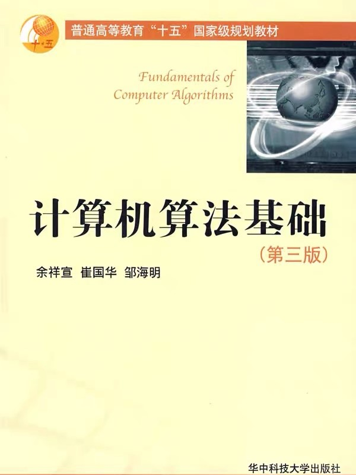

---
presentation:
  margin: 0
  center: false
  transition: "convex"
  enableSpeakerNotes: true
  slideNumber: "c/t"
  navigationMode: "linear"
---

@import "../css/font-awesome-4.7.0/css/font-awesome.css"
@import "../css/theme/solarized.css"
@import "../css/logo.css"
@import "../css/font.css"
@import "../css/color.css"
@import "../css/margin.css"
@import "../css/table.css"
@import "../css/main.css"
@import "../plugin/zoom/zoom.js"
@import "../plugin/customcontrols/plugin.js"
@import "../plugin/customcontrols/style.css"
@import "../plugin/chalkboard/plugin.js"
@import "../plugin/chalkboard/style.css"
@import "../plugin/menu/menu.js"

<!-- slide data-notes="" -->

<div class="bottom20"></div>

# 算法设计与分析

<hr class="width70 center">

## 绪论

<div class="bottom8"></div>

### 计算机学院 &nbsp;&nbsp; 张腾

#### _tengzhang@hust.edu.cn_

<!-- slide data-notes="" -->

##### 课程概况

---

授课：张腾 _tengzhang@hust.edu.cn_

时间：32 学时

- 周三 3 ~ 4 节课 (第 9 ~ 16 周)
- 周五 5 ~ 6 节课 (第 9 ~ 10 周)，周五 1 ~ 2 节课 (第 11 ~ 16 周)

<div class="top2"></div>

考核：闭卷考试 (70%)、平时作业 (30%)

主页：

<!-- slide vertical=true data-notes="" -->

##### 参考书目

---

<div class="top4">
    
    
</div>

<!-- slide data-notes="" -->

##### 本讲目标

---

回答三个问题

<div class="top5"></div>

### 是什么 what

### <span class="fragment fade-out" data-fragment-index="1">为什么 why</span>

### <span class="fragment fade-out" data-fragment-index="1">怎么样 how</span>

<!-- slide data-notes="" -->

##### 什么是算法

---

<div class="center top2">
<iframe src="http://player.bilibili.com/player.html?aid=67744781&bvid=BV1HJ411A7WP&cid=117433066&page=1" allowfullscreen="allowfullscreen" width="720" height="540" scrolling="no" frameborder="0" sandbox="allow-top-navigation allow-same-origin allow-forms allow-scripts"></iframe>
</div>

<!-- slide vertical=true data-notes="" -->

##### 什么是算法

---

要把大象装冰箱，拢共分几步？

1. 把冰箱门打开
2. 把大象装进去
3. 把冰箱门带上

<div class="top2"></div>

<p class="fragment">通俗的讲，算法是<span class="blue">完成一个任务所需的一系列步骤</span></p>

<p class="fragment">上课算法</p>

<ol class="fragment">
    <li>锁门离开宿舍房间</li>
    <li>骑自行车到西十二</li>
    <li>到教室找位置坐下</li>
</ol>

<div class="top2"></div>

<p class="fragment">刷牙算法：挤牙膏到牙刷上，牙刷贴到牙齿上，上下移动 N 秒</p>

<!-- slide data-notes="" -->

##### <span style="font-weight:900">Algorithm</span>一词的由来

---

阿尔·花拉子米：9 世纪波斯数学家、天文学家、地理学家

- 穆罕默德·伊本·穆萨·阿尔·花拉子米
- Muḥammad ibn Mūsā al-Khwārizmī
- محمد بن موسی خوارزمی

<div class="center top2">
<iframe src="https://www.google.com/maps/embed?pb=!1m18!1m12!1m3!1d10406119.73089084!2d64.80273469752038!3d40.77856267731545!2m3!1f0!2f0!3f0!3m2!1i1024!2i768!4f13.1!3m3!1m2!1s0x41de3cbf7f89baef%3A0xe874bc482a2737e!2z5LmM5YW55Yir5YWL5pav5Z2m6Iqx5ouJ5a2Q5qih!5e0!3m2!1szh-CN!2sus!4v1666251690245!5m2!1szh-CN!2sus" width="720" height="360" style="border:0;" allowfullscreen="" loading="lazy" referrerpolicy="no-referrer-when-downgrade"></iframe>
</div>

<!-- slide vertical=true data-notes="" -->

##### <span style="font-weight:900">Algorithm</span>一词的由来

---

《射雕英雄传》第三十七回 从天而降

<div class="top-4"></div>

> 原来蒙古大军分路进军，节节获胜，再西进数百里，即是花剌子模的名城撒麻尔罕。成吉思汗哨探获悉，此城是{==花剌子模==}的新都，结集重兵十余万守御，城精粮足……

<div class="top-8"></div>

> 成吉思汗自进军{==花剌子模==}以来，从无如此大败，当晚在帐中悲痛爱孙之亡，怒如雷霆。郭靖回帐翻阅《武穆遗书》，要想学一个攻城之法，但那撒麻尔罕的城防与中国大异，遗书所载的战法均无用处……

<div class="top-2"></div>

丘处机：城中常十余万户，国破以来，存者四之一

<div class="top-3"></div>

耶律楚材：寂莫河中府，声名昔日闻，城隍连畎亩，市井半邱坟

<!-- slide vertical=true data-notes="" -->

##### <span style="font-weight:900">Algorithm</span>一词的由来

---

阿尔·花拉子米：9 世纪波斯数学家、天文学家、地理学家

- 早年游学印度
- 于公元 825 年写成《印度数字算术》：十进制记数法、基础算术

<div class="top2"></div>

引入欧洲

- 意大利数学家斐波那契前往阿拉伯地区学习，约于 1200 年回国
- 名字和算术均被翻译成拉丁语 Algorismus，数字误解为阿拉伯数字

<div class="top2"></div>

词汇演化

- 拉丁语算术 Algorismus -> 英语算术 Algorism
- 英语算术 Algorism 被 Arithmetic 替代
- Algorism 的异体词 Algorithm，成为计算机专业术语“算法”

<!-- slide data-notes="" -->

##### 计算机算法

---

运行在计算设备上的算法已经接管生活

<div>
    
    
    
    
    
</div>

<!-- slide vertical=true data-notes="" -->

##### 计算机算法

---

良定义的计算过程，把输入转换成输出的计算步骤序列

@import "../dot/alg-def.dot" {.center}

- 步骤序列是有穷的
- 输入输出由待求解的问题决定

<div class="top2"></div>

算法是使用计算机求解问题的精确有效方法的代名词

<!-- slide data-notes="" -->

##### 求最大公约数

---

输入$a, b \in \Zbb_+$，输出最大公约数 ({==g==}reatest {==c==}ommon {==d==}ivisor, gcd)

暴力穷举法：从$1$遍历到$\min(a,b)$，最大的能同时整除$a,b$的数

```python {.left4 .line-numbers highlight=[2-4]}
def gcd(a, b):
    for i in range(1, min(a, b) + 1):        # 最大公约数不会大于两者中的较小者
        if ((a % i == 0) and (b % i == 0)):  # 同时整除即为公约数
            gcd = i
    return gcd

print(gcd(10000, 65535))
5
```

<p class="fragment">根据最大公约数的定义，上述算法的正确性不言而喻</p>

<!-- slide data-notes="" -->

##### 本讲目标

---

回答三个问题

<div class="top5"></div>

### <span class="fragment fade-out" data-fragment-index="1">是什么 what</span>

### 为什么 why

### <span class="fragment fade-out" data-fragment-index="1">怎么样 how</span>

<!-- slide data-notes="" -->

##### 求最大公约数

---

输入$a, b \in \Zbb_+$，输出$\gcd(a,b)$

欧几里得{==辗转相除法==}

- 不妨设$a \ge b$，记$a \div b = q \cdots r$且$r < q$，于是$\gcd(a,b) \mid r$
- $\gcd(a,b) = \gcd(b,r)$，不断令$(a,b) = (b,r)$直到$r = 0$即能整除

```python {.left4 .line-numbers}
def gcd(a, b):
    a, b = max(a, b), min(a, b)
    while a % b:            # 当余数不为零
        a, b = b, a % b
    return b
```

- 暴力穷举法迭代轮数为$\min(a, b)$，每轮做$2$次取模运算
- 辗转相除法迭代轮数约为$\log(\max(a,b))$，每轮做$1$次取模运算

<!-- slide vertical=true data-notes="" -->

##### 求最大公约数

---

输入$a, b \in \Zbb_+$，输出$\gcd(a,b)$

《九章算术》{==更相减损术==}，避免了低效的取模运算，只做加减法

- 不妨设$a \ge b$，易知有$\gcd(a,b) = \gcd(a-b,b)$
- 不断令$(a,b) = (a-b,b)$直到$a-b=b$

```python {.left4 .line-numbers}
def gcd(a, b):
    while True:
        if a > b:
            a = a - b
        elif a < b:
            b = b - a
        else:
            return b
```

最坏情况下迭代轮数为$\max(a, b)$，例如$\gcd(10000,1)$

<!-- slide vertical=true data-notes="" -->

##### 求最大公约数

---

输入$a, b \in \Zbb_+$，输出$\gcd(a,b)$

改进的{==更相减损术==}

```python {.left4 .line-numbers}
def gcd(a, b):
    if a == b: return b
    while True:
        if not (a & 1) and not (b & 1):  # 均为偶 gcd(a,b) = 2*gcd(a/2, b/2)
            return gcd(a >> 1, b >> 1) << 1
        elif not (a & 1) and (b & 1):    # a偶 b奇 gcd(a,b) = gcd(a/2, b)
            return gcd(a >> 1, b)
        elif (a & 1) and not (b & 1):    # a奇 b偶 gcd(a,b) = gcd(a, b/2)
            return gcd(a, b >> 1)
        else:                            # 均为奇 gcd(a,b) = gcd(a-b, b)
            a, b = max(a, b), min(a, b)
            return gcd(a-b, b)
```

迭代轮数约为$\log(\max(a, b))$，同辗转相除，但避免了取模运算

<!-- slide vertical=true data-notes="" -->

##### 求最大公约数

---

四种方法

<div class="threelines top-2 bottom2">

|       方法       |      迭代轮数       |   每轮操作   |
| :--------------: | :-----------------: | :----------: |
|    暴力穷举法    |    $\min(a, b)$     | 2 次取模运算 |
|    辗转相除法    | 约$\log(\max(a,b))$ | 1 次取模运算 |
|    更相减损术    |  最坏$\max(a, b)$   |  无取模运算  |
| 改进的更相减损术 | 约$\log(\max(a,b))$ |  无取模运算  |

</div>

- 设计{==正确==}的算法：对每个输入，都能给出正确的输出
- 分析算法的{==效率==}：时间开销、空间占用等，多中选优

<!-- slide data-notes="" -->

##### 排序

---

输入数组$A = \langle a_1, a_2, \ldots, a_n \rangle$
输出$A$的元素的重排列$\langle a'_1, a'_2, \ldots, a'_n \rangle$且$a'_1 \le a'_2 \le \cdots \le a'_n$


<!-- slide data-notes="" -->

##### 为什么研究算法

---

像对待计算机硬件一样把算法看成是一种技术

- 选择更快的硬件可以提升系统性能
- 运行更好的算法也可以提升系统性能

<div class="top5"></div>

如果计算机计算存储资源无限，那么我们还需研究算法吗？

- 硬件计算能力虽然日新月异，但终归不可能无限
- 大数据时代问题的规模会越来越大，算法间的效率差异也越来越显著
- 有一个好的算法基础，可以做更多的事情，同时也能做得更好


