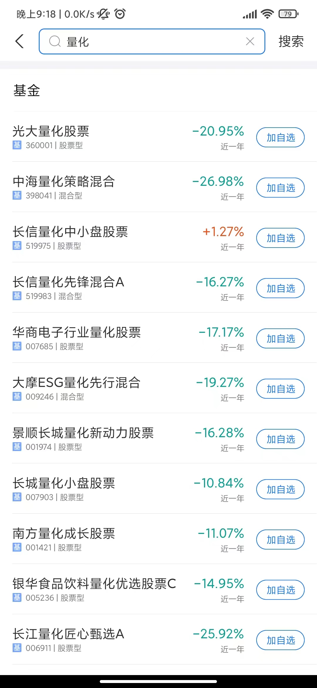

---
presentation:
  margin: 0
  center: false
  transition: "convex"
  enableSpeakerNotes: true
  slideNumber: "c/t"
  navigationMode: "linear"
---

@import "../css/font-awesome-4.7.0/css/font-awesome.css"
@import "../css/theme/solarized.css"
@import "../css/logo.css"
@import "../css/font.css"
@import "../css/color.css"
@import "../css/margin.css"
@import "../css/table.css"
@import "../css/main.css"
@import "../plugin/zoom/zoom.js"
@import "../plugin/customcontrols/plugin.js"
@import "../plugin/customcontrols/style.css"
@import "../plugin/chalkboard/plugin.js"
@import "../plugin/chalkboard/style.css"
@import "../plugin/menu/menu.js"

<!-- slide data-notes="" -->

<div class="bottom20"></div>

# 算法设计与分析

<hr class="width70 center">

## 绪论

<div class="bottom8"></div>

### 计算机学院 &nbsp;&nbsp; 张腾

#### _tengzhang@hust.edu.cn_

<!-- slide data-notes="" -->

##### 课程概况

---

授课：张腾 _tengzhang@hust.edu.cn_

时间：32 学时

- 周三 3 ~ 4 节课 (第 9 ~ 16 周)
- 周五 5 ~ 6 节课 (第 9 ~ 10 周)，周五 1 ~ 2 节课 (第 11 ~ 16 周)

<div class="top2"></div>

考核：闭卷考试 (70%)、平时作业 (30%)

主页：

<!-- slide vertical=true data-notes="" -->

##### 参考书目

---

<div class="top4">
    
    
</div>

<!-- slide data-notes="" -->

##### 本讲目标

---

回答三个问题

<div class="top5"></div>

### 是什么 what

### <span class="fragment fade-out" data-fragment-index="1">为什么 why</span>

### <span class="fragment fade-out" data-fragment-index="1">怎么样 how</span>

<!-- slide data-notes="" -->

##### 什么是算法

---

<div class="center top2">
<iframe src="http://player.bilibili.com/player.html?aid=67744781&bvid=BV1HJ411A7WP&cid=117433066&page=1" allowfullscreen="allowfullscreen" width="720" height="540" scrolling="no" frameborder="0" sandbox="allow-top-navigation allow-same-origin allow-forms allow-scripts"></iframe>
</div>

<!-- slide vertical=true data-notes="" -->

##### 什么是算法

---

要把大象装冰箱，拢共分几步？

1. 把冰箱门打开
2. 把大象装进去
3. 把冰箱门带上

<div class="top2"></div>

<p class="fragment">通俗的讲，算法是<span class="blue">完成一个任务所需的一系列步骤</span></p>

<p class="fragment">上课算法</p>

<ol class="fragment">
    <li>锁门离开宿舍房间</li>
    <li>骑自行车到西十二</li>
    <li>到教室找位置坐下</li>
</ol>

<div class="top2"></div>

<p class="fragment">刷牙算法：挤牙膏到牙刷上，牙刷贴到牙齿上，上下移动 N 秒</p>

<!-- slide data-notes="" -->

##### <span style="font-weight:900">Algorithm</span>一词的由来

---

阿尔·花拉子米：9 世纪波斯数学家、天文学家、地理学家

- 穆罕默德·伊本·穆萨·阿尔·花拉子米
- Muḥammad ibn Mūsā al-Khwārizmī
- محمد بن موسی خوارزمی

<div class="center top2">
<iframe src="https://www.google.com/maps/embed?pb=!1m18!1m12!1m3!1d10406119.73089084!2d64.80273469752038!3d40.77856267731545!2m3!1f0!2f0!3f0!3m2!1i1024!2i768!4f13.1!3m3!1m2!1s0x41de3cbf7f89baef%3A0xe874bc482a2737e!2z5LmM5YW55Yir5YWL5pav5Z2m6Iqx5ouJ5a2Q5qih!5e0!3m2!1szh-CN!2sus!4v1666251690245!5m2!1szh-CN!2sus" width="720" height="360" style="border:0;" allowfullscreen="" loading="lazy" referrerpolicy="no-referrer-when-downgrade"></iframe>
</div>

<!-- slide vertical=true data-notes="" -->

##### <span style="font-weight:900">Algorithm</span>一词的由来

---

《射雕英雄传》第三十七回 从天而降

> 原来蒙古大军分路进军，节节获胜，再西进数百里，即是花剌子模的名城撒麻尔罕。成吉思汗哨探获悉，此城是{==花剌子模==}的新都，结集重兵十余万守御，城精粮足……

<div class="top-2"></div>

> 成吉思汗自进军{==花剌子模==}以来，从无如此大败，当晚在帐中悲痛爱孙之亡，怒如雷霆。郭靖回帐翻阅《武穆遗书》，要想学一个攻城之法，但那撒麻尔罕的城防与中国大异，遗书所载的战法均无用处……

<div class="top-2"></div>

> 郭靖正欲说出辞婚之事，忽听得远处传来……，只道城中投降了的{==花剌子模==}军民突然起事，……。成吉思汗笑道：“没事，没事。这狗城不服天威，累得我损兵折将，又害死了我爱孙，须得大大洗屠一番。大家都去瞧瞧。”

丘处机：城中常十余万户，国破以来，存者四之一

<div class="top-3"></div>

耶律楚材：寂莫河中府，声名昔日闻，城隍连畎亩，市井半邱坟

<!-- slide vertical=true data-notes="" -->

##### <span style="font-weight:900">Algorithm</span>一词的由来

---

阿尔·花拉子米：9 世纪波斯数学家、天文学家、地理学家

- 早年游学印度
- 于公元 825 年写成《印度数字算术》：十进制记数法、基础算术

<div class="top2"></div>

引入欧洲

- 意大利数学家斐波那契前往阿拉伯地区学习，约于 1200 年回国
- 名字和算术均被翻译成拉丁语 Algorismus，数字误解为阿拉伯数字

<div class="top2"></div>

词汇演化

- 拉丁语算术 Algorismus -> 英语算术 Algorism
- 英语算术 Algorism 被 Arithmetic 替代
- Algorism 的异体词 Algorithm，成为计算机专业术语“算法”

<!-- slide data-notes="" -->

##### 计算机算法

---

运行在计算设备上的算法已经接管生活

<div>
    
    
    
    
    
</div>

<!-- slide vertical=true data-notes="" -->

##### 计算机算法

---

良定义的计算过程，把输入转换成输出的计算步骤序列

@import "../dot/alg-def.dot" {.center}

- 步骤序列是有穷的
- 输入输出由待求解的问题决定

<div class="top2"></div>

算法是使用计算机求解问题的精确有效方法的代名词

<!-- slide data-notes="" -->

##### 求最大公约数

---

输入$a, b \in \Zbb_+$，输出最大公约数 ({==g==}reatest {==c==}ommon {==d==}ivisor, gcd)

暴力穷举法：从$1$遍历到$\min(a,b)$，最大的能同时整除$a,b$的数

```python {.left4 .line-numbers highlight=[2-4]}
def gcd(a, b):
    for i in range(1, min(a, b) + 1):        # 最大公约数不会大于两者中的较小者
        if ((a % i == 0) and (b % i == 0)):  # 同时整除即为公约数
            gcd = i
    return gcd

print(gcd(10000, 65535))
5
```

<p class="fragment">根据最大公约数的定义，上述算法的正确性不言而喻</p>

<!-- slide data-notes="" -->

##### 本讲目标

---

回答三个问题

<div class="top5"></div>

### <span class="fragment fade-out" data-fragment-index="1">是什么 what</span>

### 为什么 why

### <span class="fragment fade-out" data-fragment-index="1">怎么样 how</span>

<!-- slide data-notes="" -->

##### 求最大公约数

---

输入$a, b \in \Zbb_+$，输出$\gcd(a,b)$

欧几里得{==辗转相除法==}

- 不妨设$a \ge b$，记$a \div b = q \cdots r$且$r < q$，于是$\gcd(a,b) \mid r$
- $\gcd(a,b) = \gcd(b,r)$，不断令$(a,b) = (b,r)$直到$r = 0$即能整除

```python {.left4 .line-numbers}
def gcd(a, b):
    a, b = max(a, b), min(a, b)
    while a % b:            # 当余数不为零
        a, b = b, a % b
    return b
```

- 暴力穷举法迭代轮数为$\min(a, b)$，每轮做$2$次取模运算
- 辗转相除法迭代轮数约为$\log(\max(a,b))$，每轮做$1$次取模运算

<!-- slide vertical=true data-notes="" -->

##### 求最大公约数

---

输入$a, b \in \Zbb_+$，输出$\gcd(a,b)$

《九章算术》{==更相减损术==}，避免了低效的取模运算，只做加减法

- 不妨设$a \ge b$，易知有$\gcd(a,b) = \gcd(a-b,b)$
- 不断令$(a,b) = (a-b,b)$直到$a-b=b$

```python {.left4 .line-numbers}
def gcd(a, b):
    while True:
        if a > b:
            a = a - b
        elif a < b:
            b = b - a
        else:
            return b
```

最坏情况下迭代轮数为$\max(a, b)$，例如$\gcd(10000,1)$

<!-- slide vertical=true data-notes="" -->

##### 求最大公约数

---

输入$a, b \in \Zbb_+$，输出$\gcd(a,b)$

改进的{==更相减损术==}

```python {.left4 .line-numbers}
def gcd(a, b):
    if a == b: return b
    while True:
        if not (a & 1) and not (b & 1):  # 均为偶 gcd(a,b) = 2*gcd(a/2, b/2)
            return gcd(a >> 1, b >> 1) << 1
        elif not (a & 1) and (b & 1):    # a偶 b奇 gcd(a,b) = gcd(a/2, b)
            return gcd(a >> 1, b)
        elif (a & 1) and not (b & 1):    # a奇 b偶 gcd(a,b) = gcd(a, b/2)
            return gcd(a, b >> 1)
        else:                            # 均为奇 gcd(a,b) = gcd(a-b, b)
            a, b = max(a, b), min(a, b)
            return gcd(a-b, b)
```

迭代轮数约为$\log(\max(a, b))$，同辗转相除，但避免了取模运算

<!-- slide vertical=true data-notes="" -->

##### 求最大公约数

---

四种方法

<div class="threelines top-2 bottom2">

|       方法       |      迭代轮数       |   每轮操作   |
| :--------------: | :-----------------: | :----------: |
|    暴力穷举法    |    $\min(a, b)$     | 2 次取模运算 |
|    辗转相除法    | 约$\log(\max(a,b))$ | 1 次取模运算 |
|    更相减损术    |  最坏$\max(a, b)$   |  无取模运算  |
| 改进的更相减损术 | 约$\log(\max(a,b))$ |  无取模运算  |

</div>

- 设计{==正确==}的算法：对每个输入，都能给出正确的输出
- 分析算法的{==效率==}：时间开销、空间占用等，多中选优

<!-- slide data-notes="" -->

##### 排序

---

输入：数组$A = \langle a_1, a_2, \ldots, a_n \rangle$
输出：$A$的元素的重排列$\langle a'_1, a'_2, \ldots, a'_n \rangle$且$a'_1 \le a'_2 \le \cdots \le a'_n$

<div class="top2"></div>

- 新华字典按音序排序
- 银行流水按时间排序
- 搜索引擎的结果按与搜索关键字的相关性排序
- 服务于其他算法，如作为二分查找的前序步骤

<div class="top2"></div>

借助这个最基本的问题，我们详细展示

- 如何证明算法的正确性
- 如何分析算法的效率

<div class="top2"></div>

冒泡排序、选择排序、插入排序、合并排序、快速排序

<!-- slide data-notes="" -->

##### 冒泡排序

---

相邻两个元素比较，如果前者大于后者，则交换

```python {.left4 .line-numbers .top-1}
def bubble_sort(a, n):
    for i in range(n-1):             # 0 -> n-2
        for j in range(n-1, i, -1):  # n-1 -> i+1
            if a[j] < a[j-1]:
                a[j], a[j-1] = a[j-1], a[j]
```

<div class="row1-6-column2-16-fullborder top-6">

|      |  1  |  2  |  3  |  4  |  5  |  6  |  7  |  8  |  9  | 10  | 11  | 12  | 13  | 14  | 15  |
| :--: | :-: | :-: | :-: | :-: | :-: | :-: | :-: | :-: | :-: | :-: | :-: | :-: | :-: | :-: | :-: |
|  5   |  5  |  5  |  5  |  5  |  1  |  1  |  1  |  1  |  1  |  1  |  1  |  1  |  1  |  1  |  1  |
|  2   |  2  |  2  |  2  |  1  |  5  |  5  |  5  |  5  |  2  |  2  |  2  |  2  |  2  |  2  |  2  |
|  4   |  4  |  4  |  1  |  2  |  2  |  2  |  2  |  2  |  5  |  5  |  3  |  3  |  3  |  3  |  3  |
|  6   |  6  |  1  |  4  |  4  |  4  |  4  |  3  |  3  |  3  |  3  |  5  |  5  |  5  |  4  |  4  |
|  1   |  1  |  6  |  6  |  6  |  6  |  3  |  4  |  4  |  4  |  4  |  4  |  4  |  4  |  5  |  5  |
|  3   |  3  |  3  |  3  |  3  |  3  |  6  |  6  |  6  |  6  |  6  |  6  |  6  |  6  |  6  |  6  |
| 交换 | 否  | 是  | 是  | 是  | 是  | 是  | 是  | 否  | 是  | 否  | 是  | 否  | 否  | 是  | 否  |

</div>

<!-- slide data-notes="" -->

##### 冒泡排序 正确性

---

```python {.left4 .line-numbers .top0 .bottom0}
def bubble_sort(a, n):
    for i in range(n-1):             # 0 -> n-2
        for j in range(n-1, i, -1):  # n-1 -> i+1
            if a[j] < a[j-1]:
                a[j], a[j-1] = a[j-1], a[j]
```

如何证明算法的正确性？{==循环不变式==} (loop-invariant)：一个{==在初次进入循环前成立==}且{==每次循环后还成立==}的命题

> 内层循环：每次进入循环前，子数组$a[j, \ldots, n-1]$的第一个元素最小
> 外层循环：每次进入循环前，子数组$a[0, \ldots, i-1]$有序排列着整个数组$a$的最小的$i$个元素

最终循环终止时有$i = n-1$，根据外层循环不变式，此时子数组$a[0, \ldots, n-2]$有序排列着整个数组$a$的最小的$n-1$个元素，剩余一个最大的元素在$a[n-1]$，因此$a$已排好序

<!-- slide vertical=true data-notes="" -->

##### 冒泡排序 正确性

---

```python {.left4 .line-numbers .top0}
def bubble_sort(a, n):
    for i in range(n-1):             # 0 -> n-2
        for j in range(n-1, i, -1):  # n-1 -> i+1
            if a[j] < a[j-1]:
                a[j], a[j-1] = a[j-1], a[j]
```

外层的循环不变式依赖内层，先证明内层

> 内层循环：每次进入循环前，子数组$a[j, \ldots, n-1]$的第一个元素最小

证明过程类似数学归纳法，分三步：1) 初始；2) 保持；3) 终止

1. 初始：子数组$a[n-1]$只有一个元素，循环不变式显然成立
2. 保持：每轮比较$a[j-1]$和$a[j]$并将小者置于前，又$a[j]$是$a[j, \ldots, n-1]$中最小的，因此迭代结束后$a[j-1, \ldots, n-1]$的第一个元素最小
3. 终止：此时有$j = i$，此时子数组$a[i, \ldots, n-1]$第一个元素最小

<!-- slide vertical=true data-notes="" -->

##### 冒泡排序 正确性

---

```python {.left4 .line-numbers .top0}
def bubble_sort(a, n):
    for i in range(n-1):             # 0 -> n-2
        for j in range(n-1, i, -1):  # n-1 -> i+1
            if a[j] < a[j-1]:
                a[j], a[j-1] = a[j-1], a[j]
```

> 内层循环：每次进入循环前，子数组$a[j, \ldots, n-1]$的第一个元素最小
> 外层循环：每次进入循环前，子数组$a[0, \ldots, i-1]$有序排列着整个数组$a$的最小的$i$个元素

<div class="top2"></div>

1. 初始：子数组$a[0, \ldots, -1]$为空，循环不变式显然成立
2. 保持：根据内层循环的终止情况，$a[i, \ldots, n-1]$的第一个元素最小，又子数组$a[0, \ldots, i-1]$有序排列着整个数组$a$的最小的$i$个元素，因此子数组$a[0, \ldots, i]$亦有序排列着整个数组$a$的最小的$i+1$个元素
3. 终止：此时有$i = n-1$，前面已述此时$a$已排好序

<!-- slide data-notes="" -->

##### 冒泡排序 时间分析

---

<div class="threelines">

| <span style="font-family:Operator">bubble_sort(a, n):</span>                                              |    时间     |             次数              |
| :-------------------------------------------------------------------------------------------------------- | :---------: | :---------------------------: |
| <span style="font-family:Operator">for i in range(n-1):</span>                                            | $c_1, c'_1$ |  对$i$赋值$1$次、自增$n-1$次  |
| ^                                                                                                         |   $c''_1$   |      $i$与$n-1$比较$n$次      |
| <span style="font-family:Operator">&nbsp;&nbsp;for j in range(n-1, i, -1):</span>                         | $c_2, c'_2$ | 对$j$赋值$1$次、自减$n-1-i$次 |
| ^                                                                                                         |   $c''_2$   |      $j$与$i$比较$n-i$次      |
| <span style="font-family:Operator">&nbsp;&nbsp;&nbsp;&nbsp;if a[j] < a[j-1]:</span>                       |    $c_3$    |         比较$n-1-i$次         |
| <span style="font-family:Operator">&nbsp;&nbsp;&nbsp;&nbsp;&nbsp;&nbsp;a[j], a[j-1] = a[j-1], a[j]</span> |    $c_4$    |          交换$t_i$次          |

</div>

$$
\begin{align*}
    \qquad \text{总时间} & = c_1 + c'_1 (n-1) + c''_1 n + \sum_{i=0}^{n-2} (c_2 + c'_2 (n-1-i) + c''_2 (n-i) \\
    & \qquad + c_3 (n-1-i) + c_4 t_i) \\
    & = a n^2 + b n + c + c_4 \sum_{i=0}^{n-2} t_i
\end{align*}
$$

<!-- slide vertical=true data-notes="" -->

##### 冒泡排序 时间分析

---

$t_i$是$a[j]$和$a[j-1]$交换的次数

- 最好情况下(初始顺序)发生$0$次
- 最坏情况下(初始逆序)发生$n-1-i$次

<div class="top2"></div>

$$
\begin{align*}
    \qquad & a n^2 + b n + c \le \text{总时间} \le a n^2 + b n + c + c_4 \sum_{i=0}^{n-2} (n-1-i) \\
    & \qquad \Longrightarrow \text{总时间} \in \Theta(n^2), ~ \text{最坏情况下交换次数} \in \Theta(n^2)
\end{align*}
$$

- 顺序结构中的语句只执行$1$次
- 循环结构中的语句执行次数等于循环被执行的次数，一重循环中的语句可以产生$n$的线性项，二重循环中的语句可以产生$n$的平方项

<div class="threelines">

| 算法     | 最坏情况下运行时间 | 最好情况下运行时间 | 最坏情况下交换次数 |
| :------- | :----------------: | :----------------: | :----------------: |
| 冒泡排序 |   $\Theta(n^2)$    |   $\Theta(n^2)$    |   $\Theta(n^2)$    |

</div>

<!-- slide data-notes="" -->

##### 选择排序

---

最小元与第一个元素互换，次小元与第二个元素互换，……

```python {.left4 .line-numbers .top-1}
def selection_sort(a, n):
    for i in range(n-1):
        smallest = i
        for j in range(i+1, n):
            if a[j] < a[smallest]:
                smallest = j
        a[i], a[smallest] = a[smallest], a[i]
```

- 第 5 行的比较操作在二重循环里，因此算法总时间$\in \Theta(n^2)$
- 第 7 行的交换操作在一重循环里，因此最坏情况下交换次数$\in \Theta(n)$

<div class="threelines">

| 算法     | 最坏情况下运行时间 | 最好情况下运行时间 | 最坏情况下交换次数 |
| :------- | :----------------: | :----------------: | :----------------: |
| 冒泡排序 |   $\Theta(n^2)$    |   $\Theta(n^2)$    |   $\Theta(n^2)$    |
| 选择排序 |   $\Theta(n^2)$    |   $\Theta(n^2)$    |    $\Theta(n)$     |

</div>

<!-- slide vertical=true data-notes="" -->

##### 选择排序 正确性

---

```python {.left4 .line-numbers .top-1}
def selection_sort(a, n):
    for i in range(n-1):
        smallest = i
        for j in range(i+1, n):
            if a[j] < a[smallest]:
                smallest = j
        a[i], a[smallest] = a[smallest], a[i]
```

> 内层循环：每次进入循环前，$a[\text{smallest}]$是子数组$a[i, \ldots, j-1]$的最小元素
> 外层循环：每次进入循环前，子数组$a[0, \ldots, i-1]$有序排列着整个数组$a$的最小的$i$个元素，{==与冒泡排序相同==}

内层循环：

1. 初始：子数组$a[0, \ldots, -1]$为空，循环不变式显然成立
2. 保持：进入循环前$a[\text{smallest}]$是$a[i, \ldots, j-1]$的最小元素，将$a[j]$与$a[\text{smallest}]$比较后，$a[\text{smallest}]$是$a[i, \ldots, j]$的最小元素
3. 终止：此时有$j = n$，$a[\text{smallest}]$是$a[i, \ldots, n-1]$的最小元素

<!-- slide vertical=true data-notes="" -->

##### 选择排序 正确性

---

```python {.left4 .line-numbers .top-1}
def selection_sort(a, n):
    for i in range(n-1):
        smallest = i
        for j in range(i+1, n):
            if a[j] < a[smallest]:
                smallest = j
        a[i], a[smallest] = a[smallest], a[i]
```

> 内层循环：每次进入循环前，$a[\text{smallest}]$是子数组$a[i, \ldots, j-1]$的最小元素
> 外层循环：每次进入循环前，子数组$a[0, \ldots, i-1]$有序排列着整个数组$a$的最小的$i$个元素，{==与冒泡排序相同==}

外层循环{==保持==}：每次进入循环前，子数组$a[0, \ldots, i-1]$有序排列着整个数组$a$的最小的$i$个元素，根据内层循环的终止情况和第 7 行的交换，$a[i]$是$a[i, \ldots, n-1]$的最小元素，因此子数组$a[0, \ldots, i]$有序排列着整个数组$a$的最小的$i+1$个元素

<!-- slide data-notes="" -->

##### 插入排序

---

在前半部分构建有序子数组，将后半部分的未排序元素插入其中

```python {.left4 .line-numbers .top-1}
def insertion_sort(a, n):
    for i in range(1, n):
        key = a[i]
        j = i - 1
        while j >= 0 and key < a[j]:
            a[j+1] = a[j]
            j -= 1
        a[j+1] = key
```

<div class="top-5 row1-1-column2-7-fullborder row1-1-column10-15-fullborder row3-3-column2-7-fullborder row3-3-column10-15-fullborder row5-5-column2-7-fullborder row5-5-column10-15-fullborder">

| &zwnj; |               1               |               2               |               3               |               4               |               5               |    6    | &zwnj; | &zwnj; |               1               |               2               |               3               |               4               |               5               |               6               |
| :----: | :---------------------------: | :---------------------------: | :---------------------------: | :---------------------------: | :---------------------------: | :-----: | :----: | :----: | :---------------------------: | :---------------------------: | :---------------------------: | :---------------------------: | :---------------------------: | :---------------------------: |
|  (1)   | <span class="yellow">5</span> |            {==2==}            |               4               |               6               |               1               |    3    | &zwnj; |  (2)   | <span class="yellow">2</span> | <span class="yellow">5</span> |            {==4==}            |               6               |               1               |               3               |
| &zwnj; |            &zwnj;             |            &zwnj;             |            &zwnj;             |            &zwnj;             |            &zwnj;             | &zwnj;  | &zwnj; | &zwnj; |            &zwnj;             |            &zwnj;             |            &zwnj;             |            &zwnj;             |            &zwnj;             |            &zwnj;             |
|  (3)   | <span class="yellow">2</span> | <span class="yellow">4</span> | <span class="yellow">5</span> |            {==6==}            |               1               |    3    | &zwnj; |  (4)   | <span class="yellow">2</span> | <span class="yellow">4</span> | <span class="yellow">5</span> | <span class="yellow">6</span> |            {==1==}            |               3               |
| &zwnj; |            &zwnj;             |            &zwnj;             |            &zwnj;             |            &zwnj;             |            &zwnj;             | &zwnj;  | &zwnj; | &zwnj; |            &zwnj;             |            &zwnj;             |            &zwnj;             |            &zwnj;             |            &zwnj;             |            &zwnj;             |
|  (5)   | <span class="yellow">1</span> | <span class="yellow">2</span> | <span class="yellow">4</span> | <span class="yellow">5</span> | <span class="yellow">6</span> | {==3==} | &zwnj; |  (6)   | <span class="yellow">1</span> | <span class="yellow">2</span> | <span class="yellow">3</span> | <span class="yellow">4</span> | <span class="yellow">5</span> | <span class="yellow">6</span> |

</div>

<!-- slide vertical=true data-notes="为了避免过于形式主义，只考虑for循环的循环不变式，不考虑while的循环不变式" -->

##### 插入排序 正确性

---

```python {.left4 .line-numbers .top-1}
def insertion_sort(a, n):
    for i in range(1, n):  # 1 -> n-1
        key = a[i]
        j = i - 1
        while j >= 0 and key < a[j]:
            a[j+1] = a[j]
            j -= 1
        a[j+1] = key
```

> 循环不变式：每次进入 for 循环前，$a[0, \ldots, i-1]$已经排好序

<div class="top2"></div>

1. 初始：子数组$a[0]$只有一个元素，已经排好序
2. 保持：进入循环前$a[0, \ldots, i-1]$已经排好序，第 3 ~ 8 行为$a[i]$寻找合适的位置并插入，故结束后$a[0, \ldots, i]$已经排好序
3. 终止：此时有$i = n$，$a[0, \ldots, n-1]$已经排好序

<!-- slide data-notes="" -->

##### 插入排序 时间分析

---

<div class="threelines">

| <span style="font-family:Operator">insertion_sort(a, n):</span>                    |    时间     |             次数              |
| :--------------------------------------------------------------------------------- | :---------: | :---------------------------: |
| <span style="font-family:Operator">for i in range(1, n):</span>                    | $c_1, c'_1$ |  对$i$赋值$1$次、自增$n-1$次  |
| ^                                                                                  |   $c''_1$   |      $i$与$n-1$比较$n$次      |
| <span style="font-family:Operator">&nbsp;&nbsp;key = a[i]</span>                   | $c_2, c'_2$ | 对$j$赋值$1$次、自减$n-1-i$次 |
| <span style="font-family:Operator">&nbsp;&nbsp;j = i - 1</span>                    |   $c''_2$   |      $j$与$i$比较$n-i$次      |
| <span style="font-family:Operator">&nbsp;&nbsp;while j >= 0 and key < a[j]:</span> |    $c_3$    |         比较$n-1-i$次         |
| <span style="font-family:Operator">&nbsp;&nbsp;&nbsp;&nbsp;a[j+1] = a[j]</span>    |    $c_4$    |          交换$t_i$次          |
| <span style="font-family:Operator">&nbsp;&nbsp;&nbsp;&nbsp;j -= 1</span>           |    $c_4$    |          交换$t_i$次          |
| <span style="font-family:Operator">&nbsp;&nbsp;a[j+1] = key</span>                 |    $c_3$    |         比较$n-1-i$次         |

</div>

<!-- slide vertical=true data-notes="" -->

##### 插入排序 时间分析

---

<div class="threelines">

| 算法     | 最坏情况下运行时间 | 最好情况下运行时间 | 最坏情况下交换次数 |
| :------- | :----------------: | :----------------: | :----------------: |
| 冒泡排序 |   $\Theta(n^2)$    |   $\Theta(n^2)$    |   $\Theta(n^2)$    |
| 选择排序 |   $\Theta(n^2)$    |   $\Theta(n^2)$    |    $\Theta(n)$     |
| 插入排序 |   $\Theta(n^2)$    |   $\Theta(n^2)$    |    $\Theta(n)$     |

</div>

<!-- slide data-notes="" -->

##### 为什么研究算法

---

像对待计算机硬件一样把算法看成是一种技术

- 选择更快的硬件可以提升系统性能
- 运行更好的算法也可以提升系统性能

<div class="top5"></div>

如果计算机计算存储资源无限，那么我们还需研究算法吗？

- 硬件计算能力虽然日新月异，但终归不可能无限
- 大数据时代问题的规模会越来越大，算法间的效率差异也越来越显著
- 有一个好的算法基础，可以做更多的事情，同时也能做得更好
