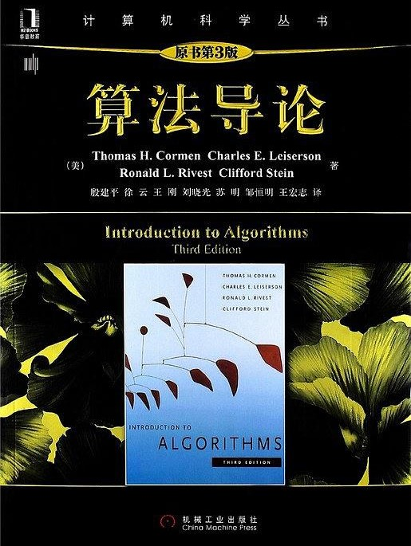
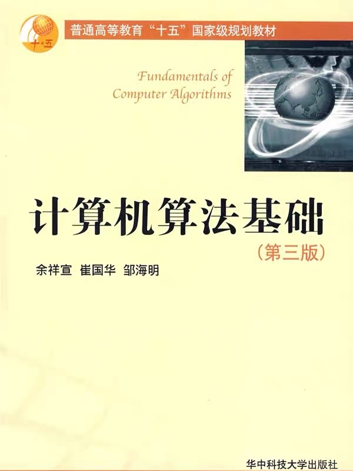

---
presentation:
  margin: 0
  center: false
  transition: "none"
  enableSpeakerNotes: true
  slideNumber: "c/t"
  navigationMode: "linear"
---

@import "../css/font-awesome-4.7.0/css/font-awesome.css"
@import "../css/theme/solarized.css"
@import "../css/logo.css"
@import "../css/font.css"
@import "../css/color.css"
@import "../css/margin.css"
@import "../css/table.css"
@import "../css/main.css"
@import "../plugin/zoom/zoom.js"
@import "../plugin/customcontrols/plugin.js"
@import "../plugin/customcontrols/style.css"
@import "../plugin/chalkboard/plugin.js"
@import "../plugin/chalkboard/style.css"
@import "../plugin/menu/menu.js"

<!-- slide data-notes="" -->

# 算法设计与分析

## 绪论

### 计算机学院 &nbsp;&nbsp; 张腾

#### _tengzhang@hust.edu.cn_

<!-- slide data-notes="" -->

##### 课程概况

---

授课：张腾 _tengzhang@hust.edu.cn_

地点：西十二楼 N504

32 学时

- 第 9 ~ 12 周：周一 7 ~ 8 节课、周三 7 ~ 8 节课
- 第 13 ~ 16 周：周一 3 ~ 4 节课、周三 5 ~ 6 节课

考核：闭卷考试 (70%)、平时作业 (30%)

主页：_https://avanti1980.github.io/course-alg/_

<!-- slide vertical=true data-notes="" -->

##### 参考书目

---

    
    

<!-- slide data-notes="" -->

##### 本讲目标

---

回答三个问题

### 是什么 what

### 为什么 why

### 怎么样 how

<!-- slide data-notes="" -->

##### 什么是算法

---

    <video controls width="800">
        <source src="../videos/a.mp4" type="video/mp4">
    </video>

<!-- slide vertical=true data-notes="" -->

##### 什么是算法

---

要把大象装冰箱，拢共分几步？

1. 把冰箱门打开
2. 把大象装进去
3. 把冰箱门带上

通俗的讲，算法是完成一个任务所需的一系列步骤

上课算法

<ol class="fragment">
    <li>锁门离开宿舍房间</li>
    <li>骑自行车到西十二</li>
    <li>到教室找位置坐下</li>
</ol>

刷牙算法：挤牙膏到牙刷上，牙刷贴到牙齿上，上下移动 N 秒

<!-- slide data-notes="" -->

##### Algorithm一词的由来

---

阿尔·花拉子米：9 世纪波斯数学家、天文学家、地理学家

- 穆罕默德·伊本·穆萨·阿尔·花拉子米
- Muḥammad ibn Mūsā al-Khwārizmī
- محمد بن موسی خوارزمی

<iframe src="https://www.google.com/maps/embed?pb=!1m18!1m12!1m3!1d10406119.73089084!2d64.80273469752038!3d40.77856267731545!2m3!1f0!2f0!3f0!3m2!1i1024!2i768!4f13.1!3m3!1m2!1s0x41de3cbf7f89baef%3A0xe874bc482a2737e!2z5LmM5YW55Yir5YWL5pav5Z2m6Iqx5ouJ5a2Q5qih!5e0!3m2!1szh-CN!2sus!4v1666251690245!5m2!1szh-CN!2sus" width="720" height="360" style="border:0;" allowfullscreen="" loading="lazy" referrerpolicy="no-referrer-when-downgrade"></iframe>

<!-- slide vertical=true data-notes="这页的逻辑是：根据花拉子米的名字推断他是花剌子模人，但是花剌子模是个早已不存在的城邦，被成吉思汗灭了，射雕英雄传里对此有过描述，灭国后的惨状如丘处机和耶律楚材的诗中所述" -->

##### Algorithm一词的由来

---

《射雕英雄传》第三十七回 从天而降

> 原来蒙古大军分路进军，节节获胜，再西进数百里，即是花剌子模的名城撒麻尔罕。成吉思汗哨探获悉，此城是{==花剌子模==}的新都，结集重兵十余万守御，城精粮足……

> 成吉思汗自进军{==花剌子模==}以来，从无如此大败，当晚在帐中悲痛爱孙之亡，怒如雷霆。郭靖回帐翻阅《武穆遗书》，要想学一个攻城之法，但那撒麻尔罕的城防与中国大异，遗书所载的战法均无用处……

> 郭靖正欲说出辞婚之事，忽听得远处传来……，只道城中投降了的{==花剌子模==}军民突然起事，……。成吉思汗笑道：“没事，没事。这狗城不服天威，累得我损兵折将，又害死了我爱孙，须得大大洗屠一番。大家都去瞧瞧。”

丘处机：城中常十余万户，国破以来，存者四之一

耶律楚材：寂莫河中府，声名昔日闻，城隍连畎亩，市井半邱坟

<!-- slide vertical=true data-notes="蒙古征服花剌子模战争爆发在1219年至1221年，所幸花拉子米生活的年代比射雕英雄传早了400年，但斐波那契前往阿拉伯的时间并没有早多少" -->

##### Algorithm一词的由来

---

阿尔·花拉子米：9 世纪波斯数学家、天文学家、地理学家

- 早年游学印度
- 于公元 825 年写成《印度数字算术》：十进制记数法、基础算术

引入欧洲

- 意大利数学家斐波那契前往阿拉伯地区学习，约于 1200 年回国
- 名字和算术均被翻译成拉丁语 Algorismus，数字误解为阿拉伯数字

词汇演化

- 拉丁语算术 Algorismus => 英语算术 Algorism [ˈælɡəˌrɪzəm]
- 英语算术 Algorism 被 Arithmetic [əˈrɪθmətɪk] 替代
- Algorism 的异体词 Algorithm [ˈælɡərɪðəm] => 计算机专业术语“算法”

<!-- slide data-notes="" -->

##### 计算机算法

---

运行在计算设备上的各种 App (算法) 已经接管生活

    
    
    
    

<!-- slide vertical=true data-notes="" -->

##### 计算机算法

---

良定义的计算过程，把输入转换成输出的计算步骤序列

@import "../dot/alg-def.dot" {.center}

- 步骤序列是有穷的
- 输入输出由待求解的问题决定

算法是使用计算机求解问题的精确有效方法的代名词

<!-- slide data-notes="" -->

##### 量水问题

---

两个没有刻度的水桶，总容量分别为 9 升和 6 升，如何量出 3 升的水？

    
    

<!-- slide vertical=true data-notes="" -->

##### 量水问题

---

两个没有刻度的水桶，总容量分别为 9 升和 6 升，如何量出 3 升的水？

算法：

- 将 9 升的桶装满水
- 向 6 升的桶倒水，直到满
- 9 升桶中剩下的即为 3 升

如果总容量分别为 7 升和 5 升，如何量出 1 升的水？

<!-- slide vertical=true data-notes="" -->

##### 量水问题

---

两个没有刻度的水桶，总容量分别为 7 升和 5 升，如何量出 1 升的水？

算法：

- 将 5 升的桶装满水，5/5、0/7
- 将 5 升的桶中的 5 升水全部倒入 7 升的桶中，0/5、5/7
- 将 5 升的桶装满水，5/5、5/7
- 向 7 升的桶倒水，直到满，此时 5 升的桶中还剩 3 升水，3/5、7/7
- 将 7 升的桶中的水倒掉，3/5、0/7
- 将 5 升的桶中的 3 升水倒入 7 升的桶中，0/5、3/7
- 将 5 升的桶装满水，5/5、3/7
- 向 7 升的桶倒水，直到满，此时 5 升的桶中还剩 {==1==} 升水，{==1==}/5、7/7

<!-- slide data-notes="" -->

##### 量水问题 一般化

---

两个没有刻度的水桶，总容量分别为$a$升和$b$升，是否可以量出$t$升的水？如果可以，请给出具体方案，其中$a,b,t \in \Zbb_+$

思路：装满对应$+a$或$+b$，倒掉对应$-a$或$-b$

是否可以通过若干次$+a$、$+b$、$-a$、$-b$得到$t$？即是否存在整数$x$、$y$使得$ax + by = t$？

前面的例子：$5 \cdot 3 - 7 \cdot 2 = 1$

$t$必须是$a,b$最大公约数的倍数，若$t=1$，则$a,b$必须互素

<!-- slide vertical=true data-notes="" -->

##### 量水问题 一般化

---

问题 1：求最大公约数 ({==g==}reatest {==c==}ommon {==d==}ivisor, gcd)

输入$a, b \in \Zbb_+$，输出整数$d=\gcd(a,b)$

问题 2：求待定系数

输入$a, b \in \Zbb_+$且$\gcd(a,b)=1$，输出整数$x,y$使得$ax+by=1$

<!-- slide vertical=true data-notes="" -->

##### 暴力穷举法

---

从$1$遍历到$\min(a,b)$，最大能同时整除$a,b$的数就是最大公约数

@import "../codes/gcd.py" {line_begin=0 line_end=5 .left4 .top0 .line-numbers}

对$x$从$1$遍历到$b$，检测$y$是否可同时为整数

@import "../codes/gcd.py" {line_begin=7 line_end=12 .left4 .top0 .line-numbers}

<!-- slide data-notes="" -->

##### 本讲目标

---

回答三个问题

### 是什么 what

### 为什么 why

### 怎么样 how

<!-- slide data-notes="" -->

##### 欧几里得 辗转相除法

---

记$a / b = q \cdots r$且$r < b$，于是$\gcd(a,b) \mid r$
$\gcd(a,b) = \gcd(b,r)$，不断令$(a,b) = (b,r)$直到$r = 0$即能整除

@import "../codes/gcd.py" {line_begin=14 line_end=26 .left4 .top0 .bottom1 .line-numbers}

- 暴力穷举法迭代轮数为$\min(a, b)$，每轮做$2$次取模运算
- 辗转相除法迭代轮数约为$\log(\max(a,b))$，每轮做$1$次取模运算

<!-- slide vertical=true data-notes="" -->

##### 九章算术 更相减损术

---

$\gcd(a,b) = \gcd(a-b,b)$，不断令$(a,b) = (a-b,b)$直到$a=b$

@import "../codes/gcd.py" {line_begin=28 line_end=47 .left4 .top0 .bottom4 .line-numbers}

- 避免了低效的取模运算，只做加减法
- 最坏情况下迭代轮数为$\max(a, b)$，例如$\gcd(10000,1)$

<!-- slide vertical=true data-notes="" -->

##### 改进的更相减损术

---

对$a$、$b$分奇偶性讨论

@import "../codes/gcd.py" {line_begin=49 line_end=64 .left4 .line-numbers .top0 .bottom0}

迭代轮数约为$\log(\max(a, b))$，同辗转相除，但避免了取模运算

<!-- slide vertical=true data-notes="" -->

##### 求最大公约数

---

四种方法

|       方法       |      迭代轮数       |   每轮操作   |
| :--------------: | :-----------------: | :----------: |
|    暴力穷举法    |    $\min(a, b)$     | 2 次取模运算 |
|    辗转相除法    | 约$\log(\max(a,b))$ | 1 次取模运算 |
|    更相减损术    |  最坏$\max(a, b)$   |  无取模运算  |
| 改进的更相减损术 | 约$\log(\max(a,b))$ |  无取模运算  |

- 设计{==正确==}的算法：对每个输入，都能给出正确的输出
- 分析算法的{==效率==}：时间开销、空间占用等，多中选优

<!-- slide data-notes="" -->

##### 排序

---

输入：数组$a = \langle a_1, a_2, \ldots, a_n \rangle$
输出：$a$的元素的重排列$\langle a'_1, a'_2, \ldots, a'_n \rangle$且$a'_1 \le a'_2 \le \cdots \le a'_n$

- 新华字典按音序排序
- 银行流水按时间排序
- 搜索引擎的结果按与搜索关键字的相关性排序
- 服务于其他算法，如作为二分查找的前序步骤

借助这个最基本的问题，我们详细展示

- 如何证明算法的正确性
- 如何分析算法的效率

冒泡排序、选择排序、插入排序、归并排序、快速排序

<!-- slide data-notes="" -->

##### 冒泡排序

---

相邻两个元素比较，如果前者大于后者，则交换

@import "../codes/sorting.py" {line_begin=0 line_end=5 .left4 .line-numbers .top-1 .bottom0}

前两轮外层循环

| &zwnj; |    1    |  2  |  3  |  4  |  5  |  6  | &zwnj; | &zwnj; |    1    |    2    |   3    |   4    |   5    |   6    |
| :----: | :-----: | :-: | :-: | :-: | :-: | :-: | :----: | :----: | :-----: | :-----: | :----: | :----: | :----: | :----: |
|  (1)   |    5    |  2  |  4  |  6  |  1  |  3  | &zwnj; |  (6)   | {==1==} |    5    |   2    |   4    |   3    |   6    |
|  (2)   |    5    |  2  |  4  |  1  |  6  |  3  | &zwnj; |  (7)   | {==1==} |    5    |   2    |   3    |   4    |   6    |
|  (3)   |    5    |  2  |  1  |  4  |  6  |  3  | &zwnj; |  (8)   | {==1==} |    5    |   2    |   3    |   4    |   6    |
|  (4)   |    5    |  1  |  2  |  4  |  6  |  3  | &zwnj; |  (9)   | {==1==} | {==2==} |   5    |   3    |   4    |   6    |
|  (5)   | {==1==} |  5  |  2  |  4  |  6  |  3  | &zwnj; | &zwnj; | &zwnj;  | &zwnj;  | &zwnj; | &zwnj; | &zwnj; | &zwnj; |

<!-- slide data-notes="" -->

##### 冒泡排序 正确性

---

@import "../codes/sorting.py" {line_begin=0 line_end=5 .left4 .line-numbers .top0 .bottom0}

如何证明算法的正确性？

{==循环不变式==} (loop-invariant)：一个满足如下三条性质的命题

1. 初始：在初次进入循环前成立
2. 保持：若每次进入循环前成立，则下次进入循环前还成立
3. 终止：循环可以终止，此时循环不变式提供一个有用的性质

> 内层循环：每次进入循环前，子数组$a[j, \ldots, n-1]$的第一个元素最小
> 外层循环：每次进入循环前，子数组$a[0, \ldots, i-1]$有序排列着整个数组$a[]$的最小的$i$个元素

<!-- slide vertical=true data-notes="" -->

##### 冒泡排序 正确性

---

@import "../codes/sorting.py" {line_begin=0 line_end=5 .left4 .line-numbers .top0 .bottom0}

> 内层循环：每次进入循环前，子数组$a[j, \ldots, n-1]$的第一个元素最小
> 外层循环：每次进入循环前，子数组$a[0, \ldots, i-1]$有序排列着整个数组$a[]$的最小的$i$个元素

外层循环不变式证明依赖内层的终止情况，先证明内层

1. 初始：$j = n-1$，子数组$a[n-1]$只有一个元素，循环不变式显然成立
2. 保持：若$a[j]$是$a[j, \ldots, n-1]$中最小的，循环中比较$a[j-1]$和$a[j]$并将小者置于前，则再次进入循环前$a[j-1, \ldots, n-1]$的第一个元素最小
3. 终止：$j = i$，此时子数组$a[i, \ldots, n-1]$第一个元素最小

<!-- slide vertical=true data-notes="" -->

##### 冒泡排序 正确性

---

@import "../codes/sorting.py" {line_begin=0 line_end=5 .left4 .line-numbers .top0 .bottom0}

> 内层循环：每次进入循环前，子数组$a[j, \ldots, n-1]$的第一个元素最小
> 外层循环：每次进入循环前，子数组$a[0, \ldots, i-1]$有序排列着整个数组$a[]$的最小的$i$个元素

1. 初始：$i=0$，子数组$a[0, \ldots, -1]$为空，循环不变式显然成立
2. 保持：若子数组$a[0, \ldots, i-1]$有序排列着整个数组$a[]$的最小的$i$个元素，又内层循环终止时$a[i, \ldots, n-1]$的第一个元素最小，因此子数组$a[0, \ldots, i]$亦有序排列着整个数组$a[]$的最小的$i+1$个元素
3. 终止：$i = n-1$，此时子数组$a[0, \ldots, n-2]$有序排列着整个数组$a[]$的最小的$n-1$个元素，故剩余的$a[n-1]$是最大元素，从而整个数组$a[]$已排好序

<!-- slide data-notes="" -->

##### 冒泡排序 时间分析

---

| bubble_sort(a, n):                                              |    时间     |                   次数                    |
| :-------------------------------------------------------------------------------------------------------- | :---------: | :---------------------------------------: |
| for i in range(n-1):                                            | $c_1, c'_1$ |        对$i$赋值$1$次、自增$n-1$次        |
| ^                                                                                                         |   $c''_1$   |            $i$与$n-1$比较$n$次            |
| &nbsp;&nbsp;for j in range(n-1, i, -1):                         | $c_2, c'_2$ | 对$j$赋值$n-1$次、自减$\frac{n^2-n}{2}$次 |
| ^                                                                                                         |   $c''_2$   |     $j$与$i$比较$\frac{n^2+n-2}{2}$次     |
| &nbsp;&nbsp;&nbsp;&nbsp;if a[j] < a[j-1]:                       |    $c_3$    |          比较$\frac{n^2-n}{2}$次          |
| &nbsp;&nbsp;&nbsp;&nbsp;&nbsp;&nbsp;a[j], a[j-1] = a[j-1], a[j] |    $c_4$    |       交换$\sum_{i=0}^{n-2} t_i$次        |

$$
\begin{align*}
    \quad & T = c_1 + c'_1 (n-1) + c''_1 n + c_2 (n-1) + c'_2 \frac{n^2-n}{2} + c''_2 \frac{n^2+n-2}{2} \\
    & \qquad \quad + c_3 \frac{n^2-n}{2} + c_4 \sum_{i=0}^{n-2} t_i = a n^2 + b n + c + c_4 \sum_{i=0}^{n-2} t_i
\end{align*}
$$

<!-- slide vertical=true data-notes="" -->

##### 冒泡排序 时间分析

---

$t_i$是外层循环第$i$轮中内层循环$a[j]$和$a[j-1]$交换的次数

- 最好情况下(初始顺序)发生$0$次
- 最坏情况下(初始逆序)发生$n-1-i$次

$$
\begin{align*}
    \qquad & a n^2 + b n + c \le T \le a n^2 + b n + c + c_4 \sum_{i=0}^{n-2} (n-1-i) \\
    & \qquad \Longrightarrow T \in \Theta(n^2), ~ \text{最坏情况下交换次数} \in \Theta(n^2)
\end{align*}
$$

- 顺序结构中的语句只执行$1$次
- 循环结构中的语句执行次数等于循环被执行的次数，一重循环中的语句可以产生$n$的线性项，二重循环中的语句可以产生$n$的平方项

|   算法   | 最坏情况下运行时间 | 最好情况下运行时间 | 最坏情况下交换次数 |
| :------: | :----------------: | :----------------: | :----------------: |
| 冒泡排序 |   $\Theta(n^2)$    |   $\Theta(n^2)$    |   $\Theta(n^2)$    |

<!-- slide data-notes="" -->

##### 选择排序

---

最小元与第一个元素互换，次小元与第二个元素互换，……

@import "../codes/sorting.py" {line_begin=7 line_end=14 .left4 .line-numbers .top-1}

- 第 5 行的比较操作在二重循环里，因此算法总时间$\in \Theta(n^2)$
- 第 7 行的交换操作在一重循环里，因此最坏情况下交换次数$\in \Theta(n)$

|   算法   | 最坏情况下运行时间 | 最好情况下运行时间 | 最坏情况下交换次数 |
| :------: | :----------------: | :----------------: | :----------------: |
| 冒泡排序 |   $\Theta(n^2)$    |   $\Theta(n^2)$    |   $\Theta(n^2)$    |
| 选择排序 |   $\Theta(n^2)$    |   $\Theta(n^2)$    |    $\Theta(n)$     |

<!-- slide vertical=true data-notes="" -->

##### 选择排序 正确性

---

@import "../codes/sorting.py" {line_begin=7 line_end=14 .left4 .line-numbers .top-1}

> 内层循环：每次进入循环前，$a[\text{smallest}]$是子数组$a[i, \ldots, j-1]$的最小元素
> 外层循环：每次进入循环前，子数组$a[0, \ldots, i-1]$有序排列着整个数组$a[]$的最小的$i$个元素，{==与冒泡排序相同==}

内层循环：

1. 初始：$j=i+1$，子数组$a[i, \ldots, j-1]$只有$a[\text{smallest}]$，循环不变式成立
2. 保持：若$a[\text{smallest}]$是子数组$a[i, \ldots, j-1]$的最小元素，经过第 5 ~ 6 行比较后，$a[\text{smallest}]$将是子数组$a[i, \ldots, j]$的最小元素
3. 终止：$j = n$，$a[\text{smallest}]$是$a[i, \ldots, n-1]$的最小元素

<!-- slide vertical=true data-notes="" -->

##### 选择排序 正确性

---

@import "../codes/sorting.py" {line_begin=7 line_end=14 .left4 .line-numbers .top-1}

> 内层循环：每次进入循环前，$a[\text{smallest}]$是子数组$a[i, \ldots, j-1]$的最小元素
> 外层循环：每次进入循环前，子数组$a[0, \ldots, i-1]$有序排列着整个数组$a[]$的最小的$i$个元素，{==与冒泡排序相同==}

外层循环{==保持==}：若子数组$a[0, \ldots, i-1]$有序排列着整个数组$a[]$的最小的$i$个元素，又$a[\text{smallest}]$是子数组$a[i, \ldots, n-1]$的最小元素，经过第 7 行的交换，$a[i]$是$a[i, \ldots, n-1]$的最小元素，因此子数组$a[0, \ldots, i]$有序排列着整个数组$a[]$的最小的$i+1$个元素

<!-- slide data-notes="" -->

##### 插入排序

---

在前半部分构建有序子数组，将后半部分的未排序元素插入其中

@import "../codes/sorting.py" {line_begin=16 line_end=24 .left4 .line-numbers .top-1}

| &zwnj; |               1               |               2               |               3               |               4               |               5               |    6    | &zwnj; | &zwnj; |               1               |               2               |               3               |               4               |               5               |               6               |
| :----: | :---------------------------: | :---------------------------: | :---------------------------: | :---------------------------: | :---------------------------: | :-----: | :----: | :----: | :---------------------------: | :---------------------------: | :---------------------------: | :---------------------------: | :---------------------------: | :---------------------------: |
|  (1)   | 5 |            {==2==}            |               4               |               6               |               1               |    3    | &zwnj; |  (2)   | 2 | 5 |            {==4==}            |               6               |               1               |               3               |
| &zwnj; |            &zwnj;             |            &zwnj;             |            &zwnj;             |            &zwnj;             |            &zwnj;             | &zwnj;  | &zwnj; | &zwnj; |            &zwnj;             |            &zwnj;             |            &zwnj;             |            &zwnj;             |            &zwnj;             |            &zwnj;             |
|  (3)   | 2 | 4 | 5 |            {==6==}            |               1               |    3    | &zwnj; |  (4)   | 2 | 4 | 5 | 6 |            {==1==}            |               3               |
| &zwnj; |            &zwnj;             |            &zwnj;             |            &zwnj;             |            &zwnj;             |            &zwnj;             | &zwnj;  | &zwnj; | &zwnj; |            &zwnj;             |            &zwnj;             |            &zwnj;             |            &zwnj;             |            &zwnj;             |            &zwnj;             |
|  (5)   | 1 | 2 | 4 | 5 | 6 | {==3==} | &zwnj; |  (6)   | 1 | 2 | 3 | 4 | 5 | 6 |

<!-- slide vertical=true data-notes="为了避免过于形式主义，只考虑for循环的循环不变式，不考虑while的循环不变式" -->

##### 插入排序 正确性

---

@import "../codes/sorting.py" {line_begin=16 line_end=24 .left4 .line-numbers .top-1}

> 内层循环：每次进入循环前，$\text{key} \le a[j+1]$
> 外层循环：每次进入循环前，子数组$a[0, \ldots, i-1]$已经排好序

1. 初始：子数组$a[0]$只有一个元素，已经排好序
2. 保持：内层循环终止时，要么$j=-1$即$\text{key} < a[0]$，故令$a[0] = \text{key}$；要么$\text{key} > a[j]$(注意同时有$\text{key} \le a[j+1]$)，故令$a[j+1] = \text{key}$，无论哪种情况都为$a[i]$在已经排好序的子数组$a[0, \ldots, i-1]$中找到了正确的插入位置，故下次进入循环前$a[0, \ldots, i]$已经排好序
3. 终止：$i = n$，$a[0, \ldots, n-1]$已经排好序

<!-- slide data-notes="" -->

##### 插入排序 时间分析

---

| insertion_sort(a, n):                    |    时间     |                   次数                   |
| :--------------------------------------------------------------------------------- | :---------: | :--------------------------------------: |
| for i in range(1, n):                    | $c_1, c'_1$ |       对$i$赋值$1$次、自增$n-1$次        |
| ^                                                                                  |   $c''_1$   |            $i$与$n$比较$n$次             |
| &nbsp;&nbsp;key = a[i]                   |    $c_2$    |            对$key$赋值$n-1$次            |
| &nbsp;&nbsp;j = i - 1                    |    $c_3$    |             对$j$赋值$n-1$次             |
| &nbsp;&nbsp;while j >= 0 and key < a[j]: | $c_4,c'_4$  | 比较$2 \sum_{i=1}^{n-1} t_i + \{1,2\}$次 |
| &nbsp;&nbsp;&nbsp;&nbsp;a[j+1] = a[j]    |    $c_5$    |       赋值$\sum_{i=1}^{n-1} t_i$次       |
| &nbsp;&nbsp;&nbsp;&nbsp;j -= 1           |    $c_6$    |    对$j$赋值$\sum_{i=1}^{n-1} t_i$次     |
| &nbsp;&nbsp;a[j+1] = key                 |    $c_7$    |               赋值$n-1$次                |

$$
\begin{align*}
    \qquad T = b n + c + d \sum_{i=1}^{n-1} t_i
\end{align*}
$$

<!-- slide vertical=true data-notes="" -->

##### 插入排序 时间分析

---

$t_i$是外层 for 循环第$i$轮中内层 while 循环的执行次数

- 最好情况下(初始顺序)执行$0$次
- 最坏情况下(初始逆序)执行$i$次

$$
\begin{align*}
    \qquad b n + c \le b n + c + d \sum_{i=1}^{n-1} t_i \le b n + c + d \cdot \frac{n^2-n}{2}
\end{align*}
$$

|   算法   | 最坏情况下运行时间 | 最好情况下运行时间 | 最坏情况下交换次数 |
| :------: | :----------------: | :----------------: | :----------------: |
| 冒泡排序 |   $\Theta(n^2)$    |   $\Theta(n^2)$    |   $\Theta(n^2)$    |
| 选择排序 |   $\Theta(n^2)$    |   $\Theta(n^2)$    |    $\Theta(n)$     |
| 插入排序 |   $\Theta(n^2)$    |    $\Theta(n)$     |   $\Theta(n^2)$    |

<!-- slide data-notes="" -->

##### 归并排序

---

{==分治==}法：将原问题分解为类似原问题的子问题进行{==递归==}求解

- 分解：将子数组$a[l,\ldots,r]$分成$a[l,\ldots,m]$和$a[m+1,\ldots,r]$两部分，其中$m$为$(l+r)/2$取整
- 解决：分别对子数组$a[l,\ldots,m]$和$a[m+1,\ldots,r]$进行递归排序
- 合并：将分别排好序的$a[l,\ldots,m]$和$a[m+1,\ldots,r]$合并成$a[l,\ldots,r]$

@import "../codes/sorting.py" {line_begin=67 line_end=73 .left4 .line-numbers .top2}

- 分解：第 3 行计算分解的中间点
- 解决：第 4 ~ 5 行对子数组递归调用归并排序
- 合并：第 6 行合并已排好序的两个子数组

<!-- slide vertical=true data-notes="" -->

##### 归并排序

---

@import "../codes/sorting.py" {line_begin=67 line_end=73 .left4 .line-numbers .top1 .bottom-10}

@import "../dot/merge-sort.dot" {.left40 .top-10}

<!-- slide vertical=true data-notes="" -->

##### 归并排序

---

合并：取两个子数组的最小元素做比较，并将小者取出

@import "../dot/merge-merge.dot" {.left50per .top0}

@import "../codes/sorting.py" {line_begin=26 line_end=65 .left4 .line-numbers .top-48per}

<!-- slide vertical=true data-notes="" -->

##### 归并排序 时间分析

---

设排序长度为$n$的数组的时间为$T(n)$，则有递推式

$$
\begin{align*}
    \qquad T(n) = 2 \cdot T \left( \frac{n}{2} \right) + \underbrace{\Theta(n)}_{\text{合并}}
\end{align*}
$$

根据{==主方法==}可得$T(n) \in \Theta(n \lg n)$

|   算法   | 最坏情况下运行时间 | 最好情况下运行时间 | 最坏情况下交换次数 |
| :------: | :----------------: | :----------------: | :----------------: |
| 冒泡排序 |   $\Theta(n^2)$    |   $\Theta(n^2)$    |   $\Theta(n^2)$    |
| 选择排序 |   $\Theta(n^2)$    |   $\Theta(n^2)$    |    $\Theta(n)$     |
| 插入排序 |   $\Theta(n^2)$    |    $\Theta(n)$     |   $\Theta(n^2)$    |
| 归并排序 | $\Theta(n \lg n)$  | $\Theta(n \lg n)$  | $\Theta(n \lg n)$  |

<!-- slide data-notes="" -->

##### 快速排序

---

{==分治==}法：将原问题分解为类似原问题的子问题进行{==递归==}求解

- 分解：将最后一个元素作为{==主元==}并确定其在$a[]$中的正确位置$m$，将小/大于主元的元素分别挪到主元的左/右边
- 解决：分别对子数组$a[l,\ldots,m-1]$和$a[m+1,\ldots,r]$进行递归排序
- 合并：什么也不用做

@import "../codes/sorting.py" {line_begin=98 line_end=103 .left4 .line-numbers .top2}

- 分解：第 3 行计算主元的位置
- 解决：第 4 ~ 5 行对子数组递归调用快速排序

<!-- slide vertical=true data-notes="" -->

##### 快速排序

---

@import "../codes/sorting.py" {line_begin=98 line_end=103 .left4 .line-numbers .top1 .bottom-10}

@import "../dot/quick-sort.dot" {.left48 .top-8}

<!-- slide vertical=true data-notes="" -->

##### 快速排序

---

@import "../codes/sorting.py" {line_begin=75 line_end=96 .left4 .line-numbers .top1 .bottom-40}

@import "../dot/partition.dot" {.left60per .top-30}

<!-- slide vertical=true data-notes="" -->

##### 快速排序 时间分析

---

设排序长度为$n$的数组的时间为$T(n)$，则有递推式

$$
\begin{align*}
    \quad T(n) = T(k) + T(n-1-k) + \underbrace{\Theta(n)}_{\text{与主元比较}}
\end{align*}
$$

- 最好情况：主元是中位数，$T(n) = 2 \cdot T (n/2) + \Theta(n)$，同归并排序
- 最坏情况：主元是最大/小元素，$T(n) = T (n-1) + \Theta(n)$

如何改进？

- 随机选取主元
- 随机选取三个元素并将其中位数作为主元
- 与其他排序方法杂交，比如当子问题规模较小时改用插入排序

<!-- slide data-notes="" -->

##### 排序小结

---

|   算法   | 最坏情况下运行时间 | 最好情况下运行时间 | 最坏情况下交换次数 |
| :------: | :----------------: | :----------------: | :----------------: |
| 冒泡排序 |   $\Theta(n^2)$    |   $\Theta(n^2)$    |   $\Theta(n^2)$    |
| 选择排序 |   $\Theta(n^2)$    |   $\Theta(n^2)$    |    $\Theta(n)$     |
| 插入排序 |   $\Theta(n^2)$    |    $\Theta(n)$     |   $\Theta(n^2)$    |
| 归并排序 | $\Theta(n \lg n)$  | $\Theta(n \lg n)$  | $\Theta(n \lg n)$  |
| 快速排序 |   $\Theta(n^2)$    | $\Theta(n \lg n)$  |   $\Theta(n^2)$    |

除最坏/最好情况分析，还有平均情况分析

我们通常更关心算法在最坏情况下的运行时间

- 最坏情况执行时间给出了运行时间的{==上界==}，方便我们做最坏打算
- 对某些算法最坏情况经常出现，对很多算法平均往往与最坏相同

<!-- slide vertical=true data-notes="" -->

##### 排序小结

---

$\Theta(n \lg n)$和$\Theta(n^2)$的差别有多大？

设对长度一千万的数组进行排序，$n = 10^7$

|          |        CPU         |   算法   |     时间复杂度     |
| :------: | :----------------: | :------: | :----------------: |
| 计算机 A | $10^{10}$条指令/秒 | 插入排序 |   $2 \cdot n^2$    |
| 计算机 B |  $10^7$条指令/秒   | 归并排序 | $50 \cdot n \lg n$ |

$$
\begin{align*}
    \qquad & \frac{2 \cdot (10^7)^2 \text{ instructions}}{10^{10} \text{ instructions/s}} = 20000 \text{ s} > 5.5 \text{ h} \\
    & \frac{50 \cdot 10^7 \lg 10^7 \text{ instructions}}{10^7 \text{ instructions/s}} \approx 1163 \text{ s} < 20 \text{ m}
\end{align*}
$$

<!-- slide data-notes="" -->

##### 为什么研究算法

---

像对待计算机硬件一样把算法看成是一种技术

- 选择更快的硬件可以提升总体性能
- 运行更好的算法也可以提升总体性能，甚至可以成为胜负手

如果计算机计算存储资源无限，那么我们还需研究算法吗？

- 硬件的计算能力虽然日新月异，但终归不可能无限
- 大数据时代问题的规模越来越大，算法间的效率差异也越来越显著
- 有一个好的算法基础，可以做更多的事情，同时也能做得更好

<!-- slide data-notes="" -->

##### 本讲目标

---

回答三个问题

### 是什么 what

### 为什么 why

### 怎么样 how

<!-- slide vertical=true data-notes="" -->

##### 课程大纲

---

@import "../vega/outline-divide.json" {as="vega" .top-2}

<!-- slide data-notes="" -->

##### 作业

---

课外阅读：算法导论 4^th^ 前两章

习题：1.2-2、1.2-3、2.1-3、2.1-4
