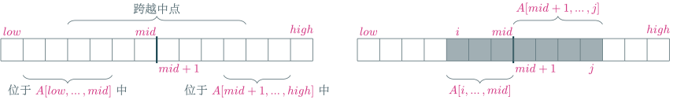
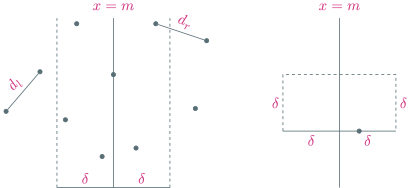
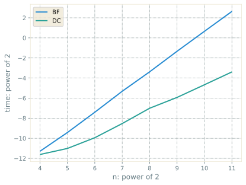
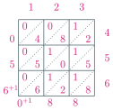
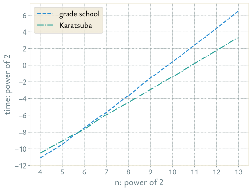
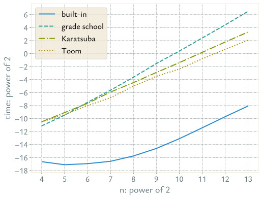
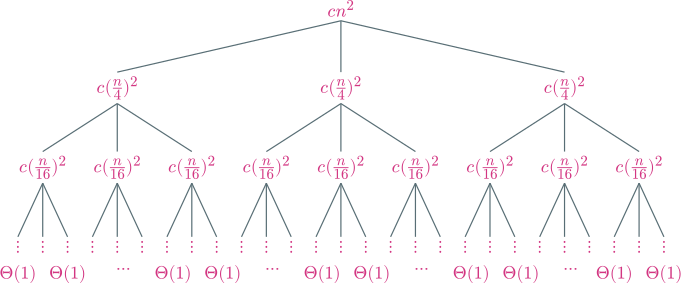
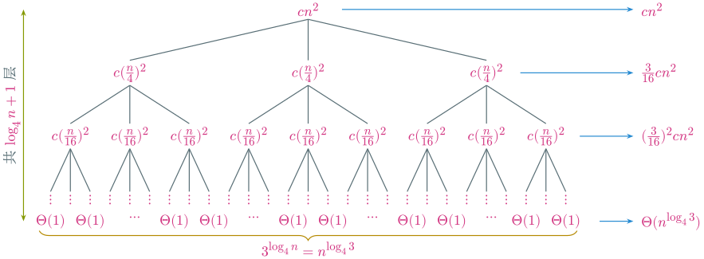
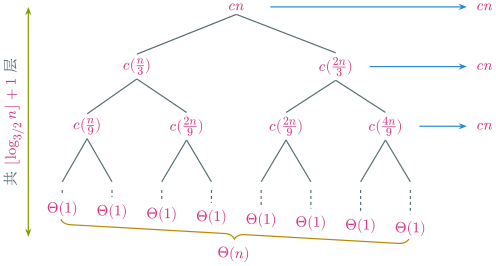

---
presentation:
  margin: 0
  center: false
  transition: "none"
  enableSpeakerNotes: true
  slideNumber: "c/t"
  navigationMode: "linear"
---

@import "../css/font-awesome-4.7.0/css/font-awesome.css"
@import "../css/theme/solarized.css"
@import "../css/logo.css"
@import "../css/font-song.css"
@import "../css/color.css"
@import "../css/margin.css"
@import "../css/table.css"
@import "../css/main.css"
@import "../plugin/zoom/zoom.js"
@import "../plugin/notes/notes.js"
@import "../plugin/customcontrols/plugin.js"
@import "../plugin/customcontrols/style.css"
@import "../plugin/chalkboard/plugin.js"
@import "../plugin/chalkboard/style.css"
@import "../plugin/reveal.js-menu/menu.js"

<!-- slide data-notes="" -->

# 算法设计与分析

## 分治

### 计算机学院&emsp;张腾

#### *tengzhang@hust.edu.cn*

<!-- slide vertical=true data-notes="" -->

##### 课程大纲

---

@import "../vega/outline-dc.json" {as="vega" .top-2}

<!-- slide data-notes="" -->

##### 分治的基本思想

---

以二等分为例

@import "../dot/dc/dc.dot" {.center .top-6}

<!-- slide vertical=true data-notes="" -->

##### 分治的设计与分析

---

分治由如下三个模块组成

- 分：将原问题分成若干同类型、规模更小的子问题，子问题规模最好相同
- 治：递归求解子问题，若子问题规模足够小，也可采用它法
- 合：合并子问题的解得到原问题的解

分治的时间分析

- 原问题规模$n$，求解时间为$T(n)$
- 子问题个数$a \ge 1$，子问题规模$n/b$，$b > 1$即子问题规模严格小于原问题
- 分解问题、合并子问题解的时间为$f(n)$

\begin{align}
    T(n) = \begin{cases} 1, & n = 1 \\ a \cdot T(n/b) + f(n), & n > 1 \end{cases}
\end{align}

递推关系的求解方法：代入法、主方法

<!-- slide vertical=true data-notes="" -->

##### 分治的时间分析初探

---

\begin{align}
    T(n) = \begin{cases} 1, & n = 1 \\ a \cdot T(n/b) + f(n), & n > 1 \end{cases}
\end{align}

假设$f(n) = c \cdot n^d$、$n = b^t$，根据递推关系有

\begin{align}
    \begin{array}{lrclcl}
        (\spadesuit) & T(b^t) & = & a \cdot T (b^{t-1}) & + & c \cdot b^{td} \\
        (\heartsuit) & T(b^{t-1}) & = & a \cdot T (b^{t-2}) & + & c \cdot b^{(t-1)d} \\
         &  & \vdots &  \\
        (\clubsuit) & T(b^1) & = & a \cdot T (1) & + & c \cdot b^d
    \end{array}
\end{align}

令$(\spadesuit) + (\heartsuit) \cdot a + \cdots + (\clubsuit) \cdot a^{t-1}$可得

\begin{align}
    T(n) = a^t \cdot T(1) + c \cdot b^{td} \left( 1 + \frac{a}{b^d} + \left( \frac{a}{b^d} \right)^2 + \cdots + \left( \frac{a}{b^d} \right)^{t-1} \right)
\end{align}

其中括号中是公比为$a / b^d$的等比数列求和

<!-- slide vertical=true data-notes="" -->

##### 分治的时间分析初探

---

\begin{align}
    T(n) = a^t \cdot T(1) + c \cdot b^{td} \left( 1 + \frac{a}{b^d} + \left( \frac{a}{b^d} \right)^2 + \cdots + \left( \frac{a}{b^d} \right)^{t-1} \right)
\end{align}

若公比为$1$，即$a = b^d$，则$T(n) = a^t \cdot T(1) + c \cdot b^{td} \cdot t$

若公比不为$1$，即$a \ne b^d$，则

\begin{align}
    T(n) = a^t \cdot T(1) + c \cdot b^{td} \cdot \frac{1 - a^t/b^{td}}{1 - a/b^d} = a^t \cdot T(1) + c \cdot \frac{b^{td} - a^t}{1 - a/b^d}
\end{align}

注意$n = b^t$，即$t = \log_b n$、$a^t = (b^{\log_b a})^t = (b^t)^{\log_b a} = n^{\log_b a}$，回代有

\begin{align}
    (\diamondsuit) \quad T(n) = 
    \begin{cases} 
        n^{\log_b a} \cdot T(1) + c \cdot n^{\log_b a} \cdot \log_b n, & 若a = b^d \\
        n^{\log_b a} \cdot T(1) + c \cdot (n^d - n^{\log_b a})/(1 - a/b^d), & 若a \ne b^d
    \end{cases}
\end{align}

 本讲后面会经常用到式$(\diamondsuit)$

<!-- slide data-notes="" -->

##### 归并排序

---

- 分：将$a[low, \ldots, high]$分成$a[low, \ldots, mid]$、$a[mid+1, \ldots, high]$两部分，为使子问题规模相同，$mid$为$(low + high)/2$取整
- 治：分别对$a[low, \ldots, mid]$和$a[mid+1, \ldots, high]$进行排序，递归实现
- 合：将排好序的$a[low, \ldots, mid]$、$a[mid+1, \ldots, high]$合并成$a[low, \ldots, high]$

@import "../codes/intro/sorting.py" {line_begin=67 line_end=73 .left4 .line-numbers .top2}

- 分：第 3 行计算分解的中间点
- 治：第 4 ~ 5 行对子数组递归调用归并排序
- 合：第 6 行合并已排好序的两个子数组

<!-- slide vertical=true data-notes="" -->

##### 归并排序

---

@import "../codes/intro/sorting.py" {line_begin=67 line_end=73 .left4 .line-numbers .top1 .bottom-10}

@import "../dot/sorting/merge-sort.dot" {.lefta .right4 .top-10}

<!-- slide vertical=true data-notes="" -->

##### 归并排序

---

合并：取两个子数组的最小元素做比较，并将小者取出

@import "../dot/sorting/merge-merge.dot" {.lefta .right4 .top0}

@import "../codes/intro/sorting.py" {line_begin=26 line_end=65 .left4 .line-numbers .top-50per}

<!-- slide data-notes="" -->

##### 归并排序 时间分析

---

\begin{align}
    T(n) = \begin{cases} 1, & n = 1 \\ 2 \cdot T (n/2) + f(n), & n > 1 \end{cases}
\end{align}

其中$f(n) = \Theta(n)$为将两个长度为$n/2$的有序数组合并的时间

- 最好情况：其中一个的最大元素小于另一个的最小元素，$f(n) = n/2$
- 最坏情况：一直要比到两个数组的最大元素，$f(n) = n-1$

代入式$(\diamondsuit)$，注意$a = 2$、$b = 2$、$d = 1$，故$a = b^d$、$\log_b a = 1$

\begin{align}
    T(n) & = n^{\log_b a} \cdot T(1) + c \cdot n^{\log_b a} \cdot \log_b n \\
    & = n \cdot T(1) + c \cdot n \cdot \log_2 n \\
    & = \Theta(n \lg n)
\end{align}

<!-- slide vertical=true data-notes="" -->

##### 归并排序 时间分析

---

式$(\diamondsuit)$假设了$n = b^t$，即$n$是$2$的幂次

若假设不成立，考虑大于$n$的最小的$2$的幂次$m$，即$n < m < 2n$

向数组末尾添加$m - n$个$\infty$，再对其进行排序

由于$n \lg n < m \lg m < 2n \lg (2n) = 2n \lg n + 2n < 4n \lg n$

因此$m \lg m = \Theta (n \lg n)$

从而$T(m) = \Theta(m \lg m) = \Theta(\Theta (n \lg n)) =  \Theta (n \lg n)$

<!-- slide data-notes="" -->

##### 逆序对计数

---

输入：长度为$n$的数组$a$

输出：$a$中逆序对数目

推荐系统中的协同过滤：甲在电影网站上列出了自己最喜爱电影 Top 10，网站如何根据其他用户的电影喜爱列表向甲推荐好友？

构造数组$a[i]$：甲最喜欢的第$i$部电影在乙的列表中的位置

- 若出现$i < j$、$a[i] > a[j]$，则甲、乙在这两部电影的喜好上有分歧
- 逆序对越多，说明甲、乙的电影审美差异越大，不宜推荐

暴力求解：二重 for 循环遍历$(i,j)$，$T(n) = \Omega(n^2)$

<!-- slide vertical=true data-notes="" -->

##### 逆序对计数 分治

---

设当前要统计子数组$a[low, \ldots, high]$的逆序对数目

- 分：$a[low, \ldots, high] = a[low, \ldots, mid] + a[mid+1, \ldots, high]$
- 治：递归求$a[low, \ldots, mid]$和$a[mid+1, \ldots, high]$的逆序对数目
- 合：跨越中点的逆序对$low \le i \le mid < j \le high$且$a[i] > a[j]$，与两个递归问题的返回值相加求和

问题：跨越中点的逆序对可能本身就有$\Theta(n^2)$个，若一个个计数，时间复杂度至少为$\Omega(n^2)$

加速关键：一次计数多个逆序对

设$(a[i], a[j])$是跨越中点的逆序对，若$a[i] \le a[i+1] \le \cdots \le a[mid]$，即升序排列，则$(a[i+1], a[j]), \ldots, (a[mid], a[j])$都是跨越中点的逆序对

<!-- slide vertical=true data-notes="" -->

##### 逆序对计数 分治

---

归并排序也是将数组二等分，$a[low, \ldots, mid]$的升序可由归并排序实现

归并排序的“合”步也是左半、右半子数组各取一个元素比大小，逆序对的计数可以融入“合”步

时间复杂度与归并排序相同

\begin{align}
    T(n) = \begin{cases} 1, & n = 1 \\ 2 \cdot T (n/2) + \Theta(n), & n > 1 \end{cases} \Longrightarrow T(n) = \Theta(n \lg n)
\end{align}

<!-- slide vertical=true data-notes="" -->

##### 逆序对计数 实现

---

@import "../codes/dc/count-inverse-pair.py" {line_begin=12 line_end=56 .left4 .line-numbers .top1 .bottom2 highlight=[11,20,33,39-42,44]}

<!-- slide data-notes="" -->

##### 快速排序

---

- 分：将最后一个元素作为{==主元==}，确定其在排好序的数组中的正确位置$m$，将小于、大于主元的元素分别挪到主元的左边、右边
- 治：分别对子数组$a[low, \ldots, m-1]$和$a[m+1, \ldots, high]$进行递归排序
- 合：什么也不做

@import "../codes/intro/sorting.py" {line_begin=98 line_end=103 .left4 .line-numbers .top2}

- 分：第 3 行计算主元的位置的正确位置
- 治：第 4 ~ 5 行对子数组递归调用快速排序

<!-- slide vertical=true data-notes="" -->

##### 快速排序

---

@import "../codes/intro/sorting.py" {line_begin=98 line_end=103 .left4 .line-numbers .top1 .bottom-10}

@import "../dot/sorting/quick-sort.dot" {.left48 .top-8}

<!-- slide vertical=true data-notes="" -->

##### 快速排序

---

@import "../codes/intro/sorting.py" {line_begin=75 line_end=96 .left4 .line-numbers .top1 .bottom-40}

@import "../dot/sorting/partition.dot" {.left60per .top-30}

<!-- slide vertical=true data-notes="" -->

##### 快速排序 时间分析

---

递推关系

\begin{align}
    T(n) = \begin{cases} 1, & n = 1 \\ T(n) = T(k) + T(n-1-k) + \Theta(n), & n > 1 \end{cases}
\end{align}

- 最好情况：主元是中位数，$T(n) = 2 \cdot T (n/2) + \Theta(n)$，同归并排序
- 最坏情况：主元是最大或最小元素，只产生一个规模为$n-1$的子问题，此时递推关系为$T(n) = T (n-1) + \Theta(n)$，易知有$T(n) = \Theta(n^2)$

如何改进？

- 随机选取主元
- 随机选取三个元素并将其中位数作为主元
- 与其它排序方法混合，比如当子问题规模较小时改用插入排序

<!-- slide data-notes="" -->

##### 最大子数组

---

某股票 17 天内的价格，哪天买进、哪天卖出，收益最大？

|  天  |   0    |  1  |  2  |  3  |  4  |  5  |  6  |  7  |  8  |  9  | 10  | 11  | 12  | 13  | 14  | 15  | 16  |
| :--: | :----: | :-: | :-: | :-: | :-: | :-: | :-: | :-: | :-: | :-: | :-: | :-: | :-: | :-: | :-: | :-: | :-: |
| 价格 |  100   | 113 | 110 | 85  | 105 | 102 | 86  | 63  | 81  | 101 | 94  | 106 | 101 | 79  | 94  | 90  | 97  |
| 变化 | &zwnj; | 13  | -3  | -25 | 20  | -3  | -16 | -23 | 18  | 20  | -7  | 12  | -5  | -22 | 15  | -4  |  7  |

收益 = 后一天的价格 - 前一天的价格，即“变化”数组中的值

第$i$天买进、第$j$天卖出，$总收益 = 变化[i+1] + \cdots + 变化[j]$

问题转化为{==寻找“变化”数组的和最大的连续子数组==}

暴力求解：二重 for 循环遍历买进、卖出的日期，$T(n) = \Omega(n^2)$

<!-- slide vertical=true data-notes="" -->

##### 最大子数组 分治

---

设当前要寻找子数组$A[low, \ldots, high]$的最大子数组

分：$A[low, \ldots, high] = A[low, \ldots, mid] + A[mid+1, \ldots, high]$

1. 最大子数组完全位于$A[low, \ldots, mid]$中，$low \le i \le j \le mid$
2. 最大子数组完全位于$A[mid+1, \ldots, high]$中，$mid < i \le j \le high$
3. 跨越了中点，$low \le i \le mid < j \le high$

治：递归求$A[low, \ldots, mid]$和$A[mid+1, \ldots, high]$的最大子数组

合：处理第 3 种情况，与前 2 种情况的最大子数组比较取最大

<!-- slide vertical=true data-notes="" -->

##### 最大子数组 分治

---

@import "../codes/dc/max-subarray-dc.py" {line_begin=0 line_end=23 .left4 .line-numbers .top1}

<!-- slide vertical=true data-notes="" -->

##### 最大子数组 跨越中点

---

数组分为$A[i, \ldots, mid]$、$A[mid+1, \ldots, j]$两部分

- 从$mid$到$low$遍历$i$，找到使得左半和最大的$A[i, \ldots, mid]$
- 从$mid+1$到$high$遍历$j$，找到使得右半和最大的$A[mid+1, \ldots, j]$

@import "../codes/dc/max-subarray-dc.py" {line_begin=25 line_end=41 .left4 .line-numbers .top2 .bottom1}

<!-- slide vertical=true data-notes="" -->

##### 最大子数组 时间分析

---

@import "../codes/dc/max-subarray-dc.py" {line_begin=25 line_end=41 .left4 .line-numbers .top1 .bottom1}

处理跨越中点的情况只需一重 for 循环，$f(n) = \Theta(n)$

\begin{align}
    T(n) = \begin{cases} 1, & n = 1 \\ 2 \cdot T (n/2) + \Theta(n), & n > 1 \end{cases} \Longrightarrow T(n) = \Theta(n \lg n)
\end{align}

<!-- slide data-notes="" -->

##### 最近点对

---

输入：$\rb^2$上的$n$个点$\sc = \{ (x_1, y_1), \ldots, (x_n, y_n) \}$

输出：最近点对的距离$d = \min_{i,j} \sqrt{(x_i - x_j)^2 + (y_i - y_j)^2}$

暴力求解：二重 for 循环遍历所有点对，$T(n) = \Omega(n^2)$

<!-- slide vertical=true data-notes="" -->

##### 最近点对 分治

---

输入：$\rb^2$上的$n$个点$\sc = \{ (x_1, y_1), \ldots, (x_n, y_n) \}$

输出：最近点对的距离$d = \min_{i,j} \sqrt{(x_i - x_j)^2 + (y_i - y_j)^2}$

分：设$x_1, \ldots, x_n$的中位数为$m$，在$m$处作垂线将$\sc$均分

1. 最近点对完全位于左半子集
2. 最近点对完全位于右半子集
3. 跨越了中线

治：递归求左半子集和右半子集的最近点对

合：处理第 3 种情况，与前 2 种情况的最近点对比较取最小

<!-- slide vertical=true data-notes="" -->

##### 最近点对 跨越中线

---

设$d_l$、$d_r$分别是递归求解出的左半、右半子集的最近点对距离

只需考虑中线左右两侧宽度为$\delta = \min \{ d_l, d_r \}$的带状区域

- 如果跨越中线的一对点其中某个点不在区域内，则其距离$> \delta$
- 按纵坐标从小到大遍历带状区域中的点，每个点最多需考虑$\class{blue}{7}$个点
- $f(n) = \Theta(n)$，从而$T(n) = 2 \cdot T(n/2) + \Theta(n) \Longrightarrow T(n) = \Theta(n \lg n)$

<!-- slide vertical=true data-notes="" -->

##### 最近点对 实现

---

@import "../codes/dc/closest-pair.py" {line_begin=5 .left4 .line-numbers .top1 highlight=[]}

<!-- slide vertical=true data-notes="" -->

##### 最近点对 实现

---

<!-- slide data-notes="" -->

##### 整数乘法

---

输入：两个$n$位整数$x = X[0, \ldots, n-1]$和$y = Y[0, \ldots, n-1]$

输出：乘积$xy = z = Z[0, \ldots, 2n-1]$

\begin{align}
    \sum_{k=0}^{2n-1} Z[k] 10^k & = z = xy = \left( \sum_{i=0}^{n-1} X[i] 10^i \right) \left( \sum_{j=0}^{n-1} X[j] 10^j \right) \\
    & = \sum_{i=0}^{n-1} \sum_{j=0}^{n-1} X[i] Y[j] 10^{i+j} = \sum_{k=0}^{2n-2} \underbrace{\class{blue}{\sum_{(i,j): i+j=k} X[i] Y[j]}}_{c_k} 10^k
\end{align}

- 左：$10^k$的线性组合，组合系数$Z[k]$是一位正整数
- 右：$10^k$的线性组合，组合系数$c_k$是若干个一位正整数的乘积

$Z[k]$和$c_k$之间的关系？

<!-- slide data-notes="" -->

##### 小学算法

---

已知$\sum_{k=0}^{2n-1} Z[k] 10^k = \sum_{k=0}^{2n-2} c_k 10^k$，其中$c_k = \sum_{(i,j): i+j=k} X[i] Y[j]$是若干个一位正整数的乘积，而$Z[k]$是一位正整数，它们的关系？

$c_0 = \sum_{(i,j): i+j=0} X[i] Y[j] = X[0] Y[0]$

- $c_0 \bmod 10$：就是$Z[0]$
- $h \gets \lfloor c_0 / 10 \rfloor$：作为进位参与$Z[1]$的计算

$c_1 = \sum_{(i,j): i+j=1} X[i] Y[j] = X[0] Y[1] + X[1] Y[0]$，再加上进位$h$

- $(c_1 + h) \bmod 10$：就是$Z[1]$
- $h \gets \lfloor (c_1 + h) / 10 \rfloor$：作为进位参与$Z[2]$的计算

如此迭代，继续计算$Z[2], Z[3], \ldots, Z[2n-1]$

<!-- slide vertical=true data-notes="" -->

##### 小学算法

---

以$x = 123$、$y = 456$、$z = 56088$为例

| $c_k$                                             |         $h$         |      $c_k + h$       |   $Z[k]$   |
| :------------------------------------------------ | :-----------------: | :------------------: | :--------: |
| $c_0 = 3 \times 6 = 18$                           |         $0$         |  $\class{red}{1}8$   | $Z[0] = 8$ |
| $c_1 = 3 \times 5 + 2 \times 6 = 27$              |  $\class{red}{1}$   | $\class{yellow}{2}8$ | $Z[1] = 8$ |
| $c_2 = 3 \times 4 + 2 \times 5 + 1 \times 6 = 28$ | $\class{yellow}{2}$ |  $\class{blue}{3}0$  | $Z[2] = 0$ |
| $c_3 = 2 \times 4 + 1 \times 5 = 13$              |  $\class{blue}{3}$  |  $\class{cyan}{1}6$  | $Z[3] = 6$ |
| $c_4 = 1 \times 4 = 4$                            |  $\class{cyan}{1}$  |         $5$          | $Z[4] = 5$ |

<!-- slide vertical=true data-notes="" -->

##### 小学算法

---

输入：$X[0, \ldots, n-1]$、$Y[0, \ldots, n-1]$

输出：$Z[0, \ldots, 2n-1]$

1. 初始化进位$c \gets 0$
2. ==for== $k = 0 \rightarrow 2n-1$
3. &emsp;&emsp;==for each== 二元组$(i,j): i+j=k$ ==do==
4. &emsp;&emsp;&emsp;&emsp;$c \gets c + X[i] Y[j]$
5. &emsp;&emsp;==end for==
6. &emsp;&emsp;$Z[k] = c \bmod 10$
7. &emsp;&emsp;下一位进位$c \gets \lfloor c/10 \rfloor$
8. ==end for==

二重 for 循环共遍历$n^2$个$(i,j)$二元组，因此$T(n) = \Theta(n^2)$

<!-- slide vertical=true data-notes="" -->

##### 小学算法 实现

---

@import "../codes/intro/integer-multiplication.py" {line_begin=20 line_end=47 .left4 .line-numbers .top1 highlight=[4,7]}

<!-- slide data-notes="" -->

##### 整数乘法 分治

---

将$x$和$y$的数位二等分，记$m = n/2$

- $a = X[0, \ldots, n-m-1]$、$b = X[n-m, \ldots, n-1]$，$x = a \cdot 10^m + b$
- $c = Y[0, \ldots, n-m-1]$、$d = Y[n-m, \ldots, n-1]$，$y = c \cdot 10^m + d$

乘积$z = xy = (a \cdot 10^m + b)(c \cdot 10^m + d) = a c \cdot 10^{2m} + (a d + b c) 10^m + b d$

- 乘法：$4$个$n/2$位数相乘，$ac$、$ad$、$bc$、$bd$
- 补零：$ac$后补$n$个、$a d + b c$前后各补$n/2$个，$bd$前补$n$个，共补$3n$个
- 加法：$3$个$2n$位数相加，一重循环遍历，逐位相加，共$4n$个加法

设$n$位数相乘的时间为$T(n)$，补零、加法的时间为$c_1$、$c_2$

\begin{align}
    T(n) = 4 \cdot T (n/2) + c_1 \cdot 3n + c_2 \cdot 4n = 4 \cdot T (n/2) + \Theta(n)
\end{align}

<!-- slide vertical=true data-notes="" -->

##### 整数乘法 分治

---

\begin{align}
    T(n) = \begin{cases} 1, & n = 1 \\ 4 \cdot T(n/2) + c n, & n > 1 \end{cases}
\end{align}

代入式$(\diamondsuit)$，注意$a = 4$、$b = 2$、$d = 1$，故$a \ne b^d$、$\log_b a = 2$

\begin{align}
    T(n) & = n^{\log_b a} \cdot T(1) + c \cdot (n^d - n^{\log_b a})/(1 - a/b^d) \\
    & = n^2 \cdot T(1) + c \cdot (n^1 - n^2)/(1 - 4 / 2^1) \\
    & = \Theta(n^2)
\end{align}

分解成$4$个规模大致减半的子问题并不改进时间复杂度

<!-- slide data-notes="" -->

##### Karatsuba 算法

---

利用$a d + b c = (a+b) (c+d) - a c - b d$可得

\begin{align}
    x y = a c \cdot 10^{2m} + ((a+b) (c+d) - a c - b d) \cdot 10^m + b d
\end{align}

$n/2$位数相乘减少为$3$个：$(a+b) (c+d)$、$a c$、$b d$，补零不变，加法次数变多但时间复杂度依然为$\Theta(n)$

\begin{align}
    T(n) = 3 \cdot T (n/2) + \Theta(n)
\end{align}

代入式$(\diamondsuit)$，注意$a = 3$、$b = 2$、$d = 1$，故$a \ne b^d$、$\log_b a = \lg 3$

\begin{align}
    T(n) & = n^{\log_b a} \cdot T(1) + c \cdot (n^d - n^{\log_b a})/(1 - a/b^d) \\
    & = n^{\lg 3} \cdot T(1) + c \cdot (n^1 - n^{\lg 3})/(1 - 3/2^1) \\
    & = \Theta(n^{\lg 3}) \approx \Theta(n^{1.58496250})
\end{align}

分解成$3$个规模大致减半的子问题可以改进时间复杂度

<!-- slide vertical=true data-notes="" -->

##### Karatsuba 算法 实现

---

@import "../codes/intro/integer-multiplication.py" {line_begin=49 line_end=67 .left4 .line-numbers .top1 highlight=[19-21,37]}

<!-- slide data-notes="" -->

##### 整数乘法 时间对比

---

<!-- slide data-notes="" -->

##### Toom 算法

---

将$x$和$y$的数位三等分，记$m = n/3$

\begin{align}
    x & = a \cdot 10^{2m} + b \cdot 10^m + c \\
    y & = d \cdot 10^{2m} + e \cdot 10^m + f
\end{align}

于是

\begin{align}
    xy = a d \cdot 10^{4m} + (a e + b d) \cdot 10^{3m} & + (af + be + cd) \cdot 10^{2m} \\
    & + (bf + ce) \cdot 10^m + cf
\end{align}

共产生$9$个子问题，有点难办！

<!-- slide vertical=true data-notes="" -->

##### Toom 算法

---

引入多项式$x(t) = a t^2 + b t + c$、$y(t) = d t^2 + e t + f$

\begin{align}
    x(t) y(t) & = a d \cdot t^4 + (a e + b d) \cdot t^3 + (af + be + cd) \cdot t^2 + (bf + ce) \cdot t + cf \\
    & \triangleq w(t) = w_4 t^4 + w_3 t^3 + w_2 t^2 + w_1 t + w_0 
\end{align}

代入$t = 10^m$ (在系数后面分别添加$4m$、$3m$、$2m$、$m$、$0$个$0$再相加) 就是$xy$，剩下只需确定$w(t)$的$5$个系数

令$t$取$5$个不同的值可得$5$变量线性方程组：

\begin{align}
    \begin{array}{lrcl}
        t = 0      : & cf                 & = & w_0                                  \\
        t = 1      : & (a+b+c)(d+e+f)     & = & w_4 + w_3 + w_2 + w_1 + w_0          \\
        t = -1     : & (a-b+c)(d-e+f)     & = & w_4 - w_3 + w_2 - w_1 + w_0          \\
        t = 2      : & (4a+2b+c)(4d+2e+f) & = & 16 w_4 + 8 w_3 + 4 w_2 + 2 w_1 + w_0 \\
        t = \infty : & ad                 & = & w_4
    \end{array}
\end{align}

<!-- slide vertical=true data-notes="" -->

##### Toom 算法

---

方程组涉及$5$个乘法子问题：

\begin{align}
    \begin{array}{l}
    s_4 \triangleq ad \\
    s_3 \triangleq (4a+2b+c)(4d+2e+f) \\
    s_2 \triangleq (a-b+c)(d-e+f) \\
    s_1 \triangleq (a+b+c)(d+e+f) \\
    s_0 \triangleq cf
    \end{array} \Longrightarrow
    \begin{array}{l}
    w_4 = s_4                                                           \\
    w_3 = (-12 s_4 + s_3 - s_2 - 3 s_1 + 3 s_0) / 6  \\
    w_2 = (-2 s_4 + s_2 + s_1 - 2 s_0) / 2                   \\
    w_1 = (12 s_4 - s_3 - 2 s_2 + 6 s_1 - 3 s_0) / 6 \\
    w_0 = s_0
    \end{array}
\end{align}

由此可得$T(n) = 5 \cdot T (n/3) + \Theta(n)$

代入式$(\diamondsuit)$，注意$a = 5$、$b = 3$、$d = 1$，故$a \ne b^d$、$\log_b a = \log_3 5$

\begin{align}
    T(n) & = n^{\log_b a} \cdot T(1) + c \cdot (n^d - n^{\log_b a})/(1 - a/b^d) \\
    & = n^{\log_3 5} \cdot T(1) + c \cdot (n^1 - n^{\log_3 5})/(1 - 5/3^1) = \Theta(n^{\log_3 5}) \approx \Theta(n^{1.46497352})
\end{align}

比 Karatsuba 算法的$\Theta(n^{\lg_3}) \approx \Theta(n^{1.58496250})$更优

<!-- slide vertical=true data-notes="" -->

##### Toom 算法 实现

---

@import "../codes/intro/integer-multiplication.py" {line_begin=69 line_end=104 .left4 .line-numbers .top1 highlight=[]}

<!-- slide data-notes="" -->

##### 整数乘法 时间对比

---

<!-- slide vertical=true data-notes="" -->

##### 一般性结论

---

将$x$、$y$作$k$等分，引入多项式

\begin{align}
    x(t) = a_{k-1} t^{k-1} + a_{k-2} t^{k-2} + \cdots + a_0, \quad y(t) = b_{k-1} t^{k-1} + b_{k-2} t^{k-2} + \cdots + b_0
\end{align}

\begin{align}
    x(t) y(t) & = a_{k-1} b_{k-1} \cdot t^{2k-2} + (a_{k-1} b_{k-2} + a_{k-2} b_{k-1}) \cdot t^{2k-3} + \cdots + a_0 b_0 \\
    & \triangleq w(t) = w_{2k-2} t^{2k-2} + w_{2k-3} t^{2k-3} + \cdots + w_0 
\end{align}

$w(t)$共有$2k-1$个系数，故$t$需取$2k-1$个不同的值，由此产生$2k-1$个规模为$n/k$的子问题，代入式$(\diamondsuit)$，注意$a = 2k-1$、$b = k$、$d = 1$，故$a \ne b^d$、$\log_b a = \log_k (2k-1)$

\begin{align}
    T(n) & = n^{\log_b a} \cdot T(1) + c \cdot (n^d - n^{\log_b a})/(1 - a/b^d) \\
    & = n^{\log_k (2k-1)} \cdot T(1) + c \cdot (n^1 - n^{\log_k (2k-1)})/(1 - (2k-1) / k^1) \\
    & = \Theta(n^{\log_k (2k-1)})
\end{align}

 Karatsuba 算法和 Toom 算法都是该结论的特例，易证$\log_k (2k-1)$关于$k$严格单调减，故$k$越大越好，但$k$越大，关于$w(t)$的$2k-1$个系数的线性方程组也越复杂，实际需取一个适中的$k$

<!-- slide data-notes="" -->

##### 矩阵加法

---

设$\Av = (a_{ij})_{n \times n}$、$\Bv = (b_{ij})_{n \times n}$为$n$阶方阵

设$\Cv  = (c_{ij})_{n \times n} = \Av + \Bv$，则$c_{ij} = a_{ij} + b_{ij}$

直接计算$\Cv = \Av + \Bv$的代码如下

@import "../codes/dc/matrix-addition.py" {line_begin=3 line_end=9 .left4 .line-numbers .top0 .bottom0 highlight=[3-4]}

因为二重 for 循环的存在，$T(n) = \Theta(n^2)$

<!-- slide vertical=true data-notes="" -->

##### 矩阵加法 分块

---

将$\Av$、$\Bv$、$\Cv$分成$4$个分块矩阵，每块$n/2 \times n/2$

\begin{align}
    \Av = \begin{bmatrix} \Av_{11} & \Av_{12} \\ \Av_{21} & \Av_{22} \end{bmatrix}, \quad \Bv = \begin{bmatrix} \Bv_{11} & \Bv_{12} \\ \Bv_{21} & \Bv_{22} \end{bmatrix}, \quad \Cv = \begin{bmatrix} \Cv_{11} & \Cv_{12} \\ \Cv_{21} & \Cv_{22} \end{bmatrix}
\end{align}

根据分块矩阵的运算法则

\begin{align}
    \begin{bmatrix} \Cv_{11} & \Cv_{12} \\ \Cv_{21} & \Cv_{22} \end{bmatrix} & = \begin{bmatrix} \Av_{11} & \Av_{12} \\ \Av_{21} & \Av_{22} \end{bmatrix} + \begin{bmatrix} \Bv_{11} & \Bv_{12} \\ \Bv_{21} & \Bv_{22} \end{bmatrix} \\[4px]
    & \Longrightarrow \begin{cases} \Cv_{11} = \Av_{11} + \Bv_{11} \\
    \Cv_{12} = \Av_{12} + \Bv_{12} \\
    \Cv_{21} = \Av_{21} + \Bv_{21} \\
    \Cv_{22} = \Av_{22} + \Bv_{22} \end{cases}
\end{align}

<!-- slide data-notes="" -->

##### 矩阵加法 分治

---

若$n = 1$，则$\Av$、$\Bv$已退化为标量，直接相加

若$n > 1$，将$\Av$、$\Bv$分成四个子矩阵

- {==复制==}四个子矩阵作为参数，递归

\begin{align}
    T(n) = \begin{cases} 1, & n = 1 \\ 4 \cdot T(n/2) + \class{blue}{\Theta(n^2)}, & n > 1 \end{cases}
\end{align}

- 直接将四个子矩阵的行列索引作为参数，递归

\begin{align}
    T(n) = \begin{cases} 1, & n = 1 \\ 4 \cdot T(n/2) + \class{blue}{\Theta(1)}, & n > 1 \end{cases}
\end{align}

<!-- slide vertical=true data-notes="" -->

##### 矩阵加法 分治 实现

---

@import "../codes/dc/matrix-addition.py" {line_begin=11 line_end=28 .left4 .line-numbers .top1}

<!-- slide vertical=true data-notes="" -->

##### 矩阵加法 分治 有复制

---

\begin{align}
    T(n) = \begin{cases} 1, & n = 1 \\ 4 \cdot T(n/2) + c n^2, & n > 1 \end{cases}
\end{align}

代入式$(\diamondsuit)$，注意$a = 4$、$b = 2$、$d = 2$，故$a = b^d$、$\log_b a = 2$

\begin{align}
    T(n) & = n^{\log_b a} \cdot T(1) + c \cdot n^{\log_b a} \cdot \log_b n \\
    & = n^2 \cdot T(1) + c \cdot n^2 \cdot \log_2 n \\
    & = \Theta(n^2 \lg n)
\end{align}

分治反而让时间复杂度更坏了

<!-- slide vertical=true data-notes="" -->

##### 矩阵加法 分治 无复制

---

\begin{align}
    T(n) = \begin{cases} 1, & n = 1 \\ 4 \cdot T(n/2) + c, & n > 1 \end{cases}
\end{align}

代入式$(\diamondsuit)$，注意$a = 4$、$b = 2$、$d = 0$，故$a \ne b^d$、$\log_b a = 2$

\begin{align}
    T(n) & = n^{\log_b a} \cdot T(1) + c \cdot (n^d - n^{\log_b a})/(1 - a/b^d) \\
    & = n^2 \cdot T(1) + c \cdot (n^0 - n^2)/(1 - 4/2^0) \\
    & = \Theta(n^2)
\end{align}

与直接相加的时间复杂度相当，分治没有带来收益

<!-- slide data-notes="" -->

##### 矩阵乘法

---

设$\Av = (a_{ij})_{n \times n}$、$\Bv = (b_{ij})_{n \times n}$为$n$阶方阵

设$\Cv  = (c_{ij})_{n \times n} = \Av \Bv$，则$c_{ij} = \sum_{k=1}^n a_{ik} b_{kj}$

直接计算$\Cv = \Av \Bv$的代码如下

@import "../codes/dc/matrix-multiply.py" {line_begin=3 line_end=10 .left4 .line-numbers .top0 .bottom0 highlight=[3-5]}

因为三重 for 循环的存在，$T(n) = \Theta(n^3)$

<!-- slide vertical=true data-notes="" -->

##### 矩阵乘法 分块

---

将$\Av$、$\Bv$、$\Cv$分成$4$个分块矩阵，每块$n/2 \times n/2$

\begin{align}
    \Av = \begin{bmatrix} \Av_{11} & \Av_{12} \\ \Av_{21} & \Av_{22} \end{bmatrix}, \quad \Bv = \begin{bmatrix} \Bv_{11} & \Bv_{12} \\ \Bv_{21} & \Bv_{22} \end{bmatrix}, \quad \Cv = \begin{bmatrix} \Cv_{11} & \Cv_{12} \\ \Cv_{21} & \Cv_{22} \end{bmatrix}
\end{align}

根据分块矩阵的运算法则

\begin{align}
    \begin{bmatrix} \Cv_{11} & \Cv_{12} \\ \Cv_{21} & \Cv_{22} \end{bmatrix} & = \begin{bmatrix} \Av_{11} & \Av_{12} \\ \Av_{21} & \Av_{22} \end{bmatrix} \begin{bmatrix} \Bv_{11} & \Bv_{12} \\ \Bv_{21} & \Bv_{22} \end{bmatrix} \\[2px]
    & = \begin{bmatrix} \Av_{11} \Bv_{11} + \Av_{12} \Bv_{21} & \Av_{11} \Bv_{12} + \Av_{12} \Bv_{22} \\ \Av_{21} \Bv_{11} + \Av_{22} \Bv_{21} & \Av_{21} \Bv_{12} + \Av_{22} \Bv_{22} \end{bmatrix} \\[2px]
    & \Longrightarrow \begin{cases} \Cv_{11} = \Av_{11} \Bv_{11} + \Av_{12} \Bv_{21} \\
    \Cv_{12} = \Av_{11} \Bv_{12} + \Av_{12} \Bv_{22} \\
    \Cv_{21} = \Av_{21} \Bv_{11} + \Av_{22} \Bv_{21} \\
    \Cv_{22} = \Av_{21} \Bv_{12} + \Av_{22} \Bv_{22} \end{cases}
\end{align}

<!-- slide data-notes="" -->

##### 矩阵乘法 分治

---

若$n = 1$，则$\Av$、$\Bv$已退化为标量，直接相乘

若$n > 1$，将$\Av$、$\Bv$分成四个子矩阵

- {==复制==}四个子矩阵作为参数，递归

\begin{align}
    T(n) = \begin{cases} 1, & n = 1 \\ 8 \cdot T(n/2) + \class{blue}{\Theta(n^2)}, & n > 1 \end{cases}
\end{align}

- 直接将四个子矩阵的行列索引作为参数，递归

\begin{align}
    T(n) = \begin{cases} 1, & n = 1 \\ 8 \cdot T(n/2) + \class{blue}{\Theta(1)}, & n > 1 \end{cases}
\end{align}

<!-- slide vertical=true data-notes="" -->

##### 矩阵乘法 分治 实现

---

@import "../codes/dc/matrix-multiply.py" {line_begin=12 line_end=32 .left4 .line-numbers .top1}

<!-- slide vertical=true data-notes="" -->

##### 矩阵乘法 分治 有复制

---

\begin{align}
    T(n) = \begin{cases} 1, & n = 1 \\ 8 \cdot T(n/2) + c n^2, & n > 1 \end{cases}
\end{align}

代入式$(\diamondsuit)$，注意$a = 8$、$b = 2$、$d = 2$，故$a \ne b^d$、$\log_b a = 3$

\begin{align}
    T(n) & = n^{\log_b a} \cdot T(1) + c \cdot (n^d - n^{\log_b a})/(1 - a/b^d) \\
    & = n^3 \cdot T(1) + c \cdot (n^2 - n^3)/(1 - 8/2^2) \\
    & = \Theta(n^3)
\end{align}

<!-- slide vertical=true data-notes="" -->

##### 矩阵乘法 分治 无复制

---

\begin{align}
    T(n) = \begin{cases} 1, & n = 1 \\ 8 \cdot T(n/2) + c, & n > 1 \end{cases}
\end{align}

代入式$(\diamondsuit)$，注意$a = 8$、$b = 2$、$d = 0$，故$a \ne b^d$、$\log_b a = 3$

\begin{align}
    T(n) & = n^{\log_b a} \cdot T(1) + c \cdot (n^d - n^{\log_b a})/(1 - a/b^d) \\
    & = n^3 \cdot T(1) + c \cdot (n^0 - n^3)/(1 - 8/2^0) \\
    & = \Theta(n^3)
\end{align}

与直接相乘的时间复杂度相当，分治没有带来收益

<!-- slide data-notes="" -->

##### 矩阵加法乘法小结

---

| &zwnj; | 方法 |  复制  |                      递推关系                       | 时间复杂度          |
| :----: | :--: | :----: | :-------------------------------------------------: | ------------------- |
|  加法  | 直接 | &zwnj; |                       &zwnj;                        | $\Theta(n^2)$       |
|   ^    | 分治 |   是   | $T(n) = 4 \cdot T(n/2) + \class{blue}{\Theta(n^2)}$ | $\Theta(n^2 \lg n)$ |
|   ^    | 分治 |   否   |  $T(n) = 4 \cdot T(n/2) + \class{blue}{\Theta(1)}$  | $\Theta(n^2)$       |
|  乘法  | 直接 | &zwnj; |                       &zwnj;                        | $\Theta(n^3)$       |
|   ^    | 分治 |   是   | $T(n) = 8 \cdot T(n/2) + \class{blue}{\Theta(n^2)}$ | $\Theta(n^3)$       |
|   ^    | 分治 |   否   |  $T(n) = 8 \cdot T(n/2) + \class{blue}{\Theta(1)}$  | $\Theta(n^3)$       |

<!-- slide vertical=true data-notes="" -->

##### 矩阵乘法的改进

---

考虑一般情况，设每次分治

- 子问题 (子矩阵相乘) 的个数为$a$
- 问题规模减半，即$b = 2$
- 允许对子矩阵做加减运算，即$f(n) = c \cdot n^2$、$d = 2$

假设$a > b^d = 4$，代入式$(\diamondsuit)$有

\begin{align}
    T(n) & = n^{\log_b a} \cdot T(1) + c \cdot (n^d - n^{\log_b a})/(1 - a/b^d) \\
    & = n^{\lg a} \cdot T(1) + c \cdot (n^2 - n^{\lg a})/(1 - a/4) \\
    & = \Theta (n^{\lg a})
\end{align}

只要$a < 8$就能优于$\Theta(n^3)$

<!-- slide data-notes="" -->

##### Strassen 矩阵乘法

---

\begin{align}
    T(n) = n^{\lg a} \cdot T(1) + c \cdot (n^2 - n^{\lg a})/(1 - a/4) = \Theta (n^{\lg a})
\end{align}

只要$a < 8$就能优于$\Theta(n^3)$

Strassen 乘法：通过多做子矩阵加法来少做子矩阵乘法

- 多做子矩阵的加法会增大$c$，但不影响，依然有$f(n) = \Theta(n^2)$
- 少做子矩阵的乘法可以减小$a$，影响显著，直接改进时间复杂度

直观例子

1. $x^2 - y^2 = (x+y)(x-y)$，前者 2 乘 1 加，后者 1 乘 2 加
2. $(a + b \imath)(c + d \imath) = ac - bd + (ad + bc) \imath = ac - bd + ((a+b)(c+d) - ac - bd) \imath$，前者 4 乘 2 加，后者 3 乘 5 加，Karatsuba 乘法就利用了该技巧

<!-- slide vertical=true data-notes="" -->

##### Strassen 矩阵乘法

---

$2$阶矩阵相乘，标准的矩阵乘法需要做$8$次乘法、$4$次加法

\begin{align}
    \begin{bmatrix} a_{11} & a_{12} \\ a_{21} & a_{22} \end{bmatrix} \begin{bmatrix} b_{11} & b_{12} \\ b_{21} & b_{22} \end{bmatrix} = \begin{bmatrix} a_{11} b_{11} + a_{12} b_{21} & a_{11} b_{12} + a_{12} b_{22} \\ a_{21} b_{11} + a_{22} b_{21} & a_{21} b_{12} + a_{22} b_{22} \end{bmatrix}
\end{align}

下面给出{==只做==}$\class{blue}{7}${==次乘法==}的实现方法

\begin{align}
    \begin{bmatrix}
        a_{11} b_{11} + a_{12} b_{21} \\
        a_{11} b_{12} + a_{12} b_{22} \\
        a_{21} b_{11} + a_{22} b_{21} \\
        a_{21} b_{12} + a_{22} b_{22}
    \end{bmatrix} =
    \underbrace{\begin{bmatrix}
        a_{11} & 0   & a_{12} & 0   \\
        0   & a_{11} & 0   & a_{12} \\
        a_{21} & 0   & a_{22} & 0   \\
        0   & a_{21} & 0   & a_{22}
    \end{bmatrix}}_{\triangleq ~ \widetilde{\Av}}
    \begin{bmatrix}
        b_{11} \\ b_{12} \\ b_{21} \\ b_{22}
    \end{bmatrix} = \widetilde{\Av}
    \begin{bmatrix}
        b_{11} \\ b_{12} \\ b_{21} \\ b_{22}
    \end{bmatrix}
\end{align}

<!-- slide vertical=true data-notes="" -->

##### Strassen 矩阵乘法

---

\begin{align}
    \begin{bmatrix}
        a_{11} b_{11} + a_{12} b_{21} \\
        a_{11} b_{12} + a_{12} b_{22} \\
        a_{21} b_{11} + a_{22} b_{21} \\
        a_{21} b_{12} + a_{22} b_{22}
    \end{bmatrix} =
    \begin{bmatrix}
        a_{11} & 0   & a_{12} & 0   \\
        0   & a_{11} & 0   & a_{12} \\
        a_{21} & 0   & a_{22} & 0   \\
        0   & a_{21} & 0   & a_{22}
    \end{bmatrix}
    \begin{bmatrix}
        b_{11} \\ b_{12} \\ b_{21} \\ b_{22}
    \end{bmatrix} \triangleq \widetilde{\Av}
    \begin{bmatrix}
        b_{11} \\ b_{12} \\ b_{21} \\ b_{22}
    \end{bmatrix}
\end{align}

假设$\widetilde{\Av} \in \rb^{4 \times 4}$可以分解成$m$个{==秩==}$\class{blue}{1}${==矩阵==} (列向量乘行向量) 的和

\begin{align}
    \widetilde{\Av} = \begin{bmatrix}
        a_{11} & 0   & a_{12} & 0   \\
        0   & a_{11} & 0   & a_{12} \\
        a_{21} & 0   & a_{22} & 0   \\
        0   & a_{21} & 0   & a_{22}
    \end{bmatrix} = \sum_{i=1}^m r_i \pv_i \qv_i^\top = \sum_{i=1}^m r_i
    \begin{bmatrix}
        p_{i1} \\ p_{i2} \\ p_{i3} \\ p_{i4}
    \end{bmatrix}
    \begin{bmatrix}
        q_{i1} \\ q_{i2} \\ q_{i3} \\ q_{i4}
    \end{bmatrix}^\top
\end{align}

且满足

- 系数$r_i$只由$a_{11}, a_{12}, a_{21}, a_{22}$进行加减运算得到
- 行列向量的元素$p_{i1}, \ldots,p_{i4}, q_{i1}, \ldots, q_{i4} \in \{ \pm 1, 0 \}$

<!-- slide vertical=true data-notes="" -->

##### Strassen 矩阵乘法

---

代入$\widetilde{\Av}$的形式有

\begin{align}
    & \begin{bmatrix}
        a_{11} b_{11} + a_{12} b_{21} \\
        a_{11} b_{12} + a_{12} b_{22} \\
        a_{21} b_{11} + a_{22} b_{21} \\
        a_{21} b_{12} + a_{22} b_{22}
    \end{bmatrix} = \widetilde{\Av}
    \begin{bmatrix}
        b_{11} \\ b_{12} \\ b_{21} \\ b_{22}
    \end{bmatrix} = \sum_{i=1}^m r_i
    \begin{bmatrix}
        p_{i1} \\ p_{i2} \\ p_{i3} \\ p_{i4}
    \end{bmatrix}
    \begin{bmatrix}
        q_{i1} \\ q_{i2} \\ q_{i3} \\ q_{i4}
    \end{bmatrix}^\top
    \begin{bmatrix}
        b_{11} \\ b_{12} \\ b_{21} \\ b_{22}
    \end{bmatrix} \\
    & \qquad = \sum_{i=1}^m r_i
    \begin{bmatrix}
        p_{i1} \\ p_{i2} \\ p_{i3} \\ p_{i4}
    \end{bmatrix} s_i = \sum_{i=1}^m t_i
    \begin{bmatrix}
        p_{i1} \\ p_{i2} \\ p_{i3} \\ p_{i4}
    \end{bmatrix} = \begin{bmatrix}
        p_{11} t_1 + \cdots + p_{m1} t_m \\
        p_{12} t_1 + \cdots + p_{m2} t_m \\
        p_{13} t_1 + \cdots + p_{m3} t_m \\
        p_{14} t_1 + \cdots + p_{m4} t_m
    \end{bmatrix}
\end{align}

- 由于$q_{i1}, \ldots, q_{i4} \in \{ \pm 1, 0 \}$，$s_i$只由$b_{11}, b_{12}, b_{21}, b_{22}$进行加减运算得到
- 计算全部$m$个$t_i = r_i s_i$需做$m$次乘法
- 由于$p_{i1}, \ldots, p_{i4} \in \{ \pm 1, 0 \}$，最后一步也只需对$t_1, \ldots, t_m$进行加减运算

<!-- slide data-notes="" -->

##### Strassen 矩阵乘法

---

关键：如何将$\widetilde{\Av}$可以分解成$m$个{==秩==}$\class{blue}{1}${==矩阵==}的和，其中$m < 8$

\begin{align}
    \widetilde{\Av} = \begin{bmatrix}
        a_{11} & 0   & a_{12} & 0   \\
        0   & a_{11} & 0   & a_{12} \\
        a_{21} & 0   & a_{22} & 0   \\
        0   & a_{21} & 0   & a_{22}
    \end{bmatrix} = \sum_{i=1}^m r_i \pv_i \qv_i^\top = \sum_{i=1}^m r_i
    \begin{bmatrix}
        p_{i1} \\ p_{i2} \\ p_{i3} \\ p_{i4}
    \end{bmatrix}
    \begin{bmatrix}
        q_{i1} \\ q_{i2} \\ q_{i3} \\ q_{i4}
    \end{bmatrix}^\top
\end{align}

且满足

- 系数$r_i$只由$a_{11}, a_{12}, a_{21}, a_{22}$进行加减运算得到
- 行列向量的元素$p_{i1}, \ldots,p_{i4}, q_{i1}, \ldots, q_{i4} \in \{ \pm 1, 0 \}$

<!-- slide vertical=true data-notes="" -->

##### Strassen 矩阵乘法

---

首先去掉左上的$a_{11}$和右下的$a_{22}$

\begin{align}
    \widetilde{\Av} & = \begin{bmatrix}
        a_{11} & 0   & a_{12} & 0   \\
        0   & a_{11} & 0   & a_{12} \\
        a_{21} & 0   & a_{22} & 0   \\
        0   & a_{21} & 0   & a_{22}
    \end{bmatrix} =
    \begin{bmatrix}
        a_{11} & 0 & a_{11} & 0 \\
        0   & 0 & 0   & 0 \\
        a_{11} & 0 & a_{11} & 0 \\
        0   & 0 & 0   & 0
    \end{bmatrix} +
    \begin{bmatrix}
        0 & 0 & 0 & 0 \\ 0 & a_{22} & 0 & a_{22} \\ 0 & 0 & 0 & 0 \\ 0 & a_{22} & 0 & a_{22}
    \end{bmatrix} \\
    & \qquad +
    \begin{bmatrix}
        0 & 0 & a_{12} - a_{11} & 0 \\ 0 & a_{11} - a_{22} & 0 & a_{12} - a_{22} \\ a_{21} - a_{11} & 0 & a_{22} - a_{11} & 0 \\ 0 & a_{21} - a_{22} & 0 & 0
    \end{bmatrix} \\
    & = a_{11} \begin{bmatrix}
        1 \\ 0 \\ 1 \\ 0
    \end{bmatrix}
    \begin{bmatrix}
        1 \\ 0 \\ 1 \\ 0
    \end{bmatrix}^\top + a_{22} \begin{bmatrix}
        0 \\ 1 \\ 0 \\ 1
    \end{bmatrix}
    \begin{bmatrix}
        0 \\ 1 \\ 0 \\ 1
    \end{bmatrix}^\top + \widetilde{\Av}'
\end{align}

<!-- slide vertical=true data-notes="" -->

##### Strassen 矩阵乘法

---

再去掉中间的$a_{11} - a_{22}$

\begin{align}
    & \widetilde{\Av}' = \begin{bmatrix}
        0 & 0 & a_{12} - a_{11} & 0 \\ 0 & a_{11} - a_{22} & 0 & a_{12} - a_{22} \\ a_{21} - a_{11} & 0 & a_{22} - a_{11} & 0 \\ 0 & a_{21} - a_{22} & 0 & 0
    \end{bmatrix} \\
    & = \begin{bmatrix}
             0 & 0 & 0 & 0 \\ 0 & a_{11} - a_{22} & a_{11} - a_{22} & 0 \\ 0 & a_{22} - a_{11} & a_{22} - a_{11} & 0 \\ 0 & 0 & 0 & 0
         \end{bmatrix} +
    \begin{bmatrix}
        0 & 0 & a_{12} - a_{11}              & 0              \\
        0 & 0 & a_{22} - a_{11} & a_{12} - a_{22} \\
        0 & 0 & 0              & 0              \\
        0 & 0 & 0              & 0
    \end{bmatrix}                                                                                                                                                                     \\
     & +
    \begin{bmatrix}
        0              & 0              & 0 & 0 \\
        0              & 0              & 0 & 0 \\
        a_{21} - a_{11} & a_{11} - a_{22} & 0 & 0 \\
        0              & a_{21} - a_{22}              & 0 & 0
    \end{bmatrix} = (a_{11} - a_{22}) \begin{bmatrix}
        0 \\ 1 \\ -1 \\ 0
    \end{bmatrix}
    \begin{bmatrix}
        0 \\ 1 \\ 1 \\ 0
    \end{bmatrix}^\top + \widetilde{\Av}'' + \widetilde{\Av}'''
\end{align}

<!-- slide vertical=true data-notes="" -->

##### Strassen 矩阵乘法

---

最后分解$\widetilde{\Av}''$和$\widetilde{\Av}'''$

\begin{align}
    \widetilde{\Av}'' & = \begin{bmatrix}
        0 & 0 & a_{12} - a_{11}              & 0              \\
        0 & 0 & a_{22} - a_{11} & a_{12} - a_{22} \\
        0 & 0 & 0              & 0              \\
        0 & 0 & 0              & 0
    \end{bmatrix} \\
    & = \begin{bmatrix}
        0 & 0 & 0              & 0              \\
        0 & 0 & a_{22} - a_{12} & a_{12} - a_{22} \\
        0 & 0 & 0              & 0              \\
        0 & 0 & 0              & 0
    \end{bmatrix} +
    \begin{bmatrix}
        0 & 0 & a_{12} - a_{11} & 0 \\
        0 & 0 & a_{12} - a_{11} & 0 \\
        0 & 0 & 0              & 0 \\
        0 & 0 & 0              & 0
    \end{bmatrix} \\
    & = (a_{12} - a_{22}) \begin{bmatrix}
        0 \\ 1 \\ 0 \\ 0
    \end{bmatrix}
    \begin{bmatrix}
        0 \\ 0 \\ -1 \\ 1
    \end{bmatrix}^\top + (a_{11} - a_{12})
    \begin{bmatrix}
        1 \\ 1 \\ 0 \\ 0
    \end{bmatrix}
    \begin{bmatrix}
        0 \\ 0 \\ -1 \\ 0
    \end{bmatrix}^\top
\end{align}

<!-- slide vertical=true data-notes="" -->

##### Strassen 矩阵乘法

---

最后分解$\widetilde{\Av}''$和$\widetilde{\Av}'''$

\begin{align}
    \widetilde{\Av}''' & = \begin{bmatrix}
        0              & 0              & 0 & 0 \\
        0              & 0              & 0 & 0 \\
        a_{21} - a_{11} & a_{11} - a_{22} & 0 & 0 \\
        0              & a_{21} - a_{22}              & 0 & 0
    \end{bmatrix} \\
    & = \begin{bmatrix}
        0              & 0              & 0 & 0 \\
        0              & 0              & 0 & 0 \\
        a_{21} - a_{11} & a_{11} - a_{21} & 0 & 0 \\
        0              & 0              & 0 & 0
    \end{bmatrix} +
    \begin{bmatrix}
        0 & 0              & 0 & 0 \\
        0 & 0              & 0 & 0 \\
        0 & a_{21} - a_{22} & 0 & 0 \\
        0 & a_{21} - a_{22} & 0 & 0
    \end{bmatrix} \\
    & = (a_{11} - a_{21})
    \begin{bmatrix}
        0 \\ 0 \\ 1 \\ 0
    \end{bmatrix}
    \begin{bmatrix}
        -1 \\ 1 \\ 0 \\ 0
    \end{bmatrix}^\top + (a_{21} - a_{22})
    \begin{bmatrix}
        0 \\ 0 \\ 1 \\ 1
    \end{bmatrix}
    \begin{bmatrix}
        0 \\ 1 \\ 0 \\ 0
    \end{bmatrix}^\top
\end{align}

<!-- slide data-notes="" -->

##### Strassen 矩阵乘法

---

\begin{align}
    \widetilde{\Av} & = \underbrace{a_{11}}_{r_1} \begin{bmatrix}
        1 \\ 0 \\ 1 \\ 0
    \end{bmatrix}
    \begin{bmatrix}
        1 \\ 0 \\ 1 \\ 0
    \end{bmatrix}^\top + \underbrace{a_{22}}_{r_2} \begin{bmatrix}
        0 \\ 1 \\ 0 \\ 1
    \end{bmatrix}
    \begin{bmatrix}
        0 \\ 1 \\ 0 \\ 1
    \end{bmatrix}^\top + \underbrace{(a_{11} - a_{22})}_{r_3} \begin{bmatrix}
        0 \\ 1 \\ -1 \\ 0
    \end{bmatrix}
    \begin{bmatrix}
        0 \\ 1 \\ 1 \\ 0
    \end{bmatrix}^\top \\
    & ~ + \underbrace{(a_{12} - a_{22})}_{r_4} \begin{bmatrix}
        0 \\ 1 \\ 0 \\ 0
    \end{bmatrix}
    \begin{bmatrix}
        0 \\ 0 \\ -1 \\ 1
    \end{bmatrix}^\top + \underbrace{(a_{11} - a_{12})}_{r_5}
    \begin{bmatrix}
        1 \\ 1 \\ 0 \\ 0
    \end{bmatrix}
    \begin{bmatrix}
        0 \\ 0 \\ -1 \\ 0
    \end{bmatrix}^\top \\
    & ~ + \underbrace{(a_{11} - a_{21})}_{r_6}
    \begin{bmatrix}
        0 \\ 0 \\ 1 \\ 0
    \end{bmatrix}
    \begin{bmatrix}
        -1 \\ 1 \\ 0 \\ 0
    \end{bmatrix}^\top + \underbrace{(a_{21} - a_{22})}_{r_7}
    \begin{bmatrix}
        0 \\ 0 \\ 1 \\ 1
    \end{bmatrix}
    \begin{bmatrix}
        0 \\ 1 \\ 0 \\ 0
    \end{bmatrix}^\top = \sum_{i=1}^7 r_i \pv_i \qv_i^\top
\end{align}

- 系数$r_1, \ldots, r_7$只由$a_{11}, a_{12}, a_{21}, a_{22}$进行加减运算得到
- 向量$\pv_1, \ldots, \pv_7, \qv_1, \ldots, \qv_7$的元素$\in \{ \pm 1, 0 \}$

<!-- slide vertical=true data-notes="" -->

##### Strassen 矩阵乘法

---

根据上面的分解

\begin{align}
    \begin{bmatrix}
        s_1 \\ s_2 \\ s_3 \\ s_4 \\ s_5 \\ s_6 \\ s_7
    \end{bmatrix} =
    \begin{bmatrix}
        1    & 0 & 1    & 0 \\
        0 & 1    & 0 & 1    \\
        0 & 1    & 1    & 0 \\
        0 & 0 & -1    & 1   \\
        0 & 0 & -1    & 0 \\
        -1    & 1   & 0 & 0 \\
        0 & 1    & 0 & 0
    \end{bmatrix}
    \begin{bmatrix}
        b_{11} \\ b_{12} \\ b_{21} \\ b_{22}
    \end{bmatrix} =
    \begin{bmatrix}
        b_{11} + b_{21} \\ b_{12} + b_{22} \\ b_{12} + b_{21} \\ b_{22} - b_{21} \\ -b_{21} \\ b_{12} - b_{11} \\ b_{12}
    \end{bmatrix}, ~
    \begin{bmatrix}
        r_1 \\ r_2 \\ r_3 \\ r_4 \\ r_5 \\ r_6 \\ r_7
    \end{bmatrix} =
    \begin{bmatrix}
        a_{11} \\ a_{22} \\ a_{11} - a_{22} \\ a_{12} - a_{22} \\ a_{11} - a_{12} \\ a_{11} - a_{21} \\ a_{21} - a_{22}
    \end{bmatrix}
\end{align}

- 计算$s_1, \ldots, s_7, r_1, \ldots, r_7$共会产生$10$次加减运算
- 计算$t_1 = r_1 s_1, \ldots, t_7 = r_7 s_7$共会产生$7$次乘法运算

<!-- slide vertical=true data-notes="" -->

##### Strassen 矩阵乘法

---

最后计算

\begin{align}
    \begin{bmatrix}
        a_{11} b_{11} + a_{12} b_{21} \\
        a_{11} b_{12} + a_{12} b_{22} \\
        a_{21} b_{11} + a_{22} b_{21} \\
        a_{21} b_{12} + a_{22} b_{22}
    \end{bmatrix}
     & =
    t_1 \begin{bmatrix}
        1 \\ 0 \\ 1 \\ 0
    \end{bmatrix} +
    t_2 \begin{bmatrix}
        0 \\ 1 \\ 0 \\ 1
    \end{bmatrix} +
    t_3 \begin{bmatrix}
        0 \\ 1 \\ -1 \\ 0
    \end{bmatrix} +
    t_4 \begin{bmatrix}
        0 \\ 1 \\ 0 \\ 0
    \end{bmatrix} +
    t_5 \begin{bmatrix}
        1 \\ 1 \\ 0 \\ 0
    \end{bmatrix} \\
    & \quad + t_6 \begin{bmatrix}
        0 \\ 0 \\ 1 \\ 0
    \end{bmatrix} +
    t_7 \begin{bmatrix}
        0 \\ 0 \\ 1 \\ 1
    \end{bmatrix} = \begin{bmatrix}
        t_1 + t_5 \\ t_2 + t_3 + t_4 + t_5 \\ t_1 - t_3 + t_6 + t_7 \\ t_2 + t_7
    \end{bmatrix}
\end{align}

共会产生$8$次加减运算，一共$18$次加减运算

Strassen 矩阵乘法：$8$次乘法、$4$次加法 => $7$次乘法、$18$次加法

<!-- slide vertical=true data-notes="" -->

##### Strassen 矩阵乘法

---

@import "../codes/dc/matrix-multiply.py" {line_begin=34 line_end=90 .left4 .line-numbers .top1}

<!-- slide data-notes="" -->

##### Strassen 矩阵乘法改进

---

Strassen 矩阵乘法：$a = 7$、$b = 2$、$T(n) = \Theta(n^{\lg 7})$

自 1969 年 V. Strassen 提出上述方法后，后续改进沿用其思路

时隔 9 年，1978 年 V. Pan 发现

- $68$分，$132464$个子问题，$T(n) = \Theta(n^{\log_{68} 132464}) \approx \Theta(n^{2.795128})$
- $70$分，$143640$个子问题，$T(n) = \Theta(n^{\log_{70} 143640}) \approx \class{blue}{\Theta(n^{2.795122})}$
- $72$分，$155424$个子问题，$T(n) = \Theta(n^{\log_{72} 155424}) \approx \Theta(n^{2.795147})$

2014 年最好结果$T(n) \approx \Theta(n^{2.3728639})$
2021 年最好结果$T(n) \approx \Theta(n^{2.3728596})$，7 年改进了$0.0000043$

<!-- slide data-notes="" -->

##### 递归式求解

---

常用的求解方法

- 代入法
- 主方法

<!-- slide vertical=true data-notes="" -->

##### 代入法

---

分两步：

1. 猜测解的形式
2. 用数学归纳法求出解中的常数，并证明解是正确的

如何猜测？

- 根据经验，以前是否碰到形式上类似的表达式？
- 根据递归树确定

<!-- slide data-notes="" -->

##### 代入法 取整可忽略

---

例：$T(n) = \begin{cases} 1, & n = 1 \\ 2 \cdot T(\lfloor n/2 \rfloor) + n, & n > 1 \end{cases}$

这个形式仅比归并排序的递推关系多了个向下取整

当$n$很大时取整的影响微乎其微，有理由猜测$T(n) = O(n \lg n)$

下面用数学归纳法证明$T(n) \le c n \lg n$，其中$c$是待定正常数

假设该上界对任意$m < n$都成立，特别的对$\lfloor n/2 \rfloor$也成立

\begin{align}
    T(n) & = 2 \cdot T(\lfloor n/2 \rfloor) + n \\
    & \le 2 c \lfloor n/2 \rfloor \lg \lfloor n/2 \rfloor + n \quad \gets 归纳假设 \\
    & \le 2 c (n/2) \lg (n/2) + n \\
    & = cn \lg n - (c-1)n \\
    & \le cn \lg n \quad \gets 如果 c \ge 1
\end{align}

<!-- slide vertical=true data-notes="" -->

##### 代入法 取整可忽略

---

例：$T(n) = \begin{cases} 1, & n = 1 \\ 2 \cdot T(\lfloor n/2 \rfloor) + n, & n > 1 \end{cases}$，求证$T(n) \le c n \lg n$

最后考虑边界条件，当$n=1$时，则$T(1) = 1 \not \le c \lg 1 = 0$

将边界条件替换为$T(2)$、$T(3)$

- $T(2) = 4 \le c 2 \lg 2 \Longrightarrow c \ge 2$
- $T(3) = 5 \le c 3 \lg 3 \Longrightarrow c \ge 5 / 3 \lg 3$

取$c=2$可以使上界对$n=2,3$成立

综上：$T(n) \le 2 n \lg n$对任意$n \ge 2$成立，即$T(n) = O(n \lg n)$

之后不再讨论边界条件的证明细节，取充分大的$c$即可

<!-- slide data-notes="" -->

##### 代入法 常数可忽略

---

例：$T(n) = \begin{cases} 1, & n = 1 \\ 2 \cdot T(\lfloor n/2 \rfloor + 17) + n, & n > 1 \end{cases}$

这个形式仅比前一个例子多了个$+17$

当$n$很大时$+17$的影响微乎其微，继续猜测$T(n) \le c n \lg n$

\begin{align}
    T(n) & = 2 \cdot T(\lfloor n/2 \rfloor + 17) + n \\
    & \le 2 c (\lfloor n/2 \rfloor + 17) \lg (\lfloor n/2 \rfloor + 17) + n \\
    & \le 2 c (n/2 + 17) \lg (n/2 + 17) + n \\
    & = c (n+34) (\lg (n+34) - 1) + n
\end{align}

出现了$\lg (n+34)$，没法推导下去了

修改猜测为$T(n) \le c (n-t) \lg (n-t) = O(n \lg n)$，用$t$把$+34$消掉

<!-- slide vertical=true data-notes="" -->

##### 代入法 常数可忽略

---

例：$T(n) = \begin{cases} 1, & n = 1 \\ 2 \cdot T(\lfloor n/2 \rfloor + 17) + n, & n > 1 \end{cases}$

猜测：$T(n) \le c (n-t) \lg (n-t) = O(n \lg n)$

\begin{align}
    T(n) & = 2 \cdot T (\lfloor n/2 \rfloor + 17) + n \\
    & \le 2 c (\lfloor n/2 \rfloor + 17 - t) \lg (\lfloor n/2 \rfloor + 17 - t) + n \quad \gets \text{归纳假设} \\
    & \le c (n + 34 - 2t) (\lg (n + 34 - 2t) - 1) + n \\
    & = c (n + 34 - 2t) \lg (n + 34 - 2t) - ((c-1)n - 34c + 2ct) \\
    & \le c (n + 34 - 2t) \lg (n + 34 - 2t)
\end{align}

令$34 - 2t = -t$得$t = 34$，最后一个不等号成立只需$c \ge 1$

综上，$T(n) \le c (n-34) \lg (n-34) = O(n \lg n)$

向上取整等于向下取整加$1$，故向上取整也可忽略

<!-- slide data-notes="" -->

##### 代入法 减去低阶项

---

猜出了正确的渐进界，却卡在了归纳证明

假设不够强，减去一个低阶项

例：$T(n) = \begin{cases} 1, & n = 1 \\ T(\lfloor n/2 \rfloor) + T(\lceil n/2 \rceil) + 1, & n > 1 \end{cases}$

- 取整可忽略，递推关系变成$T(n) = 2 \cdot T(n/2) + 1$
- 当$n$很大时，最后$+1$的影响也微乎其微
- $T(n)$是$T(n/2)$的 2 倍，有理由猜测$T(n) = O(n)$

设$T(n) \le cn$，于是

\begin{align}
    T(n) & = T(\lfloor n/2 \rfloor) + T(\lceil n/2 \rceil) + 1 \\
    & \le c \lfloor n/2 \rfloor + c \lceil n/2 \rceil + 1 \\
    & = cn + 1 \not \le cn
\end{align}

<!-- slide vertical=true data-notes="" -->

##### 代入法 减去低阶项

---

例：$T(n) = \begin{cases} 1, & n = 1 \\ T(\lfloor n/2 \rfloor) + T(\lceil n/2 \rceil) + 1, & n > 1 \end{cases}$

设$T(n) \le cn - d$，其中$d$是待定常数，于是

\begin{align}
    T(n) & = T(\lfloor n/2 \rfloor) + T(\lceil n/2 \rceil) + 1 \\
    & \le c \lfloor n/2 \rfloor - d + c \lceil n/2 \rceil - d + 1 \\
    & = cn - 2d + 1 \\
    & \le cn - d
\end{align}

最后一个不等号成立只需$d \ge 1$

<!-- slide vertical=true data-notes="" -->

##### 代入法 减去低阶项

---

例：$T(n) = \begin{cases} 1, & n = 1 \\ 2 \cdot T(n-1) + 1, & n > 1 \end{cases}$

忽略的最后$+1$，有理由猜测$T(n) = O(2^n)$，设$T(n) \le c \cdot 2^n$

\begin{align}
    T(n) = 2 \cdot T(n-1) + 1 \le 2 c \cdot 2^{n-1} + 1 = c \cdot 2^n + 1 \not \le c \cdot 2^n
\end{align}

设$T(n) \le c \cdot 2^n - d$，则

\begin{align}
    T(n) & = 2 \cdot T(n-1) + 1 \\
    & \le 2 (c \cdot 2^{n-1} - d) + 1 \\
    & = c \cdot 2^n - 2 d + 1 \\
    & \le c \cdot 2^n - d
\end{align}

最后一个不等号成立只需$d \ge 1$

<!-- slide data-notes="" -->

##### 代入法 变量代换

---

例：$T(n) = 2 \cdot T (\lfloor \sqrt{n} \rfloor) + \lg n$

先令$m = \lg n$即$n = 2^m$去掉$\lg n$，则$T(2^m) = 2 \cdot T (\lfloor \sqrt{2^m} \rfloor) + m$

忽略取整有$T(2^m) = 2 \cdot T (2^{m/2}) + m$

令$S(m) = T(2^m)$，则$S(m) = 2 \cdot S(m/2) + m = \Theta(m \lg m)$

回代可得$T(n) = \Theta( \lg n \cdot \lg \lg n )$

<!-- slide vertical=true data-notes="" -->

##### 代入法 变量代换

---

例：$T(n) = 2 \cdot T (\lfloor \sqrt{n} \rfloor) + \lg n$

先证$T(n) = O(\lg n \cdot \lg \lg n)$，设$T(n) \le c \cdot \lg n \cdot \lg \lg n$

\begin{align}
    T(n) & = 2 \cdot T (\lfloor \sqrt{n} \rfloor) + \lg n \\
    & \le 2 c \cdot \lg \lfloor \sqrt{n} \rfloor \cdot \lg (\lg \lfloor \sqrt{n} \rfloor) + \lg n \\
    & \le 2 c \cdot \lg \sqrt{n} \cdot \lg (\lg \sqrt{n}) + \lg n \\
    & = c \cdot \lg n \cdot \lg (\lg n / 2) + \lg n \\
    & = c \cdot \lg n \cdot (\lg \lg n - 1) + \lg n \\
    & = c \cdot \lg n \cdot \lg \lg n - (c - 1) \lg n \\
    & \le c \cdot \lg n \cdot \lg \lg n
\end{align}

最后一个不等号成立只需$c \ge 1$

<!-- slide vertical=true data-notes="" -->

##### 代入法 变量代换

---

例：$T(n) = 2 \cdot T (\lfloor \sqrt{n} \rfloor) + \lg n$

再证$T(n) = \Omega (\lg n \cdot \lg \lg n)$，设$T(n) \ge c \cdot \lg (n+3) \cdot \lg \lg (n+3)$

\begin{align}
    T(n) & = 2 \cdot T (\lfloor \sqrt{n} \rfloor) + \lg n \\
    & \ge 2 c \cdot \lg (\lfloor \sqrt{n} \rfloor + 3) \cdot \lg \lg (\lfloor \sqrt{n} \rfloor + 3) + \lg n \\
    & \ge 2 c \cdot \lg (\sqrt{n}+2) \cdot \lg \lg (\sqrt{n}+2) + \lg n \\
    & \ge 2 c \cdot \lg \sqrt{n+3} \cdot \lg \lg \sqrt{n+3} + \lg n \\
    & = c \cdot \lg (n+3) \cdot (\lg \lg (n+3) - 1) + \lg n \\
    & = c \cdot \lg (n+3) \cdot \lg \lg (n+3) + \lg n - c \cdot \lg (n+3) \\
    & \ge c \cdot \lg (n+3) \cdot \lg \lg (n+3)
\end{align}

当$c = 1/2$时，最后一个不等号对$\forall n \ge 3$成立

<!-- slide data-notes="" -->

##### 递归树

---

递归树可用来生成好的猜测

$T(n) = 3 \cdot T(n/4) + c n^2$的递归树如下

<!-- slide vertical=true data-notes="" -->

##### 递归树

---

\begin{align}
    T(n) = 3 \cdot T(n/4) + c n^2
\end{align}

- 每个结点表示某个单一子问题的时间复杂度
- 第$i$层共有$3^i$个结点，对应第$i$层递归调用，总层数为$\log_4 n + 1$
- 叶结点为递归调用的边界情况，共有$3^{\log_4 n} = n^{\log_4 3}$个
- 所有结点上的值的和即为$T(n)$

<!-- slide vertical=true data-notes="" -->

##### 递归树

---

\begin{align}
    T(n) = 3 \cdot T(n/4) + c n^2
\end{align}

\begin{align}
    T(n) & = n^{\log_4 3} \cdot \Theta(1) + cn^2 \frac{1 - 3^{\log_4 n} / 16^ {\log_4 n}}{1 - 3/16} \\
    & = n^{\log_4 3} \cdot \Theta(1) + c \frac{16}{13} ( n^2 - n^{\log_4 3} )
\end{align}

<!-- slide data-notes="" -->

##### 递归树 _vs._ 累加求和

---

\begin{align}
    T(n) = 3 \cdot T(n/4) + c n^2
\end{align}

递归树的结果

\begin{align}
    T(n) = n^{\log_4 3} \cdot \Theta(1) + c \frac{16}{13} ( n^2 - n^{\log_4 3} )
\end{align}

累加求和的结果，代入式$(\diamondsuit)$，注意$a = 3$、$b = 4$、$d = 2$，故$a \ne b^d$

\begin{align}
    T(n) & = n^{\log_b a} \cdot T(1) + c \cdot (n^d - n^{\log_b a})/(1 - a/b^d) \\
    & = n^{\log_4 3} \cdot T(1) + c \cdot (n^2 - n^{\log_4 3})/(1 - 3/4^2) \\
    & = n^{\log_4 3} \cdot T(1) + c \cdot \frac{16}{13} \cdot (n^2 - n^{\log_4 3})
\end{align}

- 第一项对应递归树中叶结点的和
- 第二项对应递归树中内部结点的和

<!-- slide data-notes="" -->

##### 递归树 + 代入法

---

猜测$T(n) = 3 \cdot T(n/4) + c n^2 = O(n^2)$

用代入法证明，设$T(n) \le d n^2$，则

\begin{align}
    T(n) & = 3 \cdot T(n/4) + c n^2 \\
    & \le 3 \cdot d (n/4)^2 + c n^2 \\
    & = (3d/16 + c) n^2 \\
    & \le d n^2
\end{align}

最后一个不等号成立只需$d \ge (16/13) c$

又$T(n) \ge c n^2 = \Omega(n^2)$的代价，因此$T(n) = \Theta(n^2)$

<!-- slide data-notes="" -->

##### 递归树 非平衡子问题

---

例：$T(n) = T(n/3) + T(2n/3) + c n$

- 最浅分支共$\lfloor \log_3 n \rfloor + 1$层，最深分支共$\lfloor \log_{3/2} n \rfloor + 1$层，层数$h = \Theta(\lg n)$
- 前$\lfloor \log_3 n \rfloor$层结点行和为$cn$，其后不超过$cn$，内部结点代价$\Theta(n \lg n)$
- 叶结点个数$L(n) = L(n/3) + L(2n/3) \Longrightarrow L(n) = \Theta(n)$，叶结点代价$\Theta(n)$

<!-- slide vertical=true data-notes="" -->

##### 递归树 非平衡子问题

---

例：$T(n) = T(n/3) + T(2n/3) + c n$，猜测$T(n) = \Theta(n \lg n)$

注意

\begin{align}
    \frac{dn}{3} \lg \frac{n}{3} + \frac{2dn}{3} \lg \frac{2n}{3} & = d n \lg n + \frac{dn}{3} \lg \frac{1}{3} + \frac{2dn}{3} \lg \frac{2}{3} \\
    & = d n \lg n - \left( \lg 3 - \frac{2}{3} \right) dn
\end{align}

欲证$d_1 n \lg n \le T(n) \le d_2 n \lg n$，只需取$d_1$、$d_2$满足

\begin{align}
    T(n) & \le d_2 n \lg n - \left( \lg 3 - \frac{2}{3} \right) d_2 n + cn \le d_2 n \lg n \\
    T(n) & \ge d_1 n \lg n - \left( \lg 3 - \frac{2}{3} \right) d_1 n + cn \ge d_1 n \lg n
\end{align}

<!-- slide data-notes="" -->

##### 主方法

---

主定理：设$T(n) = a \cdot T(n/b) + f(n)$，其中$a>0$、$b>1$

1. 若$\exists \epsilon > 0$使得$f(n) = O(n^{\log_b a - \epsilon})$，则$T(n) = \Theta(n^{\log_b a})$
2. 若$\exists k \ge 0$使得$f(n) = \Theta(n^{\log_b a} \lg^k n)$，则$T(n) = \Theta(n^{\log_b a} \lg^{k+1} n)$
3. 若$\exists \epsilon > 0$使得$f(n) = \Omega(n^{\log_b a + \epsilon})$且$f$满足{==正则条件==}：存在某个$c < 1$对充分大的$x$都有$a f(x/b) \le c f(x)$，则$T(n) = \Theta(f(n))$

三种情形都在比较$f(n)$和$n^{\log_b a}$

- 情形 1 中$n^{\log_b a}$占上风，所以它主导$T(n)$
- 情形 2 中两者相仿，最多差个对数，$k=0$即为完全一样
- 情形 3 中$f(n)$占上风，若进一步满足{==正则条件==}，它主导$T(n)$

两点说明：

1. 情形 1 和情形 3 中的占上风，是要{==至少超出一个多项式的界==}
2. 主定理并{==没有覆盖全部的情形==}，例如$f(n) = \Theta(n^{\log_b a} / \lg^k n)$，其中$k > 0$

<!-- slide data-notes="" -->

##### 主方法

---

主定理：设$T(n) = a \cdot T(n/b) + f(n)$，其中$a>0$、$b>1$

1. 若$\exists \epsilon > 0$使得$f(n) = O(n^{\log_b a - \epsilon})$，则$T(n) = \Theta(n^{\log_b a})$
2. 若$\exists k \ge 0$使得$f(n) = \Theta(n^{\log_b a} \lg^k n)$，则$T(n) = \Theta(n^{\log_b a} \lg^{k+1} n)$
3. 若$\exists \epsilon > 0$使得$f(n) = \Omega(n^{\log_b a + \epsilon})$且$f$满足{==正则条件==}：存在某个$c < 1$对充分大的$x$都有$a f(x/b) \le c f(x)$，则$T(n) = \Theta(f(n))$

例：

- 归并排序：$T(n) = 2 \cdot T(n/2) + \Theta(n)$，$n^{\log_b a} = n$，对应于情形 2 中的$k=0$，故$T(n) = \Theta(n \lg n)$
- Karatsuba 算法：$T(n) = 3 \cdot T(n/2) + \Theta(n)$，$n^{\log_b a} = n^{\lg 3}$，对应于情形 1，故$T(n) = \Theta(n^{\lg 3})$
- 二分查找：$T(n) = T(n/2) + \Theta(1)$，$n^{\log_b a} = 1$，对应于情形 2 中的$k=0$，故$T(n) = \Theta(\lg n)$

<!-- slide vertical=true data-notes="" -->

##### 主方法

---

主定理：设$T(n) = a \cdot T(n/b) + f(n)$，其中$a>0$、$b>1$

1. 若$\exists \epsilon > 0$使得$f(n) = O(n^{\log_b a - \epsilon})$，则$T(n) = \Theta(n^{\log_b a})$
2. 若$\exists k \ge 0$使得$f(n) = \Theta(n^{\log_b a} \lg^k n)$，则$T(n) = \Theta(n^{\log_b a} \lg^{k+1} n)$
3. 若$\exists \epsilon > 0$使得$f(n) = \Omega(n^{\log_b a + \epsilon})$且$f$满足{==正则条件==}：存在某个$c < 1$对充分大的$x$都有$a f(x/b) \le c f(x)$，则$T(n) = \Theta(f(n))$

例：

- 矩阵加法有复制：$T(n) = 4 \cdot T(n/2) + \Theta(n^2)$，$n^{\log_b a} = n^2$，对应于情形 2 中的$k=0$，故$T(n) = \Theta(n^2 \lg n)$
- 矩阵加法无复制：$T(n) = 4 \cdot T(n/2) + \Theta(1)$，$n^{\log_b a} = n^2$，对应于情形 1，故$T(n) = \Theta(n^2)$
- 矩阵乘法有/无复制 ：$T(n) = 8 \cdot T(n/2) + O(n^2)$，$n^{\log_b a} = n^3$，对应于情形 1，故$T(n) = \Theta(n^3)$
- Strassen 矩阵乘法：$T(n) = 7 \cdot T(n/2) + \Theta(n^2)$，$n^{\log_b a} = n^{\lg 7}$，对应于情形 1，故$T(n) = \Theta(n^{\lg 7})$

<!-- slide vertical=true data-notes="" -->

##### 主方法

---

主定理：设$T(n) = a \cdot T(n/b) + f(n)$，其中$a>0$、$b>1$

1. 若$\exists \epsilon > 0$使得$f(n) = O(n^{\log_b a - \epsilon})$，则$T(n) = \Theta(n^{\log_b a})$
2. 若$\exists k \ge 0$使得$f(n) = \Theta(n^{\log_b a} \lg^k n)$，则$T(n) = \Theta(n^{\log_b a} \lg^{k+1} n)$
3. 若$\exists \epsilon > 0$使得$f(n) = \Omega(n^{\log_b a + \epsilon})$且$f$满足{==正则条件==}：存在某个$c < 1$对充分大的$x$都有$a f(x/b) \le c f(x)$，则$T(n) = \Theta(f(n))$

例：

- $T(n) = 3 \cdot T(n/4) + n \lg n$，$n^{\log_b a} = n^{\log_4 3} \approx n^{0.793}$，若属于情形 3，则$T(n) = \Theta(n \lg n)$ 检查正则条件：$3 (x/4) \lg (x/4) \le c x \lg x$，取$c = 3/4$即可
- $T(n) = 2 \cdot T(n/2) + n / \lg n$，$n^{\log_b a} = n$，但$n / \lg n \ne O(n^{1 - \epsilon})$，主定理情况 1 不适用

<!-- slide data-notes="" -->

##### 主方法 证明思路

---

以$f(n) = n^d$为例，设$n = b^t$，回顾式$(\diamondsuit)$的推导过程有

\begin{align}
    T(n) = n^{\log_b a} \cdot T(1) + \underbrace{n^d \left( 1 + \frac{a}{b^d} + \left( \frac{a}{b^d} \right)^2 + \cdots + \left( \frac{a}{b^d} \right)^{t-1} \right)}_{g(n)}
\end{align}

若$a = b^d$，则$\log_b a = d \Longrightarrow n^{\log_b a} = n^d = f(n)$，等比数列的元素都是$1$

\begin{align}
    T(n) & = n^{\log_b a} \cdot T(1) + n^d \cdot t \\
    & = n^{\log_b a} \cdot T(1) + n^{\log_b a} \cdot \log_b n \\
    & = \Theta(n^{\log_b a} \log_b n) \\
    & = \Theta(n^{\log_b a} \lg n)
\end{align}

对应主定理情形 2 中$k=0$的情况

<!-- slide vertical=true data-notes="" -->

##### 主方法 证明思路

---

以$f(n) = n^d$为例，设$n = b^t$，回顾式$(\diamondsuit)$的推导过程有

\begin{align}
    T(n) = n^{\log_b a} \cdot T(1) + \underbrace{n^d \left( 1 + \frac{a}{b^d} + \left( \frac{a}{b^d} \right)^2 + \cdots + \left( \frac{a}{b^d} \right)^{t-1} \right)}_{g(n)}
\end{align}

若$a > b^d$，则$\log_b a > d \Longrightarrow n^{\log_b a} > n^d = f(n)$，等比数列公比$a / b^d > 1$

\begin{align}
    g(n) & = n^d \cdot \frac{1 - a^t / b^{td}}{1 - a / b^d} = \frac{a^t - b^{td}}{a / b^d - 1} < \frac{a^t}{a / b^d - 1} = \frac{n^{\log_b a}}{a / b^d - 1} \\
    & \Longrightarrow n^{\log_b a} \cdot T(1) < T(n) < n^{\log_b a} \cdot T(1) + \frac{n^{\log_b a}}{a / b^d - 1} \\
    & \Longrightarrow T(n) = \Theta(n^{\log_b a})
\end{align}

对应主定理情形 1

<!-- slide vertical=true data-notes="" -->

##### 主方法 证明思路

---

以$f(n) = n^d$为例，设$n = b^t$，回顾式$(\diamondsuit)$的推导过程有

\begin{align}
    T(n) = n^{\log_b a} \cdot T(1) + \underbrace{n^d \left( 1 + \frac{a}{b^d} + \left( \frac{a}{b^d} \right)^2 + \cdots + \left( \frac{a}{b^d} \right)^{t-1} \right)}_{g(n)}
\end{align}

若$a < b^d$，则$\log_b a < d \Longrightarrow n^{\log_b a} < n^d = f(n)$，$T(n)$由$g(n)$主导

显然$g(n) > n^d = f(n)$，若想有$g(n) = \Theta(f(n))$，等比数列的和得是常数 (不发散)，注意等比数列公比$a / b^d < 1$，其和不超过$1 / (1 - a / b^d)$，因此只需在渐进意义下 ($n$充分大时)，公比不无限趋近$1$，即存在常数$c < 1$使得$a / b^d \le c \Longrightarrow a f(x/b) = a (x/b)^d \le c x^d = c f(x)$，这正是主定理情形 3 中的正则条件

<!-- slide data-notes="" -->

##### 主方法 证明

---

对于一般的$f(n)$，$g(n) = \sum_{i=0}^{t-1} a^i f(n/b^i)$

情形 1：若$\exists \epsilon > 0$使得$f(n) = O(n^{\log_b a - \epsilon})$，则

\begin{align}
    g(n) & = \sum_{i=0}^{t-1} a^i f \left( \frac{n}{b^i} \right) = \sum_{i=0}^{t-1} a^i O \left( \left( \frac{n}{b^i} \right)^{\log_b a - \epsilon} \right) \\
    & = O \left( \sum_{i=0}^{t-1} a^i \left( \frac{n}{b^i} \right)^{\log_b a - \epsilon} \right) = O \left( \sum_{i=0}^{t-1} a^i \frac{n^{\log_b a - \epsilon}}{a^i b^{-\epsilon i}} \right) \\
    & = O \left( n^{\log_b a - \epsilon} \sum_{i=0}^{t-1} b^{\epsilon i} \right) = O \left( n^{\log_b a - \epsilon} \frac{1 - b^{\epsilon t}}{1 - b^\epsilon} \right) \overset{n ~ = ~ b^t}{=} O (n^{\log_b a})
\end{align}

因此$n^{\log_b a}$主导$T(n)$

<!-- slide vertical=true data-notes="" -->

##### 主方法 证明

---

对于一般的$f(n)$，$g(n) = \sum_{i=0}^{t-1} a^i f(n/b^i)$

情形 2：若$\exists k \ge 0$使得$f(n) = \Theta(n^{\log_b a} \lg^k n)$，则

\begin{align}
    g(n) & = \sum_{i=0}^{t-1} a^i f \left( \frac{n}{b^i} \right) = \sum_{i=0}^{t-1} a^i \Theta \left( \left( \frac{n}{b^i} \right)^{\log_b a} \lg^k \frac{n}{b^i} \right) \\
    & = \Theta \left( \sum_{i=0}^{t-1} a^i \frac{n^{\log_b a}}{a^i} \log_b^k \left( \frac{n}{b^i} \right) \bigg/ \log_b^k 2 \right) = \Theta \left( n^{\log_b a} \sum_{i=0}^{t-1} (t - i)^k \right) \\
    & = \Theta \left( n^{\log_b a} \sum_{i=1}^t i^k \right)
\end{align}

$\sum_{i=1}^t i^k \le \sum_{i=1}^t t^k = t^{k+1} \Longrightarrow \sum_{i=1}^t i^k = O(\log_b^{k+1} n) = O(\lg^{k+1} n)$

最后只需证$\sum_{i=1}^t i^k = \Omega(\lg^{k+1} n)$

<!-- slide vertical=true data-notes="" -->

##### 主方法 证明

---

对于一般的$f(n)$，$g(n) = \sum_{i=0}^{t-1} a^i f(n/b^i)$

情形 2：若$\exists k \ge 0$使得$f(n) = \Theta(n^{\log_b a} \lg^k n)$，则

\begin{align}
    g(n) = \Theta \left( n^{\log_b a} \sum_{i=1}^t i^k \right)
\end{align}

已证$\sum_{i=1}^t i^k = O(\lg^{k+1} n)$，最后只需证$\sum_{i=1}^t i^k = \Omega(\lg^{k+1} n)$

考虑函数$h(x) = x^k$的黎曼积分，易知$\sum_{i=1}^t i^k$是

\begin{align}
    \int_0^t h(x) \diff x = \left. \frac{1}{k+1} x^{k+1} \right|_0^t = \frac{1}{k+1} t^{k+1} = \frac{1}{k+1} \log_b^{k+1} n
\end{align}

的上方和，即$\sum_{i=1}^t i^k = \Omega(\lg^{k+1} n)$

<!-- slide vertical=true data-notes="" -->

##### 主方法 证明

---

对于一般的$f(n)$，$g(n) = \sum_{i=0}^{t-1} a^i f(n/b^i)$

情形 3：若$\exists \epsilon > 0$使得$f(n) = \Omega(n^{\log_b a + \epsilon})$且$f$满足{==正则条件==}：对$c < 1$和充分大的$x$有$a f(x/b) \le c f(x)$

设$a f(x/b) \le c f(x)$对$\forall x \ge b^{t-q} = n / b^q$都成立，则

\begin{align}
    g(n) & = \sum_{i=0}^{t-1} a^i f \left( \frac{n}{b^i} \right) = \sum_{i=0}^q a^i f \left( \frac{n}{b^i} \right) + \sum_{i=q+1}^{t-1} a^i f \left( \frac{n}{b^i} \right) \\
    & \le \sum_{i=0}^q c^i f(n) + \Theta(1) \le f(n) \sum_{i=0}^\infty c^i + \Theta(1) = O(f(n))
\end{align}

由于$f(n)$是$g(n)$求和式中的一项，因此$g(n) = \Omega(f(n))$是显然的

<!-- slide data-notes="" -->

##### 再看主方法不适用例

---

例：$f(n) = n^{\log_b a} / \lg n$，此时主定理的情况 1 不适用

\begin{align}
    g(n) & = \sum_{i=0}^{t-1} a^i f \left( \frac{n}{b^i} \right) = \sum_{i=0}^{t-1} a^i \left( \frac{n}{b^i} \right)^{\log_b a} \bigg/ \lg \frac{n}{b^i} = \sum_{i=0}^{t-1} a^i \frac{n^{\log_b a}}{a^i} \bigg/ \lg \frac{n}{b^i} \\
    & = n^{\log_b a} \sum_{i=0}^{t-1} \log_b 2 \bigg/ \log_b \frac{n}{b^i} \overset{n~=~b^t}{=} n^{\log_b a} \log_b 2 \sum_{i=0}^{t-1} \frac{1}{t-i} \\
    & = n^{\log_b a} \log_b 2 \sum_{i=1}^t \frac{1}{i}
\end{align}

考虑函数$h(x) = 1/x$的黎曼积分，易知

\begin{align}
    \ln (t+1) \le \sum_{i=1}^t \frac{1}{i} \le \ln t + 1 \Longrightarrow \sum_{i=1}^t \frac{1}{i} = \Theta(\ln t) = \Theta(\lg \lg n)
\end{align}

故$g(n) = \Theta (n^{\log_b a} \lg \lg n)$占主导，从而$T(n) = \Theta (n^{\log_b a} \lg \lg n)$

<!-- slide data-notes="" -->

##### 拓展 Akra-Bazzi 法

---

Akra-Bazzi 法可以处理子问题非平衡的情形

\begin{align}
    T(n) = f(n) + \sum_{i=1}^k a_i \cdot T(n/b_i)
\end{align}

其中$k \in \zb^+$、$a_1, \ldots, a_k > 0$、$b_1, \ldots, b_k > 1$

设实数$p$满足$\sum_{i=1}^k a_i / b_i^p = 1$，则

\begin{align}
    T(n) = \Theta \left( n^p \left(  1 + \int_1^n \frac{f(x)}{x^{p+1}} \diff x \right) \right)
\end{align}

注意$\sum_{i=1}^k a_i / b_i^p \rightarrow \begin{cases} 0, & p \rightarrow \infty \\ \infty, & p \rightarrow -\infty \end{cases}$，满足要求的$p$总是存在的

<!-- slide vertical=true data-notes="" -->

##### 拓展 Akra-Bazzi 法

---

设实数$p$满足$\sum_{i=1}^k a_i / b_i^p = 1$，则

\begin{align}
    T(n) = \Theta \left( n^p \left(  1 + \int_1^n \frac{f(x)}{x^{p+1}} \diff x \right) \right)
\end{align}

例：$T(n) = T(n/3) + T(2n/3) + c n$

$a_1 = a_2 = 1$、$b_1 = 3$、$b_2 = 3/2$，$\sum_{i=1}^2 a_i / b_i = 1$，即$p = 1$

\begin{align}
    T(n) & = \Theta \left( n \left(  1 + \int_1^n \frac{cx}{x^2} \diff x \right) \right) = \Theta \left( n \left(  1 + c \int_1^n \frac{1}{x} \diff x \right) \right) \\[2px]
    & = \Theta ( n (  1 + c \ln x |_1^n ) ) \\[2px]
    & = \Theta ( n (  1 + c \ln n ) ) \\[2px]
    & = \Theta ( n \ln n )
\end{align}

<!-- slide vertical=true data-notes="" -->

##### 拓展 Akra-Bazzi 法

---

设实数$p$满足$\sum_{i=1}^k a_i / b_i^p = 1$，则

\begin{align}
    T(n) = \Theta \left( n^p \left(  1 + \int_1^n \frac{f(x)}{x^{p+1}} \diff x \right) \right)
\end{align}

主定理不适用例：$T(n) = 2 \cdot T(n/2) + n / \lg n$，$a = b = 2$

$n^{\log_b a} = n$，$n / \lg n \ne O(n^{1 - \epsilon})$，Akra-Bazzi 法的$p = 1$

\begin{align}
    T(n) & = \Theta \left( n \left(  1 + \int_1^n \frac{x}{x^2 \lg x} \diff x \right) \right) = \Theta \left( n \left(  1 + \int_1^n \frac{1}{x \lg x} \diff x \right) \right) \\[2px]
    & = \Theta \left( n \left(  1 + \int_1^n \frac{\ln 2}{\ln x} \diff \ln x \right) \right) = \Theta ( n (  1 + \ln \ln n ) ) \\[2px]
    & = \Theta ( n \lg \lg n )
\end{align}

<!-- slide data-notes="" -->

##### 作业

---

算法导论 3^rd^

2-4、4.3-2、4.3-9、4.4-6、4.5-1、4.5-4
