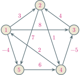
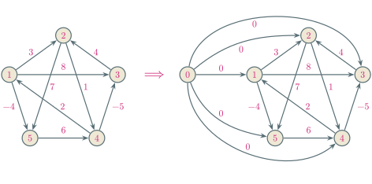
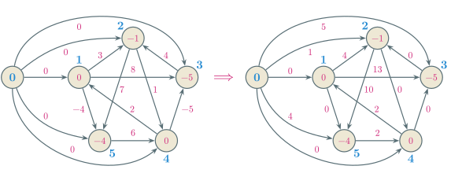

---
presentation:
  margin: 0
  center: false
  transition: "none"
  enableSpeakerNotes: true
  slideNumber: "c/t"
  navigationMode: "linear"
---

@import "../css/font-awesome-4.7.0/css/font-awesome.css"
@import "../css/theme/solarized.css"
@import "../css/logo.css"
@import "../css/font-song.css"
@import "../css/color.css"
@import "../css/margin.css"
@import "../css/table.css"
@import "../css/main.css"
@import "../plugin/zoom/zoom.js"
@import "../plugin/notes/notes.js"
@import "../plugin/customcontrols/plugin.js"
@import "../plugin/customcontrols/style.css"
@import "../plugin/chalkboard/plugin.js"
@import "../plugin/chalkboard/style.css"
@import "../plugin/reveal.js-menu/menu.js"

<!-- slide id="front-page" data-notes="" -->

<div class="bottom20"></div>

# 算法设计与分析

<hr class="width70 center">

## 全结点对最短路径

<div class="bottom8"></div>

### 计算机学院&emsp;张腾

#### *tengzhang@hust.edu.cn*

<!-- slide vertical=true data-notes="" -->

##### 问题描述

---

给定带权有向图$\gc = (\vc, \ec)$，其中$\vc$为点集、$\ec$为边集

边上的权重由函数$w: \ec \mapsto \rb$给出，允许权重为负，但没有负环

全结点对最短路径问题 (<span class="blue">a</span>ll-<span class="blue">p</span>airs <span class="blue">s</span>hortest <span class="blue">p</span>ath, APSP)：对任意一对点$u,v \in \vc$，求$u$到$v$的最短路径

<!-- slide vertical=true data-notes="" -->

##### 问题描述

---

对 APSP 问题，采用矩阵更方便，设$n = |\vc|$，点记为$1, 2, \ldots, n$，邻接矩阵$\Wv = [w_{ij}]_{1 \le i,j \le n}$，其中

<p>
\begin{align}
    w_{ij} = \begin{cases} 0, & i=j \\ w(i,j), & (i,j) \in \ec \\ \infty, & (i,j) \not \in \ec \end{cases}
\end{align}
</p>

输出：

- 最短路径矩阵，其$(i,j)$-元素就是点$i$到点$j$的最短路径长度
- 前驱矩阵，其$(i,j)$-元素就是点$i$到点$j$的最短路径上点$j$的前驱

<div class="top2"></div>

思路：

- 直接：利用动态规划求解全结点对的最短路径
- 间接：以每个点为源点，调用$n$次 SSSP 算法

<!-- slide data-notes="" -->

##### 动态规划

---

沿用 Bellman-Ford 的思路

$d_v^{(k)}$：从$s$到$v$经过不超过$k$条边的最短路径的长度

<p>
\begin{align}
    d_v^{(k)} = \begin{cases} \infty, & k = 0 \\ \min \{ d_v^{(k-1)}, ~ \min_{u \ne v} \{ d_u^{(k-1)} + w(u,v) \} \}, & k \ge 1 \end{cases}
\end{align}
</p>

<div class="top2"></div>

$\ell_{ij}^{(m)}$：从$i$到$j$经过不超过$m$条边的最短路径的长度

<p>
\begin{align}
    \ell_{ij}^{(m)} & = \begin{cases} \infty, & m = 0 \\ \min \{ \ell_{ij}^{(m-1)}, ~ \min_{k \ne j} \{ \ell_{ik}^{(m-1)} + w_{kj} \} \}, & m \ge 1 \end{cases} \\
    & = \begin{cases} \infty, & m = 0 \\ \min_k \{ \ell_{ik}^{(m-1)} + w_{kj} \}, & m \ge 1 \end{cases}
\end{align}
</p>

<!-- slide vertical=true data-notes="" -->

##### 动态规划 实现

---

<p>
\begin{align}
    \ell_{ij}^{(m)} = \begin{cases} \infty, & m = 0 \\ \min_k \{ \ell_{ik}^{(m-1)} + w_{kj} \}, & m \ge 1 \end{cases}
\end{align}
</p>

@import "../codes/apsp/sp-all-dp.py" {line_begin=12 line_end=24 .left4 .line-numbers .top0 .bottom0}

四重 for 循环时间复杂度$\Theta(n^4)$，二维表格空间复杂度$\Theta(n^2)$

若图用邻接表表示，内部二重 for 循环可改为对边的遍历

<!-- slide data-transition="convex-in none" data-notes="" -->

##### 动态规划 例子

---

<p>
\begin{align}
    & \ell_{ij}^{(m)} = \begin{cases} \infty, & m = 0 \\ \min_k \{ \ell_{ik}^{(m-1)} + w_{kj} \}, & m \ge 1 \end{cases} \\[5px]
    & \Lv^{(1)} = \begin{bmatrix}
        0 & 3 & 8 & \infty & -4 \\
        \infty & 0 & \infty & 1 & 7 \\
        \infty & 4 & 0 & \infty & \infty \\
        2 & \infty & -5 & 0 & \infty \\
        \infty & \infty & \infty & 6 & 0
    \end{bmatrix} \\[5px]
    & \Pv^{(1)} = \begin{bmatrix}
        - & 1 & 1 & - & 1 \\
        - & - & - & 2 & 2 \\
        - & 3 & - & - & - \\
        4 & - & 4 & - & - \\
        - & - & - & 5 & -
    \end{bmatrix}
\end{align}
</p>



<!-- slide data-transition="none" vertical=true data-notes="" -->

##### 动态规划 例子

---

<p>
\begin{align}
    & \ell_{ij}^{(m)} = \begin{cases} \infty, & m = 0 \\ \min_k \{ \ell_{ik}^{(m-1)} + w_{kj} \}, & m \ge 1 \end{cases} \\[5px]
    & \Lv^{(2)} = \begin{bmatrix}
        0 & 3 & 8 & \class{blue}{2} & -4 \\
        \class{blue}{3} & 0 & \class{blue}{-4} & 1 & 7 \\
        \infty & 4 & 0 & \class{blue}{5} & \class{blue}{11} \\
        2 & \class{blue}{-1} & -5 & 0 & \class{blue}{-2} \\
        \class{blue}{8} & \infty & \class{blue}{1} & 6 & 0
    \end{bmatrix} \\[5px]
    & \Pv^{(2)} = \begin{bmatrix}
        - & 1 & 1 & \class{blue}{5} & 1 \\
        \class{blue}{4} & - & \class{blue}{4} & 2 & 2 \\
        - & 3 & - & \class{blue}{2} & \class{blue}{2} \\
        4 & \class{blue}{3} & 4 & - & \class{blue}{1} \\
        \class{blue}{4} & - & \class{blue}{4} & 5 & -
    \end{bmatrix}
\end{align}
</p>


<!-- slide data-transition="none" vertical=true data-notes="" -->

##### 动态规划 例子

---

<p>
\begin{align}
    & \ell_{ij}^{(m)} = \begin{cases} \infty, & m = 0 \\ \min_k \{ \ell_{ik}^{(m-1)} + w_{kj} \}, & m \ge 1 \end{cases} \\[5px]
    & \Lv^{(3)} = \begin{bmatrix}
        0 & 3 & \class{blue}{-3} & 2 & -4 \\
        3 & 0 & -4 & 1 & \class{blue}{-1} \\
        \class{blue}{7} & 4 & 0 & 5 & 11 \\
        2 & -1 & -5 & 0 & -2 \\
        8 & \class{blue}{5} & 1 & 6 & 0
    \end{bmatrix} \\[5px]
    & \Pv^{(3)} = \begin{bmatrix}
        - & 1 & \class{blue}{4} & 5 & 1 \\
        4 & - & 4 & 2 & \class{blue}{1} \\
        \class{blue}{4} & 3 & - & 2 & 2 \\
        4 & 3 & 4 & - & 1 \\
        4 & \class{blue}{3} & 4 & 5 & -
    \end{bmatrix}
\end{align}
</p>


<!-- slide data-transition="none" vertical=true data-notes="" -->

##### 动态规划 例子

---

<p>
\begin{align}
    & \ell_{ij}^{(m)} = \begin{cases} \infty, & m = 0 \\ \min_k \{ \ell_{ik}^{(m-1)} + w_{kj} \}, & m \ge 1 \end{cases} \\[5px]
    & \Lv^{(4)} = \begin{bmatrix}
        0 & \class{blue}{1} & -3 & 2 & -4 \\
        3 & 0 & -4 & 1 & -1 \\
        7 & 4 & 0 & 5 & \class{blue}{3} \\
        2 & -1 & -5 & 0 & -2 \\
        8 & 5 & 1 & 6 & 0
    \end{bmatrix} \\[5px]
    & \Pv^{(4)} = \begin{bmatrix}
        - & \class{blue}{3} & 4 & 5 & 1 \\
        4 & - & 4 & 2 & 1 \\
        4 & 3 & - & 2 & \class{blue}{1} \\
        4 & 3 & 4 & - & 1 \\
        4 & 3 & 4 & 5 & -
    \end{bmatrix}
\end{align}
</p>


<!-- slide data-notes="" -->

##### 动态规划 改进

---

将长度为$m$的路径拆分为长度为$m-1$的路径和边

<p>
\begin{align}
    \ell_{ij}^{(m)} = \begin{cases} \infty, & m = 0 \\ \min_k \{ \ell_{ik}^{(m-1)} + w_{kj} \}, & m \ge 1 \end{cases}
\end{align}
</p>

<div class="top2"></div>

将长度为$m$的路径拆分为$2$条长度为$m/2$的路径

<p>
\begin{align}
    \ell_{ij}^{(m)} = \begin{cases} w_{ij}, & m = 1 \\ \min_k \{ \ell_{ik}^{(m/2)} + \ell_{kj}^{(m/2)} \}, & m = 2,4,8, \ldots \end{cases}
\end{align}
</p>

<!-- slide vertical=true data-notes="" -->

##### 动态规划 改进

---

当$m \ge n-1$后$\Lv^{(m)}$不再变化，因此$m$不断乘$2$直至达到$n-1$，前驱矩阵的更新也有变化

@import "../codes/apsp/sp-all-dp.py" {line_begin=26 line_end=40 .left4 .line-numbers .top0 highlight=[4-5,10-13]}

<!-- slide vertical=true data-notes="" -->

##### 动态规划 改进

---

与矩阵平方的联系

```python {.left4 .line-numbers .top0 .bottom0}
for i in range(n):
    for j in range(n):
        a[i,j] = 0
        for k in range(n):
            a[i,j] = a[i,j] + aa[i,k] * aa[k,j]

for i in range(n):
    for j in range(n):
        l[i,j] = float("inf")
        for k in range(n):
            l[i,j] = min(l[i,j], ll[i,k] + ll[k,j])
```

该改进算法本质上与计算矩阵幂次时不断平方相同

<!-- slide data-notes="" -->

##### 动态规划 再改进

---

$\ell_{ij}^{(m)}$：从$i$到$j${==经过不超过$m$条边==}的最短路径的长度

<p>
\begin{align}
    \ell_{ij}^{(m)} = \begin{cases} \infty, & m = 0 \\ \min_k \{ \ell_{ik}^{(m-1)} + w_{kj} \}, & m \ge 1 \end{cases}
\end{align}
</p>

<div class="top2"></div>

$d_{ij}^{(k)}$：从$i$到$j${==中间结点属于集合$\{1,2, \ldots,k\}$==}的最短路径的长度

- 若最短路径不经过$k$，则$d_{ij}^{(k)} = d_{ij}^{(k-1)}$
- 若最短路径经过$k$，不妨设为$i \overset{p_1}{\rightsquigarrow} k \overset{p_2}{\rightsquigarrow} j$，根据最优子结构性，$p_1$和$p_2$的长度分别为$d_{ik}^{(k-1)}$和$d_{kj}^{(k-1)}$

<div class="top2"></div>

<p>
\begin{align}
    d_{ij}^{(k)} = \begin{cases} w_{ij}, & k = 0 \\ \min \{ d_{ij}^{(k-1)}, d_{ik}^{(k-1)} + d_{kj}^{(k-1)} \}, & k \ge 1 \end{cases}
\end{align}
</p>

<!-- slide vertical=true data-notes="" -->

##### Floyd-Warshall 实现

---

<p>
\begin{align}
    d_{ij}^{(k)} = \begin{cases} w_{ij}, & k = 0 \\ \min \{ d_{ij}^{(k-1)}, d_{ik}^{(k-1)} + d_{kj}^{(k-1)} \}, & k \ge 1 \end{cases}
\end{align}
</p>

@import "../codes/apsp/sp-all-dp.py" {line_begin=42 line_end=55 .left4 .line-numbers .top0 .bottom0 highlight=[]}

三重 for 循环时间复杂度$\Theta(n^3)$，二维表格空间复杂度$\Theta(n^2)$

<!-- slide data-transition="convex-in none" data-notes="" -->

##### Floyd-Warshall 例子

---

<p>
\begin{align}
    & d_{ij}^{(k)} = \begin{cases} w_{ij}, & k = 0 \\ \min \{ d_{ij}^{(k-1)}, d_{ik}^{(k-1)} + d_{kj}^{(k-1)} \}, & k \ge 1 \end{cases} \\[5px]
    & \Dv^{(0)} = \begin{bmatrix}
        0 & 3 & 8 & \infty & -4 \\
        \infty & 0 & \infty & 1 & 7 \\
        \infty & 4 & 0 & \infty & \infty \\
        2 & \infty & -5 & 0 & \infty \\
        \infty & \infty & \infty & 6 & 0
    \end{bmatrix} \\[5px]
    & \Pv^{(0)} = \begin{bmatrix}
        - & 1 & 1 & - & 1 \\
        - & - & - & 2 & 2 \\
        - & 3 & - & - & - \\
        4 & - & 4 & - & - \\
        - & - & - & 5 & -
    \end{bmatrix}
\end{align}
</p>


<!-- slide data-transition="none" vertical=true data-notes="" -->

##### Floyd-Warshall 例子

---

<p>
\begin{align}
    & d_{ij}^{(k)} = \begin{cases} w_{ij}, & k = 0 \\ \min \{ d_{ij}^{(k-1)}, d_{ik}^{(k-1)} + d_{kj}^{(k-1)} \}, & k \ge 1 \end{cases} \\[5px]
    & \Dv^{(1)} = \begin{bmatrix}
        0 & 3 & 8 & \infty & -4 \\
        \infty & 0 & \infty & 1 & 7 \\
        \infty & 4 & 0 & \infty & \infty \\
        2 & \class{blue}{5} & -5 & 0 & \class{blue}{-2} \\
        \infty & \infty & \infty & 6 & 0
    \end{bmatrix} \\[5px]
    & \Pv^{(1)} = \begin{bmatrix}
        - & 1 & 1 & - & 1 \\
        - & - & - & 2 & 2 \\
        - & 3 & - & - & - \\
        4 & \class{blue}{1} & 4 & - & \class{blue}{1} \\
        - & - & - & 5 & -
    \end{bmatrix}
\end{align}
</p>


<!-- slide data-transition="none" vertical=true data-notes="" -->

##### Floyd-Warshall 例子

---

<p>
\begin{align}
    & d_{ij}^{(k)} = \begin{cases} w_{ij}, & k = 0 \\ \min \{ d_{ij}^{(k-1)}, d_{ik}^{(k-1)} + d_{kj}^{(k-1)} \}, & k \ge 1 \end{cases} \\[5px]
    & \Dv^{(2)} = \begin{bmatrix}
        0 & 3 & 8 & \class{blue}{4} & -4 \\
        \infty & 0 & \infty & 1 & 7 \\
        \infty & 4 & 0 & \class{blue}{5} & \class{blue}{11} \\
        2 & 5 & -5 & 0 & -2 \\
        \infty & \infty & \infty & 6 & 0
    \end{bmatrix} \\[5px]
    & \Pv^{(2)} = \begin{bmatrix}
        - & 1 & 1 & \class{blue}{2} & 1 \\
        - & - & - & 2 & 2 \\
        - & 3 & - & \class{blue}{2} & \class{blue}{2} \\
        4 & 1 & 4 & - & 1 \\
        - & - & - & 5 & -
    \end{bmatrix}
\end{align}
</p>


<!-- slide data-transition="none" vertical=true data-notes="" -->

##### Floyd-Warshall 例子

---

<p>
\begin{align}
    & d_{ij}^{(k)} = \begin{cases} w_{ij}, & k = 0 \\ \min \{ d_{ij}^{(k-1)}, d_{ik}^{(k-1)} + d_{kj}^{(k-1)} \}, & k \ge 1 \end{cases} \\[5px]
    & \Dv^{(3)} = \begin{bmatrix}
        0 & 3 & 8 & 4 & -4 \\
        \infty & 0 & \infty & 1 & 7 \\
        \infty & 4 & 0 & 5 & 11 \\
        2 & \class{blue}{-1} & -5 & 0 & -2 \\
        \infty & \infty & \infty & 6 & 0
    \end{bmatrix} \\[5px]
    & \Pv^{(3)} = \begin{bmatrix}
        - & 1 & 1 & 2 & 1 \\
        - & - & - & 2 & 2 \\
        - & 3 & - & 2 & 2 \\
        4 & \class{blue}{3} & 4 & - & 1 \\
        - & - & - & 5 & -
    \end{bmatrix}
\end{align}
</p>


<!-- slide data-transition="none" vertical=true data-notes="" -->

##### Floyd-Warshall 例子

---

<p>
\begin{align}
    & d_{ij}^{(k)} = \begin{cases} w_{ij}, & k = 0 \\ \min \{ d_{ij}^{(k-1)}, d_{ik}^{(k-1)} + d_{kj}^{(k-1)} \}, & k \ge 1 \end{cases} \\[5px]
    & \Dv^{(4)} = \begin{bmatrix}
        0 & 3 & \class{blue}{-1} & 4 & -4 \\
        \class{blue}{3} & 0 & \class{blue}{-4} & 1 & \class{blue}{-1} \\
        \class{blue}{7} & 4 & 0 & 5 & \class{blue}{3} \\
        2 & -1 & -5 & 0 & -2 \\
        \class{blue}{8} & \class{blue}{5} & \class{blue}{1} & 6 & 0
    \end{bmatrix} \\[5px]
    & \Pv^{(4)} = \begin{bmatrix}
        - & 1 & \class{blue}{4} & 2 & 1 \\
        \class{blue}{4} & - & \class{blue}{4} & 2 & \class{blue}{1} \\
        \class{blue}{4} & 3 & - & 2 & \class{blue}{1} \\
        4 & 3 & 4 & - & 1 \\
        \class{blue}{4} & \class{blue}{3} & \class{blue}{4} & 5 & -
    \end{bmatrix}
\end{align}
</p>


<!-- slide data-transition="none" vertical=true data-notes="" -->

##### Floyd-Warshall 例子

---

<p>
\begin{align}
    & d_{ij}^{(k)} = \begin{cases} w_{ij}, & k = 0 \\ \min \{ d_{ij}^{(k-1)}, d_{ik}^{(k-1)} + d_{kj}^{(k-1)} \}, & k \ge 1 \end{cases} \\[5px]
    & \Dv^{(5)} = \begin{bmatrix}
        0 & \class{blue}{1} & \class{blue}{-3} & \class{blue}{2} & -4 \\
        3 & 0 & -4 & 1 & -1 \\
        7 & 4 & 0 & 5 & 3 \\
        2 & -1 & -5 & 0 & -2 \\
        8 & 5 & 1 & 6 & 0
    \end{bmatrix} \\[5px]
    & \Pv^{(5)} = \begin{bmatrix}
        - & \class{blue}{3} & \class{blue}{4} & \class{blue}{5} & 1 \\
        4 & - & 4 & 2 & 1 \\
        4 & 3 & - & 2 & 1 \\
        4 & 3 & 4 & - & 1 \\
        4 & 3 & 4 & 5 & -
    \end{bmatrix}
\end{align}
</p>


<!-- slide data-notes="" -->

##### 传递闭包

---

输入：有向图$\gc = (\vc, \ec)$

<div class="top-2"></div>

输出：传递闭包$\gc^* = (\vc, \ec^*)$，其中$\ec^* = \{ (i,j) \mid \exists p: i \overset{p}{\rightsquigarrow} j \}$

方法一：给$\ec$中每条边赋权重$1$，然后运行 Floyd-Warshall 算法

- 若$d_{ij} < n$，则存在一条从$i$到$j$的路径
- 若$d_{ij} = \infty$，则不存在一条从$i$到$j$的路径

<div class="top2"></div>

方法二：引入矩阵$\Tv = [t_{ij}]_{1 \le i,j \le n}$，其中$t_{ij} = \begin{cases} 1, & \exists p: i \overset{p}{\rightsquigarrow} j \\ 0, & 其它 \end{cases}$

<p>
\begin{align}
    t_{ij}^{(0)} & = \begin{cases} 0, & i \ne j ~ 且 ~ (i,j) \not \in \ec \\ 1, & i = j ~ 或 ~ (i,j) \in \ec \end{cases} \\[5px]
    t_{ij}^{(k)} & = t_{ij}^{(k-1)} \vee (t_{ik}^{(k-1)} \wedge t_{kj}^{(k-1)})
\end{align}
</p>

<!-- slide vertical=true data-notes="" -->

##### 传递闭包 实现

---

$\min \rightarrow \vee$、$+ \rightarrow \wedge$，逻辑运算比算术运算快，空间需求也较小

<p>
\begin{align}
    d_{ij}^{(k)} & = \min \{ d_{ij}^{(k-1)}, d_{ik}^{(k-1)} + d_{kj}^{(k-1)} \} \\
    t_{ij}^{(k)} & = t_{ij}^{(k-1)} \vee (t_{ik}^{(k-1)} \wedge t_{kj}^{(k-1)})
\end{align}
</p>

@import "../codes/apsp/transitive-closure.py" {line_begin=3 line_end=14 .left4 .line-numbers .top0 .bottom0 highlight=[10]}

三重 for 循环时间复杂度$\Theta(n^3)$，二维表格空间复杂度$\Theta(n^2)$

<!-- slide vertical=true data-notes="" -->

##### 传递闭包 例子

---

<p>
\begin{align}
    t_{ij}^{(0)} & = \begin{cases} 0, & i \ne j ~ 且 ~ (i,j) \not \in \ec \\ 1, & i = j ~ 或 ~ (i,j) \in \ec \end{cases} \\[10px]
    t_{ij}^{(k)} & = t_{ij}^{(k-1)} \vee (t_{ik}^{(k-1)} \wedge t_{kj}^{(k-1)}) \\[10px]
    \Tv^{(0)} & = \begin{bmatrix}
    1 & 0 & 0 & 0 \\
    0 & 1 & 1 & 1 \\
    0 & 1 & 1 & 0 \\
    1 & 0 & 1 & 1
    \end{bmatrix}, ~ \Tv^{(1)} = \begin{bmatrix}
    1 & 0 & 0 & 0 \\
    0 & 1 & 1 & 1 \\
    0 & 1 & 1 & 0 \\
    1 & 0 & 1 & 1
    \end{bmatrix} \\[10px]
    \Tv^{(2)} & = \begin{bmatrix}
    1 & 0 & 0 & 0 \\
    0 & 1 & 1 & 1 \\
    0 & 1 & 1 & \class{blue}{1} \\
    1 & 0 & 1 & 1
    \end{bmatrix}, ~ \Tv^{(3)} = \begin{bmatrix}
    1 & 0 & 0 & 0 \\
    0 & 1 & 1 & 1 \\
    0 & 1 & 1 & 1 \\
    1 & \class{blue}{1} & 1 & 1
    \end{bmatrix}, ~ \Tv^{(4)} = \begin{bmatrix}
    1 & 0 & 0 & 0 \\
    \class{blue}{1} & 1 & 1 & 1 \\
    \class{blue}{1} & 1 & 1 & 1 \\
    1 & 1 & 1 & 1
    \end{bmatrix}
\end{align}
</p>

@import "../dot/transitive-closure.dot" {.top-50per .left72per}

<!-- slide data-notes="" -->

##### 稀疏图 再改进

---

Floyd-Warshall 算法的时间复杂度是$\Theta(\shu \vc \shu^3)$

<div class="threelines row2-border-top-dashed">

|    &zwnj;    |    实现    |                    一般时间复杂度                     |                 稠密图                  |                稀疏图                 |
| :----------: | :--------: | :---------------------------------------------------: | :-------------------------------------: | :-----------------------------------: |
| Bellman-Ford |   &zwnj;   |           $\Theta(\shu \vc \shu \shu \ec \shu)$           |         $\Theta(\shu \vc \shu^3)$         |        $\Theta(\shu \vc \shu^2)$        |
|   Dijkstra   |  线性数组  |         $\Theta(\shu \vc \shu^2 + \shu \ec \shu)$         |         $\Theta(\shu \vc \shu^2)$         |        $\Theta(\shu \vc \shu^2)$        |
|      ^       |   二叉堆   | $\Theta((\shu \vc \shu + \shu \ec \shu) \lg \shu \vc \shu)$ | $\Theta(\shu \vc \shu^2 \lg \shu \vc \shu)$ | $\Theta(\shu \vc \shu \lg \shu \vc \shu)$ |
|      ^       | 斐波那契堆 |  $\Theta(\shu \vc \shu \lg \shu \vc \shu + \shu \ec \shu)$  |         $\Theta(\shu \vc \shu^2)$         | $\Theta(\shu \vc \shu \lg \shu \vc \shu)$ |

</div>

对于稀疏图，以每个点为源点运行 Dijkstra 算法$\Theta(\shu \vc \shu^2 \lg \shu \vc \shu)$

有负边怎么办？Dijkstra 算法不能处理有负边的图

<!-- slide vertical=true data-notes="" -->

##### 重新赋权

---

构造新的权重函数$\wh: \ec \mapsto \class{blue}{\rb^+}$且满足{==路径等价性==}：$p$在使用$w$时是最短路径当且仅当其在使用$\wh$时也是最短路径

<div class="top2"></div>

引入函数$h: \vc \mapsto \rb$，定义$\wh(u,v) = w(u,v) + h(u) - h(v)$

设$p = \langle v_0, v_1, \ldots, v_k \rangle$是$v_0$到$v_k$的任意一条路径

<p>
\begin{align}
    \sum_{i=1}^k \wh(v_{i-1}, v_i) = \sum_{i=1}^k w(v_{i-1}, v_i) + h(v_0) - h(v_k)
\end{align}
</p>

固定$v_0$和$v_k$，对任意路径，新旧权重函数引起的变化是常数，不依赖中间经过的点，因此路径等价性满足

令$v_0=v_k$易知$\class{blue}{p}${==在使用==}$\class{blue}{w}${==时是负环当且仅当在使用==}$\class{blue}{\wh}${==时也是负环==}

<!-- slide vertical=true data-notes="" -->

##### 重新赋权

---

构造新的权重函数$\wh: \ec \mapsto \class{blue}{\rb^+}$且满足{==路径等价性==}：$p$在使用$w$时是最短路径当且仅当其在使用$\wh$时也是最短路径

<div class="top2"></div>

引入函数$h: \vc \mapsto \rb$，定义$\wh(u,v) = w(u,v) + h(u) - h(v)$

如何设计$h$保证$\wh$的非负性呢？

<p>
\begin{align}
    0 \le \wh(u,v) = w(u,v) + h(u) - h(v) \Longleftrightarrow h(v) \le h(u) + w(u,v)
\end{align}
</p>

联想到{==三角不等式==}$\delta(s,v) \le \delta(s,u) + w(u,v)$，可取$h(v) = \delta(s,v)$

<!-- slide data-notes="" -->

##### Johnson 算法

---

引入新结点$0$，并有权重为零的边指向其它所有点

$0$没有入边，不会影响其它点间的最短路径，也不会产生新的环



<!-- slide vertical=true data-notes="" -->

##### Johnson 算法

---

以$0$为源点运行 Bellman-Ford 算法

1. 若检测到负环，则原图有负环，问题无解，否则计算$\delta(0,v)$作为$h(v)$
2. 对所有边重新赋予权重$\wh(u,v) = w(u,v) + h(u) - h(v)$
3. 在新权重下，以每个点为源点运行 Dijkstra 算法
4. 求得$u$到$v$的最短路径后，加上$h(v)-h(u)$复原出原最短路径长度



<!-- slide vertical=true data-notes="" -->

##### Johnson 算法 实现

---

@import "../codes/apsp/sp-all-johnson.py" {line_begin=44 line_end=77 .left4 .line-numbers .top1 highlight=[8-9,13,18,25]}

<!-- slide data-notes="" -->

##### 作业

---

算法导论 3^rd^

计算题：24.1-1、24.4-1、25.2-1

设计、证明题：24.1-3、24-3、25.2-7

思考题：25.2-6
