---
presentation:
  margin: 0
  center: false
  transition: "none"
  enableSpeakerNotes: true
  slideNumber: "c/t"
  navigationMode: "linear"
---

@import "../css/font-awesome-4.7.0/css/font-awesome.css"
@import "../css/theme/solarized.css"
@import "../css/logo.css"
@import "../css/font.css"
@import "../css/color.css"
@import "../css/margin.css"
@import "../css/table.css"
@import "../css/main.css"
@import "../plugin/zoom/zoom.js"
@import "../plugin/customcontrols/plugin.js"
@import "../plugin/customcontrols/style.css"
@import "../plugin/chalkboard/plugin.js"
@import "../plugin/chalkboard/style.css"
@import "../plugin/menu/menu.js"

<!-- slide id="front-page" data-notes="" -->

# 算法设计与分析

## 迭代改进

### 计算机学院 &nbsp;&nbsp; 张腾

#### _tengzhang@hust.edu.cn_

<!-- slide vertical=true data-notes="" -->

##### 课程大纲

---

@import "../vega/outline-max-flow.json" {as="vega" .top-2}

<!-- slide data-notes="" -->

##### 最大流 问题背景

---

    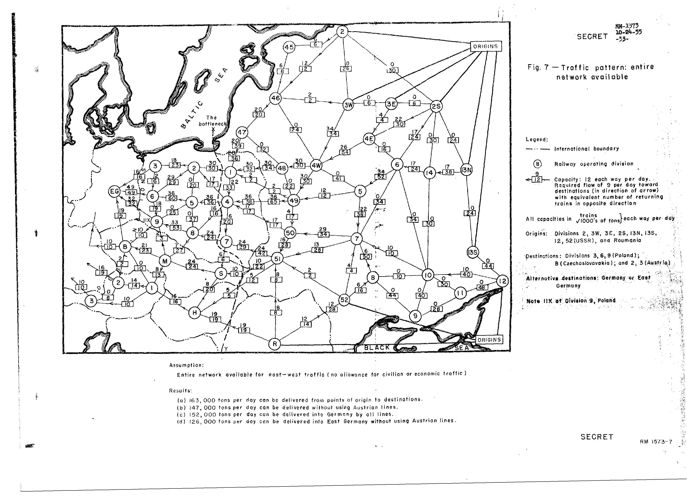

 上世纪 50 年代中期，美国空军研究员 Theodore E. Harris 和退伍少将 Frank S. Ross 联合写了一份研究苏联到其东欧卫星国铁路网的报告，该报告于 1999 年解密

<!-- slide vertical=true data-notes="" -->

##### 最大流 问题背景

---

铁路网可以看作加权有向图

- 44 个点为重要地区
- 105 条边为连接这些地区的铁路
- 边上权重代表单位时间运输量，可以想象成平行的铁路条数

两个问题

- 从苏联到东欧卫星国的单位时间最大运输量，最大流 (maximum flow)
- 炸毁最少的铁路切断运输，最小切割 (minimum cut)

 Ford 和 Fulkerson 将最大流问题的形式化归功于 Harris 和 Ross，但 Harris 和 Ross 又致谢了 George Dantzig 协助形式化了该问题

<!-- slide data-notes="" -->

##### 流

---

给定流网络$\Gcal = (\Vcal, \Ecal)$，源点$s$，汇点$t$

流$f: \Ecal \mapsto \Rbb$是实值函数且满足{==流量守恒==}：对$\forall u \in \Vcal \setminus \{ s,t \}$有

$$
\begin{align*}
    \quad \sum_{v \in \Vcal} f(v,u) = \sum_{v \in \Vcal} f(u,v)
\end{align*}
$$

流值$|f| \triangleq \sum_{v \in \Vcal} f(s,v) - \sum_{v \in \Vcal} f(v,s)$，即源点$s$的净流出流量

<!-- slide vertical=true data-notes="" -->

##### 容量

---

容量$c: \Ecal \mapsto \Rbb^+$是非负实值函数

容量限制：对$\forall (u,v) \in \Ecal$有$0 \le f(u,v) \le c(u,v)$

- $f(u,v) = c(u,v)$，流$f$充斥 (saturate) 于边$(u,v)$
- $f(u,v) = 0$，流$f$回避 (avoid) 了边$(u,v)$

满足容量限制的流称为可行的 (feasible)

@import "../tikz/max-flow.svg" {.center .top2 .width80}

<!-- slide vertical=true data-notes="" -->

##### 最大流问题

---

$$
\begin{align*}
    \quad & \begin{cases}
        f(s,v_1) = 11 \\ f(s,v_2) = 8 \\ f(v_1,v_3) = 12 \\ f(v_2,v_1) = 1 \\ f(v_2,v_4) = 11 \\ f(v_3,v_2) = 4 \\ f(v_4,v_3) = 7 \\ f(v_3,t) = 15 \\ f(v_4,t) = 4
    \end{cases} \\[10px]
    & |f| = \sum_{v \in \Vcal} f(s,v) - \sum_{v \in \Vcal} f(v,s) = 11 + 8 = 19
\end{align*}
$$

最大流问题：在给定的流网络中找一个流值最大的流

@import "../tikz/max-flow2.svg" {.right25 .lefta .top-45per .width40}

<!-- slide data-notes="" -->

##### 两个约定

---

流网络中{==无反向平行边==}

对反向平行边$(v_1,v_2)$、$(v_2,v_1)$，选择其中一条，比如$(v_1,v_2)$，加入新结点$v$，将其分为两条边$(v_1,v)$和$(v,v_2)$，并将两条边的容量设为被替代掉的边的容量，即$c(v_1,v) = c(v,v_2) = c(v_1,v_2)$

可以证明，转换后的网络与原网络等价

@import "../tikz/max-flow-para-edge.svg" {.center .top4 .width80}

<!-- slide vertical=true data-notes="" -->

##### 两个约定

---

流网络中{==只有单一的源点和汇点==}

加入超级源点$s$和超级汇点$t$，$c(s,s_i) = \infty$，$c(t_j,t) = \infty$

可以证明，转换后的网络与原网络等价

@import "../tikz/max-flow-multiple-st.svg" {.center .top4 .width50}

<!-- slide data-notes="" -->

##### 切割

---

给定流网络$\Gcal = (\Vcal, \Ecal)$，源点$s$，汇点$t$

切割$(\Scal, \Tcal)$将$\Vcal$分成$\Scal$和$\Tcal = \Vcal \setminus \Scal$使得$s \in \Scal$、$t \in \Tcal$

切割$(\Scal,\Tcal)$的容量为$c(\Scal, \Tcal) = \sum_{u \in \Scal} \sum_{v \in \Tcal} c(u,v)$

最小切割问题：在给定的流网络中找一个容量最小的切割

<!-- slide vertical=true data-notes="" -->

##### 切割

---

@import "../tikz/max-flow-cut.svg" {.center .top2 .width40}

切割$(\Scal, \Tcal)$：$\Scal = \{ s, v_1, v_2 \}$，$\Tcal = \{ t, v_3, v_4 \}$

切割$(\Scal,\Tcal)$的容量$c(\Scal, \Tcal) = 12 + 14 = 26$

该切割不是最小切割，$(\{s,v_1,v_2,v_4\},\{v_3,t\})$是更小的切割

<!-- slide vertical=true data-notes="" -->

##### 流与切割的关系

---

引理：任意流值不超过任意切割的容量

$$
\begin{align*}
    \quad |f| & = \sum_{v \in \Vcal} f(s,v) - \sum_{v \in \Vcal} f(v,s) = \sum_{u \in \Scal} \left( \sum_{v \in \Vcal} f(u,v) - \sum_{v \in \Vcal} f(v,u) \right) \\
    & = \sum_{u \in \Scal} \left( \sum_{v \in \Scal} f(u,v) + \sum_{v \in \Tcal} f(u,v) - \sum_{v \in \Scal} f(v,u) - \sum_{v \in \Tcal} f(v,u) \right) \\
    & = \sum_{u \in \Scal} \sum_{v \in \Tcal} f(u,v) - \sum_{u \in \Scal} \sum_{v \in \Tcal} f(v,u) \\
    & \le \sum_{u \in \Scal} \sum_{v \in \Tcal} f(u,v) \le \sum_{u \in \Scal} \sum_{v \in \Tcal} c(u,v)  = c(\Scal, \Tcal)
\end{align*}
$$

- 第四个等号表明流值等于横跨切割的净流量
- 若$|f| = c(\Scal, \Tcal)$，则$f$为最大流、$(\Scal,\Tcal)$为最小切割
- $f$为最大流时，所有不等式取等号，因此最大流充斥横跨切割的正向边、回避横跨切割的反向边

<!-- slide data-notes="" -->

##### 最大流最小切割定理

---

对任意流网络，存在最大流等于最小切割

- 1954 年 Lester Randolph Ford Jr.、Delbert Ray Fulkerson 证明
- 1956 年 Peter Elias、Amiel Feinstein、Claude Shannon 证明

@import "../tikz/max-flow-min-cut.svg" {.center .top4 .width50}

 最大流最小切割定理是线性规划中强对偶成立的一个特例

<!-- slide vertical=true data-notes="" -->

##### 证明 残存网络

---

给定流网络$\Gcal = (\Vcal, \Ecal)$和流$f$，定义残存网络$\Gcal_f = (\Vcal, \Ecal_f)$来{==记录每条边上的流量可以修改的极限==}

若$0 < f(u,v) < c(u, v)$

- 边上的流量最多可再增加$c(u,v) - f(u,v)$，将$(u,v)$加入$\Gcal_f$，并设其{==残存容量==}为$c_f (u,v) = c(u,v) - f(u,v)$
- 边上的流量最多可减少$f(u,v)$，将反向边$(v,u)$加入$\Gcal_f$，并设其{==残存容量==}为$c_f (v,u) = f(u,v)$

若$f(u,v) = c(u, v)$，则正向边$(u,v)$不加入，没有可增加的余地

若$f(u,v) = 0$，则反向边$(v,u)$不加入，没有可减少的余地

<!-- slide vertical=true data-notes="" -->

##### 证明 残存网络

---

残存网络$\Gcal_f = (\Vcal, \Ecal_f)$中边$(u,v)$的残存容量$c_f(u,v)$定义为

$$
\begin{align*}
    \quad c_f(u,v) = \begin{cases}
        c(u,v) - f(u,v), & (u,v) \in \Ecal \\
        f(v,u), & (v,u) \in \Ecal \\
        0, & \text{其它}
    \end{cases}
\end{align*}
$$

@import "../tikz/max-flow-res-net.svg" {.center .top4 .width90}

 残存容量定义中的前两种情形是互斥的，因为我们约定了给定的流网络中不存在反向平行边

<!-- slide data-notes="" -->

##### 证明 增广路径

---

给定流网络$\Gcal = (\Vcal, \Ecal)$和流$f$，设$p$是残存网络$\Gcal_f$中一条从源点$s$到汇点$t$的路径，称为增广路径 (augmenting path)

增广路径的残存容量是所有边上残存容量的最小值

$$
\begin{align*}
    \quad c_f (p) = \min \{ c_f (u,v): (u,v) \in p \}
\end{align*}
$$

下图蓝色边构成一条增广路径，$c_f (p) = \min \{ 5,4,5 \} = 4$

@import "../tikz/max-flow-aug2.svg" {.center .top4 .width90}

<!-- slide vertical=true data-notes="" -->

##### 证明 增广路径

---

若残存网络$\Gcal_f$包含增广路径，则可根据残存容量增加流

$$
\begin{align*}
    \quad f'(u,v) = \begin{cases}
        f(u,v) + c_f(p), & (u,v) \in p \\
        f(u,v) - c_f(p), & (v,u) \in p \\
        f(u,v), & \text{其它}
    \end{cases}
\end{align*}
$$

增广路径的残存容量为$4$，原流网络的流值可以增大$4$

@import "../tikz/max-flow-aug.svg" {.center .top2 .width60}

<!-- slide data-notes="" -->

##### 证明 流的递增

---

可以证明$f'$是原网络中的一个流，流值$|f'| = |f| + c_f (p) > |f|$

流量守恒：对任意点$v \in \Vcal \setminus \{ s,t \}$

若$v \not \in p$，进入、离开点$v$的流量不变，显然满足流量守恒

若$v \in p$，设$p = \langle s, \ldots, u, v, w, \ldots, t \rangle$，分四种情况：

- $(u,v), (v,w) \in \Ecal$ => $(u,v), (v,w)$的流量都增加$c_f(p)$
- $(v,u), (w,v) \in \Ecal$ => $(v,u), (w,v)$的流量都减少$c_f(p)$
- $(v,u), (v,w) \in \Ecal$ => $(v,u)$的流量减少$c_f(p)$、$(v,w)$的流量增加$c_f(p)$
- $(u,v), (w,v) \in \Ecal$ => $(u,v)$的流量增加$c_f(p)$、$(w,v)$的流量减少$c_f(p)$

流值为源点$s$的净流出流量，源点$s \in p$，故流值增加$c_f(p)$

<!-- slide vertical=true data-notes="" -->

##### 证明 流的递增

---

容量限制：对任意边$(u,v) \in \Ecal$

若$(u,v), (v,u) \not \in p$，则$(u,v)$的流量不变

若$(u,v) \in p$，则$(u,v)$的流量增加

$$
\begin{align*}
    \quad f' (u,v) & = f(u,v) + c_f(p) \\
    & \le f(u,v) + c_f(u,v) = f(u,v) + c(u,v) - f(u,v) = c(u,v)
\end{align*}
$$

若$(v,u) \in p$，则$(u,v)$的流量减少

$$
\begin{align*}
    \quad f' (u,v) & = f(u,v) - c_f(p) \\
    & \ge f(u,v) - c_f(v,u) = f(u,v) - f(u,v) = 0
\end{align*}
$$

<!-- slide vertical=true data-notes="" -->

##### 证明 最后一步

---

若残存网络$\Gcal_f$不包含任何增广路径，即$s$、$t$不连通，构造切割$(\Scal, \Tcal)$，其中$\Scal$为与$s$连通的所有结点，$\Tcal = \Vcal \setminus \Scal$

对$\forall u \in \Scal$、$\forall v \in \Tcal$，边$(u,v) \not \in \Gcal_f$，否则$v$也与$s$连通

- 若$(u,v) \in \Ecal$，则$f(u,v) = c(u,v)$，$f$充斥横跨切割的正向边
- 若$(v,u) \in \Ecal$，则$f(v,u) = 0$，$f$回避横跨切割的反向边

由引理知此时$f$为最大流、$(\Scal, \Tcal)$为最小切割

<!-- slide data-notes="" -->

##### Ford-Fulkerson 算法

---

最大流最小切割定理直接给出了 Ford-Fulkerson 算法：

- 初始化流为零
- 不断在残存网络中寻找增广路径，根据残存容量增加流网络的流值，直至不再存在增广路径

算法没有明确指定如何寻找增广路径

- 从源点开始做 DFS，搜到汇点就返回
- 从源点开始做 BFS，搜到汇点就返回，最少边数的增广路径
- 最多边数的增广路径
- 残存容量最大的增广路径

<!-- slide vertical=true data-notes="" -->

##### 算法实现

---

@import "../codes/ford-fulkerson.py" {line_begin=4 line_end=196 .left4 .line-numbers .top1 .bottom4 highlight=[]}

<!-- slide data-notes="" -->

##### 例子 深度优先 递归

---

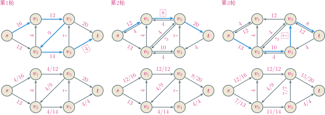

流值变化$0 \overset{+4}{\longrightarrow} 4 \overset{+8}{\longrightarrow} 12 \overset{+7}{\longrightarrow} 19 \overset{+4}{\longrightarrow} 23$

<!-- slide vertical=true data-notes="" -->

##### 例子 深度优先 递归

---

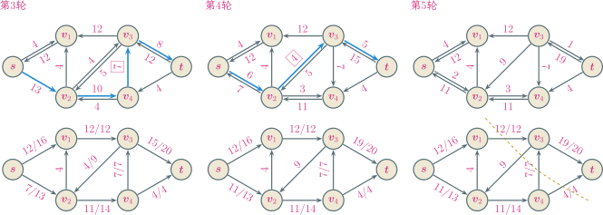

流值变化$0 \overset{+4}{\longrightarrow} 4 \overset{+8}{\longrightarrow} 12 \overset{+7}{\longrightarrow} 19 \overset{+4}{\longrightarrow} 23$

<!-- slide data-notes="" -->

##### 例子 深度优先 栈

---

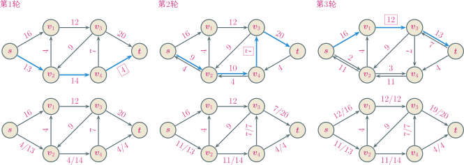

流值变化$0 \overset{+4}{\longrightarrow} 4 \overset{+7}{\longrightarrow} 11 \overset{+12}{\longrightarrow} 23$

<!-- slide vertical=true data-notes="" -->

##### 例子 深度优先 栈

---

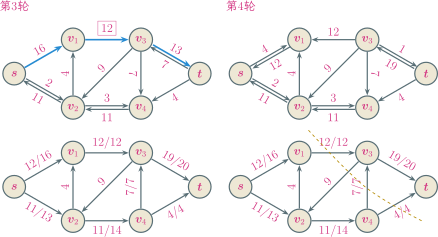

流值变化$0 \overset{+4}{\longrightarrow} 4 \overset{+7}{\longrightarrow} 11 \overset{+12}{\longrightarrow} 23$

<!-- slide data-notes="" -->

##### 例子 广度优先 队列

---

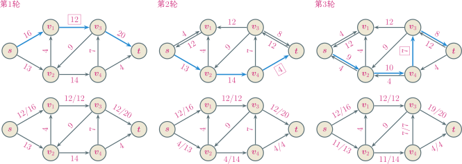

流值变化$0 \overset{+12}{\longrightarrow} 12 \overset{+4}{\longrightarrow} 16 \overset{+7}{\longrightarrow} 23$

<!-- slide vertical=true data-notes="" -->

##### 例子 广度优先 队列

---

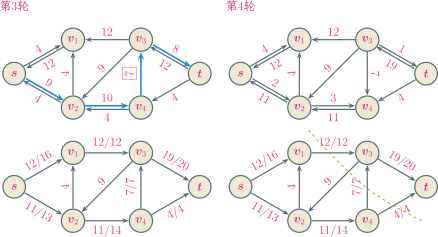

流值变化$0 \overset{+12}{\longrightarrow} 12 \overset{+4}{\longrightarrow} 16 \overset{+7}{\longrightarrow} 23$

<!-- slide data-notes="" -->

##### 例子 边数最多

---

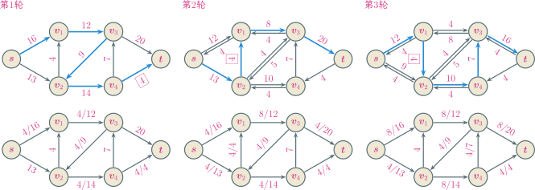

流值变化$0 \overset{+4}{\longrightarrow} 4 \overset{+4}{\longrightarrow} 8 \overset{+4}{\longrightarrow} 12 \overset{+4}{\longrightarrow} 16 \overset{+3}{\longrightarrow} 19  \overset{+1}{\longrightarrow} 20 \overset{+3}{\longrightarrow} 23$

<!-- slide vertical=true data-notes="" -->

##### 例子 边数最多

---

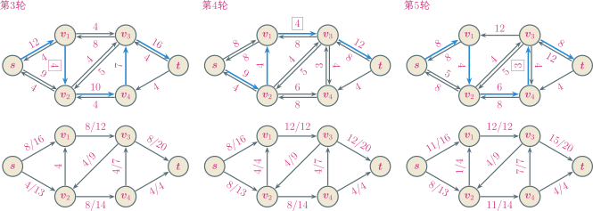

流值变化$0 \overset{+4}{\longrightarrow} 4 \overset{+4}{\longrightarrow} 8 \overset{+4}{\longrightarrow} 12 \overset{+4}{\longrightarrow} 16 \overset{+3}{\longrightarrow} 19  \overset{+1}{\longrightarrow} 20 \overset{+3}{\longrightarrow} 23$

<!-- slide vertical=true data-notes="" -->

##### 例子 边数最多

---

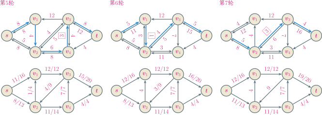

流值变化$0 \overset{+4}{\longrightarrow} 4 \overset{+4}{\longrightarrow} 8 \overset{+4}{\longrightarrow} 12 \overset{+4}{\longrightarrow} 16 \overset{+3}{\longrightarrow} 19  \overset{+1}{\longrightarrow} 20 \overset{+3}{\longrightarrow} 23$

<!-- slide vertical=true data-notes="" -->

##### 例子 边数最多

---

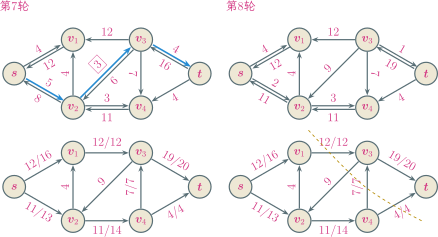

流值变化$0 \overset{+4}{\longrightarrow} 4 \overset{+4}{\longrightarrow} 8 \overset{+4}{\longrightarrow} 12 \overset{+4}{\longrightarrow} 16 \overset{+3}{\longrightarrow} 19  \overset{+1}{\longrightarrow} 20 \overset{+3}{\longrightarrow} 23$

<!-- slide data-notes="" -->

##### 例子 残存容量最大

---

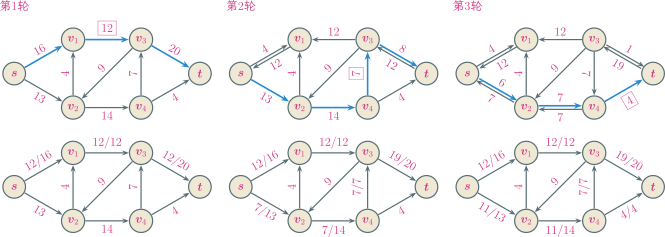

流值变化$0 \overset{+12}{\longrightarrow} 12 \overset{+7}{\longrightarrow} 19 \overset{+4}{\longrightarrow} 23$

<!-- slide vertical=true data-notes="" -->

##### 例子 残存容量最大

---

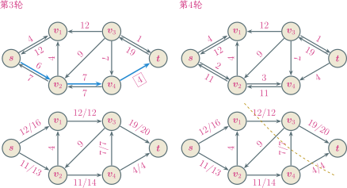

流值变化$0 \overset{+12}{\longrightarrow} 12 \overset{+7}{\longrightarrow} 19 \overset{+4}{\longrightarrow} 23$

<!-- slide data-notes="" -->

##### 算法分析

---

若边的容量均为整数，则最大流$f^\star$在各个边上的流量也是整数

- 初始流为零，是整数
- 每轮迭代开始，流值为整数、容量为整数 => 残存网络中的容量都为整数 => 增广路径的残存容量为整数 => 流值增量为整数

每轮迭代流值至少增加$1$，故最多迭代$O(|f^\star|)$轮

- 计算残存网络需计算每条边的残存容量，运行时间$O(|\Ecal|)$
- 利用 XX 优先搜索寻找增广路径，运行时间$O(|\Vcal| + |\Ecal|) = O(|\Ecal|)$
- 更新每条边的流值，运行时间$O(|\Ecal|)$

Ford-Fulkerson 算法的总时间复杂度为$O(|\Ecal| |f^\star|)$

<!-- slide vertical=true data-notes="" -->

##### 算法分析

---

Jack Edmonds、Richard Karp 发现时间复杂度$O(|\Ecal| |f^\star|)$是紧的

- 最多边数的增广路径，每轮流值加$1$，$|f^\star| = 2 X$，迭代$\Theta(|f^\star|)$轮
- 表示$X$只需$\Theta(\lg X)$比特，因此算法最坏情况下时间复杂度是指数级

@import "../tikz/max-flow-inefficient.svg" {.center .top4 .width52}

<!-- slide vertical=true data-notes="" -->

##### 算法分析

---

@import "../codes/ford-fulkerson.py" {line_begin=197 line_end=235 .left4 .line-numbers .top1 .bottom4 highlight=[]}

<!-- slide data-notes="" -->

##### 非整数容量

---

若边的容量均为有理数，可将有理数表示成既约分数的形式，设所有分母的最小公倍数为$d$，将所有边的容量乘以$d$可全部变成整数，根据 Ford-Fulkerson 算法求得最大流后再除以$d$就是原流网络的最大流

若存在边的容量为无理数，则 Ford-Fulkerson 算法可能无法停止，甚至极限流值不等于正确流值

<!-- slide vertical=true data-notes="" -->

##### 无理数容量

---

1993 年，Uri Zwick 提出如下 6 个点的流网络，其中$\phi$为黄金分割比，满足$\phi^2 + \phi = 1$

@import "../tikz/max-flow-irrational.svg" {.center .top2 .width70}

假设第$1$轮的增广路径为$s \rightarrow b \rightarrow c \rightarrow t$，之后中间三条边的残存容量分别为$1$、$0$、$\phi$

<!-- slide vertical=true data-notes="" -->

##### 无理数容量

---

假设某轮后中间三条边的残存容量分别为$\phi^{k-1}$、$0$、$\phi^k$

@import "../tikz/max-flow-irrational2.svg" {.center .top2 .width70}

| 轮次 | 增广路径 |   流值增量   |                       残存容量                        |
| :--: | :------: | :----------: | :---------------------------------------------------: |
| $1$  |  $(B)$   |   $\phi^k$   |   $\phi^{k-1} - \phi^k = \phi^{k+1}$、$\phi^k$、$0$   |
| $2$  |  $(C)$   |   $\phi^k$   |              $\phi^{k+1}$、$0$、$\phi^k$              |
| $3$  |  $(B)$   | $\phi^{k+1}$ | $0$、$\phi^{k+1}$、$\phi^k - \phi^{k+1} = \phi^{k+2}$ |
| $4$  |  $(A)$   | $\phi^{k+1}$ |            $\phi^{k+1}$、$0$、$\phi^{k+2}$            |

每$4$轮一个周期，残存容量从$\phi^{k-1}$、$0$、$\phi^k$变为$\phi^{k+1}$、$0$、$\phi^{k+2}$

<!-- slide vertical=true data-notes="" -->

##### 无理数容量

---

每$4$轮一个周期，残存容量从$\phi^{k-1}$、$0$、$\phi^k$变为$\phi^{k+1}$、$0$、$\phi^{k+2}$

经过$4n+1$轮后

$$
\begin{align*}
    \quad |f| & = 1 + 2 \sum_{i=1}^{2n} \phi^i = 1 + 2 \frac{\phi(1 - \phi^{2n})}{1 - \phi} \\
    & \longrightarrow 1 + 2 \frac{\phi}{1 - \phi} = 2 + \sqrt{5} \ll 2 X +1
\end{align*}
$$

计算机内部无法精确表示无理数，研究无理数容量有何意义？

- 限制容量为有理数是计算设备的局限性，不是计算问题本身带来的
- 实际问题中会有浮点数容量，如果算法实现时不注意，可能会因为舍入误差导致例子中的情形

<!-- slide data-notes="" -->

##### 算法下界

---

Ford-Fulkerson 算法的时间复杂度上界为$O(|\Ecal| |f^\star|)$

Ford-Fulkerson 算法的时间复杂度下界？

流分解定理：对任意流$f$，可将其分解为$s$到$t$的路径和有向环的正线性组合，$f(u,v) > 0$当且仅当$(u,v)$在路径或环中至少出现一次，路径和环的总数不超过$|\Ecal|$

<!-- slide vertical=true data-notes="" -->

##### 流分解定理 证明

---

在流网络中添加边$(t,s)$并令$f(t,s) = |f|$，于是流网络流值为零且所有点流量守恒，这样的流称为{==环流==} (circulation)

引理：任意环流$f$可分解为不超过$\max\{ 0, \# f - 1 \}$个有向环的正线性组合，其中$\# f = \{ |(u,v)| \mid f(u,v) > 0 \}$为有非零流量的边数

@import "../tikz/max-flow-decomposition.svg" {.center .top4 .bottom-2 .width75}

<!-- slide vertical=true data-notes="" -->

##### 引理 证明

---

分三种情况：

若流值为零，则$\# f = 0$，引理显然成立

若流值非零，且$f$只在单个有向环上有非零流量，则$\# f \ge 2$，引理显然成立

若流值非零，且$f$不只在单个有向环上有非零流量，对$\# f$的大小进行归纳

假设引理对非零流量边数$< \# f$的环流都成立

<!-- slide vertical=true data-notes="" -->

##### 引理 证明

---

考虑从$(u,v)$开始、所有边都有非零流量的路径$u \rightarrow v \rightarrow \cdots$，由于所有点流量守恒，因此该路径可不断延长直至某个点第二次出现，于是出现环$C$

设$F = \min_{(u,v) \in C} f(u,v)$，考虑新的流

$$
\begin{align*}
    \quad f'(u,v) = \begin{cases} f(u,v) - F, & (u,v) \in C \\ f(u,v), & \text{其它} \end{cases}
\end{align*}
$$

设$e \in C$、$f(e) = F$，于是$f'(e) = 0$、$\# f' \le \# f - 1$，由归纳假设，$f'$可分解为不超过$\max\{ 0, \# f' - 1 \}$个有向环的正线性组合，于是$f$可分解为不超过$\max\{ 0, \# f' \} \le \max\{ 0, \# f - 1 \}$个有向环的正线性组合

<!-- slide vertical=true data-notes="" -->

##### 流分解定理 证明

---

对任意流$f$，添加边$(t,s)$构造环流$f'$，则$\# f' = \# f + 1$

由引理，$f'$可分解为不超过$\max\{ 0, \# f' - 1 = \# f \}$个有向环的正线性组合，对包含$(t,s)$的环，删掉$(t,s)$变成$s$到$t$的路径，于是$f$分解成不超过$\max\{ 0, \# f \} \le |\Ecal|$个$s$到$t$的路径或有向环的正线性组合

<!-- slide data-notes="" -->

##### 流分解算法

---

流分解定理可导出流分解算法

1. 每轮从当前剩余流中寻找一条$s$到$t$的路径或有向环
2. 找出路径或环上的关键边，最大限度减少路径或环上的流量，直至流为零

寻找$s$到$t$的路径或有向环需$O(|\Vcal|)$时间

- 若$s$的流出为正，从$s$出发沿有向边游走，直至到达$t$得到一条路径，或某个点第二次出现得到一个有向环
- 若$s$的流出为零，对任意有正流出的点，沿有向边游走，直至某个点第二次出现得到一个有向环

流分解算法每轮至少可以让一条边的流量变为零，因此最多迭代$O(|\Ecal|)$轮，总的时间复杂度为$O(|\Vcal||\Ecal|)$

<!-- slide vertical=true data-notes="" -->

##### 算法下界

---

流分解算法每轮至少可以让一条边的流量变为零，因此最多迭代$O(|\Ecal|)$轮，总的时间复杂度为$O(|\Vcal||\Ecal|)$

存在流网络其中的环流可被分解成$|\Ecal| - |\Vcal| + 1 = O(|\Ecal|)$个有向环，且无法被分解成更少个有向环

类 Ford-Fulkerson 算法：每轮迭代寻找一条路径或是有向环，增加其上流值的算法，时间复杂度下界为$\Omega(|\Vcal| |\Ecal|)$

<!-- slide data-notes="" -->

##### Edmonds-Karp 算法

---

Ford-Fulkerson 算法的低效源自于不合适的增广路径寻找方法

70 年代初期，Jack Edmonds、Richard Karp 提出两个准则

- 寻找残存容量最大的增广路径，让剩余流值尽量小
- 寻找边数最少的增广路径，增广路径越短，参与求残存容量的边越少，残存容量越大，流值增量越大

 Ford、Fulkerson 原始的最大流论文中也提到了准则二，作为寻找增广路径的启发式方法；1970年，苏联数学家 Yefim Dinitz 提出了准则二的一个变种，当时他还是 Georgy Adelson-Velsky 算法课上的学生，他的算法多保存了一些中间结果，将时间复杂度从$O(|\Vcal| |\Ecal|^2)$降到$O(|\Vcal|^2 |\Ecal|)$

<!-- slide vertical=true data-notes="" -->

##### Edmonds-Karp 算法Ⅰ

---

准则 Ⅰ：寻找残存容量最大的增广路径

每轮迭代：以$s$为根结点生长树$\Tcal$，不断向$\Tcal$中加入残存容量最大的边 (类似最小生成树的 Prim 算法)，直至$\Tcal$中包含从$s$到$t$的路径，时间复杂度为$O(|\Ecal|\lg|\Ecal|) = O(|\Ecal|\lg|\Vcal|)$

迭代轮数：设$\Gcal_f$中的最大流为$f'$，根据流分解定理，$f'$最多可分解到$|\Ecal|$条路径上，因此至少有一条路径的流量为$|f'|/|\Ecal|$，选其为增广路径，剩余流量$\le f' - |f'|/|\Ecal| = |f'| (1 - 1/|\Ecal|)$

 若存在边的容量为无理数，Edmonds-Karp算法Ⅰ可能无法停止

<!-- slide vertical=true data-notes="" -->

##### Edmonds-Karp 算法Ⅰ

---

初始流网络即为残存网络，最大流为$f^\star$，每轮迭代后至少衰减到原来$1 - 1/|\Ecal|$，经过$|\Ecal| \ln |f^\star|$轮迭代后，流值小于$1$

$$
\begin{align*}
    \quad |f^\star| (1 - 1/|\Ecal|)^{|\Ecal| \ln |f^\star|} < |f^\star| \exp (- \ln |f^\star|) = 1
\end{align*}
$$

若边的容量均为整数，则流值亦为整数，小于$1$就意味着等于零，即$f$是最大流，总时间复杂度为$O(|\Ecal|^2 \lg|\Vcal| \ln |f^\star|)$

相较之前的$O(|\Ecal| |f^\star|)$，$|f^\star|$移到了$\ln()$里面，因此时间复杂度是多项式级

 这里用到了不等式$1 - x < \exp(-x)$

<!-- slide vertical=true data-notes="" -->

##### Edmonds-Karp 算法Ⅱ

---

准则 Ⅱ：寻找边数最少的增广路径

每轮迭代：残存网络中边的数目不超过$2 |\Ecal|$，采用 BFS 找一条从$s$到$t$的最短路径的时间是$O(|\Ecal|)$

迭代轮数：依赖下面两个引理

- 设$\delta_f (v)$为$\Gcal_f$中$s$到$v$的最短路径长度，则$\delta_f (v)$随着迭代单调递增
- 每条边成为增广路径上的关键边的次数不超过$|\Vcal|/2$次

每轮选增广路径至少产生一条关键边，总迭代轮数$O(|\Vcal||\Ecal|)$，总时间复杂度$O(|\Vcal| |\Ecal|^2)$，与最大流值无关

<!-- slide vertical=true data-notes="" -->

##### Edmonds-Karp 算法Ⅱ

---

引理：对$\forall v \in \Vcal \setminus \{ s, t \}$，$\delta_f (v)$随着迭代单调递增

直觉上，随着迭代进行，残存网络中的正向边越来越少，反向边越来越多，从$s$到其它点的路径越来越曲折

证明：假设存在结点$v$在某轮迭代后，$\delta_f (s,v)$减少

设$f \rightarrow f'$是$\delta_f (s, v)$首次变小的轮次，$\delta_f (s, v) > \delta_{f'} (s, v)$，且$v$是最短路径上离$s$最近的点

设$\Gcal_{f'}$中$s$到$v$的最短路径为$s \rightsquigarrow u \rightarrow v$，$\delta_{f'} (s, u) = \delta_{f'} (s, v) - 1$

<!-- slide vertical=true data-notes="" -->

##### Edmonds-Karp 算法Ⅱ

---

$\delta_f (s, v) > \delta_{f'} (s, v)$，$\delta_{f'} (s, u) = \delta_{f'} (s, v) - 1$

根据$v$的选取，$\delta_f (s, u) \le \delta_{f'} (s, u)$

易知$(u,v) \not \in \Ecal_f$，否则

$$
\begin{align*}
    \quad \delta_{f'} (s, v) < \delta_f (s, v) \le \delta_f (s, u) + 1 \le \delta_{f'} (s, u) + 1 = \delta_{f'} (s, v)
\end{align*}
$$

- $(u,v) \not \in \Ecal_f \Rightarrow f(u,v) = c(u,v)$
- $(u,v) \in \Ecal_{f'} \Rightarrow f'(u,v) < c(u,v)$

$\Gcal_f$中得到的增广路径在边$(v,u)$上有流量，抵消了$(u,v)$上的部分流量，故$(v,u)$是$\Gcal_f$中$s$到$u$的最短路径上的最后一条边

$$
\begin{align*}
    \quad \delta_f (s, v) = \delta_f (s, u) - 1 \le \delta_{f'} (s, u) - 1 = \delta_{f'} (s, v) - 2
\end{align*}
$$

<!-- slide vertical=true data-notes="" -->

##### Edmonds-Karp 算法Ⅱ

---

引理：每条边成为关键边的次数不超过$|\Vcal|/2$次

$(u,v)$第一次成为关键边时，$\delta_f (s, v) = \delta_f (s, u) + 1$

- 流增加后，$f$充斥$(u,v)$，$(u,v)$在残存网络中消失
- 直到某一轮$(v,u)$进入增广路径，从而$(u,v)$上的流量减少，记此时流量为$f'$，$\delta_{f'} (s, u) = \delta_{f'} (s, v) + 1$

根据前一个引理，$\delta_f (s, v) \le \delta_{f'} (s, v)$，于是

$$
\begin{align*}
    \quad \delta_{f'} (s, u) = \delta_{f'} (s, v) + 1 \ge \delta_f (s, v) + 1 = \delta_f (s, u) + 2
\end{align*}
$$

$(u,v)$成为关键边后到再次成为关键边前$\delta_f (s, u)$至少增加$2$

最短路径长度不超过$|\Vcal|$，每条边成为关键边的次数不超过$|\Vcal|/2$

<!-- slide data-notes="" -->

##### 更多算法

---

最大流问题至今是一个活跃的研究领域，2012 年，James Orlin 首次提出$O(|\Vcal| |\Ecal|)$复杂度的算法，达到理论最优

| 技术                         |                    复杂度                     |                                                 复杂度 (用数据结构)                                                  |
| :--------------------------- | :-------------------------------------------: | :------------------------------------------------------------------------------------------------------------------: |
| blocking flow                 |    $O(\shu \Vcal \shu^2 \shu \Ecal \shu)$     |                              $O(\shu \Vcal \shu \shu \Ecal \shu \log \shu \Vcal \shu)$                               |
| network simplex              |    $O(\shu \Vcal \shu^2 \shu \Ecal \shu)$     |                              $O(\shu \Vcal \shu \shu \Ecal \shu \log \shu \Vcal \shu)$                               |
| push-relabel (generic)       |    $O(\shu \Vcal \shu^2 \shu \Ecal \shu)$     |                                                          -                                                           |
| push-relabel (FIFO)          |            $O(\shu \Vcal \shu^3)$             |                   $O(\shu \Vcal \shu \shu \Ecal \shu \log (\shu \Vcal \shu^2 / \shu \Ecal \shu))$                    |
| push-relabel (highest label) | $O(\shu \Vcal \shu^2 \sqrt{\shu \Ecal \shu})$ |                                                          -                                                           |
| push-relabel-add games       |                       -                       | $O(\shu \Vcal \shu \shu \Ecal \shu \log_{\shu \Ecal \shu / (\shu \Vcal \shu \log \shu \Vcal \shu)} \shu \Vcal \shu)$ |
| pseudoflow                    |    $O(\shu \Vcal \shu^2 \shu \Ecal \shu)$     |                              $O(\shu \Vcal \shu \shu \Ecal \shu \log \shu \Vcal \shu)$                               |
| pseudoflow (highest label)    |            $O(\shu \Vcal \shu^3)$             |                   $O(\shu \Vcal \shu \shu \Ecal \shu \log (\shu \Vcal \shu^2 / \shu \Ecal \shu))$                    |
| incremental BFS              |    $O(\shu \Vcal \shu^2 \shu \Ecal \shu)$     |                   $O(\shu \Vcal \shu \shu \Ecal \shu \log (\shu \Vcal \shu^2 / \shu \Ecal \shu))$                    |
| compact networks             |                       -                       |                                        $O(\shu \Vcal \shu \shu \Ecal \shu )$                                         |

<!-- slide vertical=true data-notes="" -->

##### 更多算法

---

对于单位容量的流网络，即每条边容量为$1$的流网络

1973 年，Alexander Karzanov 证明 Dinitz 的 blocking flow 算法的时间复杂度为$O(\min\{ |\Vcal|^{2/3}, |\Ecal|^{1/2} \} |\Ecal|)$

Alexander Karzanov 同时证明了单位容量流网络中的流分解时间复杂度是$O(\min\{ |\Vcal|^{2/3}, |\Ecal|^{1/2} \} |\Ecal|)$，因此并没有和前面的下界$\Omega(|\Vcal| |\Ecal|)$矛盾

2013 年，Aleksander Mądry 提出了一个$O(|\Ecal|^{10/7} \mathrm{poly} (\log |\Ecal|))$时间复杂度的算法，在$|\Ecal| = o(|\Vcal|^{14/9})$的情况下更优

<!-- slide data-notes="" -->

##### 最大边不相交路径数

---

任给有向图，求任意两点间的最大边不相交路径数

下图$s \rightsquigarrow t$有 3 条边不相交的路径，是否为最大？

    
    

归约为单位容量的流网络的最大流问题

<!-- slide vertical=true data-notes="" -->

##### 最大边不相交路径数

---

一方面，对任意$k$条边不相交的路径，每条上面可运输单位流量，得到流值为$k$的流，因此最大边不相交路径数$\le$最大流值

另一方面，由于边的容量均为整数，因此最大流在各条边上的流值也为整数，非$0$即$1$，每条边要么满流量、要么零流量；根据流分解定理，最大流可分解为若干条$s \rightsquigarrow t$的路径，每条路径上的流量为$1$，因此这些路径不会有公共边，故最大流值$\le$最大边不相交路径数

利用 James Orlin 算法，时间复杂度为$O(|\Vcal| |\Ecal|)$

事实上，切割$(\{s\}, \Vcal \setminus \{s\})$的容量最多为$|\Vcal| - 1$，因此最大流值不超过$|\Vcal| - 1$，朴素的 Ford - Fulkerson 算法也有$O(|\Vcal| |\Ecal|)$的时间复杂度

<!-- slide data-notes="" -->

##### 匹配 最大匹配

---

{==匹配==}：无向图$\Gcal = (\Vcal, \Ecal)$的匹配是边的一个子集$\Mcal \subseteq \Ecal$，使得对$\forall v$，子集$\Mcal$中最多有一条边与$v$相连

{==最大匹配==}：若$\Mcal$是最大匹配，则对任意匹配$\Mcal'$有$|\Mcal| \ge |\Mcal'|$

@import "../tikz/matching.svg" {.center .top4 .width45}

<!-- slide vertical=true data-notes="" -->

##### 最大二分匹配

---

二分图：结点集合$\Vcal = \Lcal \uplus \Rcal$，边集$\Ecal$中所有边横跨$\Lcal$和$\Rcal$

问题：在二分图中寻找最大匹配

@import "../tikz/matching.svg" {.center .top4 .width45}

<!-- slide data-notes="" -->

##### 最大二分匹配

---

基本思路：构建一个流网络，最大二分匹配 -> 最大流

- $\Vcal' = \Vcal \cup \{ s, t \}$
- $\Ecal' = \Ecal \cup \{ (s, u) \mid u \in \Lcal \} \cup \{ (v,t) \mid v \in \Rcal \} $
- 每条边上的容量为单位容量，即对$\forall (u,v) \in \Ecal'$有$c(u,v) = 1$

@import "../tikz/matching-max-flow.svg" {.center .top5 .width70}

<!-- slide vertical=true data-notes="" -->

##### 最大二分匹配

---

由于$\Gcal'$中所有边的容量为整数，所以对应的最大流值也是整数

利用 Ford-Fulkerson 算法求得$\Gcal'$中的最大流，流值大于$0$的边构成原二分图中的最大匹配，最大匹配的边数就是最大流值

@import "../tikz/max-matching-max-flow.svg" {.center .top4 .width48 .bottom-10}

<!-- slide data-notes="" -->

##### 正确性证明

---

需证明：

原图中的匹配和流网络中的流一一对应，匹配的边数等于流值

在容量是整数的前提下，Ford-Fulkerson 方法产生的流是整值流

最大流的流值等于最大匹配的边数

<!-- slide vertical=true data-notes="" -->

##### 正确性证明

---

引理：如果$\Mcal$是$\Gcal$中的一个匹配，则流网络$\Gcal'$中存在一个整数值的流$f$，使得$|f| = |\Mcal|$；反之，如果$f$是$\Gcal'$中的一个整数流，则$\Gcal$中存在一个匹配$\Mcal$，使得$|\Mcal| = |f|$

证明：一方面，若$\Mcal$是$\Gcal$中匹配，定义$\Gcal'$中对应的流$f$如下：

- 若$(u,v) \in \Mcal$，则$f(s,u) = f(u,v) = f(v,t) = 1$
- 对$\Ecal'$中的剩余边$(u,v)$，$f(u,v)=0$

显然$f$是满足容量限制和流量守恒的整数流，最后证明$|f| = |\Mcal|$

易知$(\Lcal \cup \{s\}, \Rcal \cup \{ t \})$是一个切割，$\Mcal$中的边恰好是横跨切割的边，其上是一个单位的流量，根据切割的净流量等于流网络的流量，而切割的净流量就是匹配的边数，所以$|f|=|\Mcal|$

<!-- slide vertical=true data-notes="" -->

##### 正确性证明

---

另一方面，若$f$是$\Gcal'$中的一个整数流，并设

$$
\begin{align*}
    \quad \Mcal = \{ (u,v) \mid u \in \Lcal, ~ v \in \Rcal, ~ f(u,v) > 0 \}
\end{align*}
$$

下面证明$\Mcal$是一个匹配，根据$\Mcal$的构造，只需证明有流经过的点，$\Mcal$中恰有一条边与其相连

对$\forall u \in \Lcal$，只有一条入边$(s,u)$容量为$1$，由于$f$是整数流，流入的流量恰是$1$，根据流量守恒，流出的流量也是$1$，由于$f$是整数流，故{==恰有一个$v \in \Rcal$使得$f(u,v)=1$==}，对$\forall v \in \Rcal$同理可证

对$\forall (u,v) \in \Mcal$有$f(s,u) = 1$，对$\forall (u,v) \in \Ecal \setminus \Mcal$有$f(u,v) = 0$，因此横跨切割$(\Lcal \cup \{s\}, \Rcal \cup \{ t \})$的净流量等于$|\Mcal|$，根据切割的净流量等于流网络的流量，所以$|f|=|\Mcal|$

<!-- slide vertical=true data-notes="" -->

##### 正确性证明

---

定理：如果容量函数$c$只取整数值，则 Ford-Fulkerson 方法生成的最大流是整数流

证明：假设当前每条边上的流值是整数，由于容量函数$c$只取整数值，故残存网络中边的容量限制也都是整数，从而增广路径的残存容量是整数，故本轮流的增加值为整数，原流网络中每条边的流值改变量是整数

初始流值为零，满足每条边上的流值是整数，因此之后每条边上的流值一直都是整数

<!-- slide vertical=true data-notes="" -->

##### 正确性证明

---

定理：二分图$\Gcal$的一个最大匹配$\Mcal$的边数等于其对应的流网络$\Gcal'$中某一最大流$f$的值

证明： 若$\Mcal$是$\Gcal$中的一个最大匹配，但其相应的流网络$\Gcal'$中的流$f$不是最大流，那么$\Gcal'$中存在一个最大流$f'$，满足$|f'| > |f|$

由于$\Gcal'$的容量都是整数值，故$|f'|$也是整数，同时$f'$有一个对应的匹配$\Mcal'$，使得$|\Mcal'|=|f'|> |f|=|\Mcal|$，这与$\Mcal$是最大匹配相矛盾

同理可证，如果$f$是$\Gcal'$中的一个最大流，则其对应的匹配是$\Gcal$的一个最大匹配

<!-- slide data-notes="" -->

##### 时间复杂度

---

对于二分图，不失一般性可假设每个结点至少有一条相连的边，即$|\Ecal| \ge |\Vcal| / 2$

$|\Ecal'| = |\Ecal| + |\Vcal| \le 3 |\Ecal| = \Theta(|\Ecal|)$

$\Gcal'$的最大流值不超过$|\Vcal|$

故总时间$O(|\Vcal| |\Ecal|)$

@import "../tikz/max-matching-max-flow.svg" {.right6 .lefta .top-20 .width48 .bottom-10}

<!-- slide data-notes="" -->

##### 作业

---

算法导论 3^rd^

26.1-1、26.2-3、26.3-1
