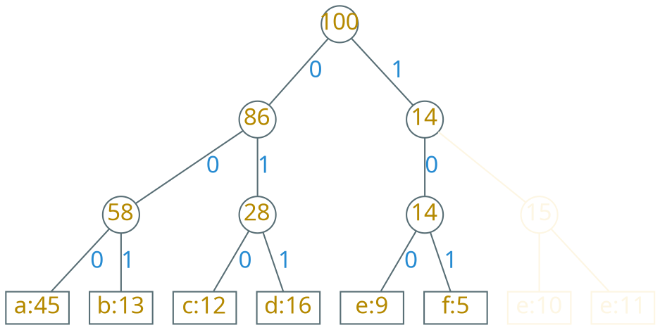
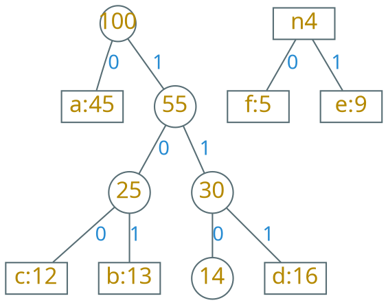

---
presentation:
  margin: 0
  center: false
  transition: "convex"
  enableSpeakerNotes: true
  slideNumber: "c/t"
  navigationMode: "linear"
---

@import "../css/font-awesome-4.7.0/css/font-awesome.css"
@import "../css/theme/solarized.css"
@import "../css/logo.css"
@import "../css/font.css"
@import "../css/color.css"
@import "../css/margin.css"
@import "../css/table.css"
@import "../css/main.css"
@import "../plugin/zoom/zoom.js"
@import "../plugin/customcontrols/plugin.js"
@import "../plugin/customcontrols/style.css"
@import "../plugin/chalkboard/plugin.js"
@import "../plugin/chalkboard/style.css"
@import "../plugin/menu/menu.js"

<!-- slide data-notes="" -->

##### 文件编码

---

压缩一个有 10w 个字符的数据文件，只包含 a、b、c、d、e、f

|   字符   |  a  |  b  |  c  |  d  |  e   |  f   |
| :------: | :-: | :-: | :-: | :-: | :--: | :--: |
|   频率   | 45  | 13  | 12  | 16  |  9   |  5   |
| 定长编码 | 000 | 001 | 010 | 011 | 100  | 101  |
| 变长编码 |  0  | 101 | 100 | 111 | 1101 | 1100 |

采用二进制字符编码

- 定长编码：3 \* 10w = 30w 个二进制位
- 变长编码：约 22.4w 个二进制位，节约 25%空间

<!-- slide vertical=true data-notes="" -->

##### 最优编码方案

---

变长编码必然是{==前缀码==} (prefix code)

码字{==互不为前缀==}，可以保证解码时无歧义

| 字符 |  a  |  b  |  c  |  d  |  e   |  f   |
| :--: | :-: | :-: | :-: | :-: | :--: | :--: |
| 频率 | 45  | 13  | 12  | 16  |  9   |  5   |
| 编码 |  0  | 101 | 100 | 111 | 1101 | 1100 |

文件编码：0101100

文件解码：0101{==100==} -> ab{==c==}

<!-- slide data-notes="" -->

##### 编码树

---

- 每个字符对应一个叶子结点
- 字符的码字由根结点到该字符叶子结点的路径表示

