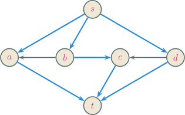
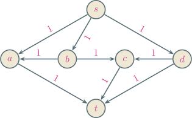

---
presentation:
  margin: 0
  center: false
  transition: "none"
  enableSpeakerNotes: true
  slideNumber: "c/t"
  navigationMode: "linear"
---

@import "../css/font-awesome-4.7.0/css/font-awesome.css"
@import "../css/theme/solarized.css"
@import "../css/logo.css"
@import "../css/font.css"
@import "../css/color.css"
@import "../css/margin.css"
@import "../css/table.css"
@import "../css/main.css"
@import "../plugin/zoom/zoom.js"
@import "../plugin/customcontrols/plugin.js"
@import "../plugin/customcontrols/style.css"
@import "../plugin/chalkboard/plugin.js"
@import "../plugin/chalkboard/style.css"
@import "../plugin/menu/menu.js"

<!-- slide data-notes="" -->

##### 最大边不相交路径数

---

任给有向图，求任意两点间的最大边不相交路径数

下图$s \rightsquigarrow t$有 3 条边不相交的路径，是否为最大？

    
    

归约为单位容量的流网络的最大流问题

<!-- slide vertical=true data-notes="" -->

##### 最大边不相交路径数

---

一方面，对任意$k$条边不相交的路径，每条上面可运输单位流量，得到流值为$k$的流，因此最大边不相交路径数$\le$最大流值

另一方面，由于边的容量均为整数，因此最大流在各条边上的流值也为整数，非$0$即$1$，每条边要么满流量、要么零流量；根据流分解定理，最大流可分解为若干条$s \rightsquigarrow t$的路径，每条路径上的流量为$1$，因此这些路径不会有公共边，故最大流值$\le$最大边不相交路径数

利用 James Orlin 算法，时间复杂度为$O(|\Vcal| |\Ecal|)$

事实上，切割$(\{s\}, \Vcal \setminus \{s\})$的容量最多为$|\Vcal| - 1$，因此最大流值不超过$|\Vcal| - 1$，朴素的 Ford - Fulkerson 算法也有$O(|\Vcal| |\Ecal|)$的时间复杂度
