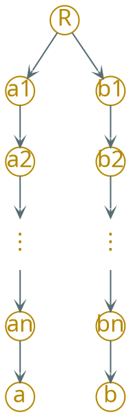

---
presentation:
  margin: 0
  center: false
  transition: "convex"
  enableSpeakerNotes: true
  slideNumber: "c/t"
  navigationMode: "linear"
---

@import "../css/font-awesome-4.7.0/css/font-awesome.css"
@import "../css/theme/solarized.css"
@import "../css/logo.css"
@import "../css/font.css"
@import "../css/color.css"
@import "../css/margin.css"
@import "../css/table.css"
@import "../css/main.css"
@import "../plugin/zoom/zoom.js"
@import "../plugin/customcontrols/plugin.js"
@import "../plugin/customcontrols/style.css"
@import "../plugin/chalkboard/plugin.js"
@import "../plugin/chalkboard/style.css"
@import "../plugin/menu/menu.js"

<!-- slide data-notes="" -->

##### 奇偶性分析 可达性

---

记$p(i)$为编号$i$的牌在初始状态中的位置，$p(16)$为空格的位置

记$l(i)$为编号小于$i$但位置在$i$之后的牌的数目

引入变量$q$，若空格初始在深色格上，$q=1$，否则为零

当且仅当$\sum_{i=1}^{16} l(i) + q$为偶数时，目标状态可达

| &ensp; | &ensp; | &ensp; | &ensp; | &ensp; | &ensp; | &ensp; | &ensp; | &ensp; | &ensp; |
| :----: | :----: | :----: | :----: | :----: | :----: | :----: | :----: | :----: | :----: |
|   1    |   2    |   3    |   4    | &ensp; | &ensp; |   1    |   2    |   3    |   4    |
|   5    |   6    | &ensp; |   8    | &ensp; | &ensp; |   5    |   6    |   7    |   8    |
|   9    |   10   |   7    |   11   | &ensp; | &ensp; |   9    |   10   |   11   |   12   |
|   13   |   14   |   15   |   12   | &ensp; | &ensp; |   13   |   14   |   15   | &ensp; |

<!-- slide vertical=true data-notes="" -->

##### 奇偶性分析 可达性

---

| &ensp; | &ensp; | &ensp; | &ensp; | &ensp; | &ensp; | &ensp; | &ensp; | &ensp; | &ensp; |
| :----: | :----: | :----: | :----: | :----: | :----: | :----: | :----: | :----: | :----: |
|   1    |   2    |   a    |   b    | &ensp; | &ensp; |   1    |   2    |   3    |   4    |
|   c    |   d    | &ensp; |   e    | &ensp; | &ensp; |   5    |   6    |   7    |   8    |
|   f    |   g   |   h    |   11   | &ensp; | &ensp; |   9    |   10   |   11   |   12   |
|   13   |   14   |   15   |   12   | &ensp; | &ensp; |   13   |   14   |   15   | &ensp; |

空格每次移动，$q$变化$1$，下面证明$\sum_{i=1}^{16} l(i)$的变化量是奇数

空格左/右移：$l(16)$增大/减小$1$，其它不变

空格上移：$l(16)$增大$4$，下证$l(a),\ldots,l(d)$的总变化量为奇数

- 对$a$、$b$，若$a < b$，则$l(b)$增大$1$，若$a > b$，则$l(a)$减小$1$
- 对$a$、$c$和$a$、$d$同理，每一对的$l(\cdot)$值的变化量为$1$，总变化量为奇数

空格上移：$l(16)$减小$4$，$l(e),\ldots,l(h)$的总变化量为奇数

<!-- slide vertical=true data-notes="" -->

##### LC-搜索 正确性

---

若对$\forall X,Y: c(X) < c(Y) \rightarrow \hat{c}(X) < \hat{c}(Y)$，则能找到最优解

